```mermaid
graph LR
    Self_Learning_Orchestrator["Self-Learning Orchestrator"]
    Course_Designer_SelfLearner_["Course Designer (SelfLearner)"]
    Learning_Environment_Preparer["Learning Environment Preparer"]
    One_Shot_Learning_Strategy["One-Shot Learning Strategy"]
    Continuous_Learning_Strategy["Continuous Learning Strategy"]
    Agent_Refiner_Abstract_Interface_["Agent Refiner (Abstract/Interface)"]
    Friday_Agent_Refiner["Friday Agent Refiner"]
    Friday2_Agent_Refiner["Friday2 Agent Refiner"]
    Self_Learning_Orchestrator -- "initiates" --> One_Shot_Learning_Strategy
    Self_Learning_Orchestrator -- "initiates" --> Continuous_Learning_Strategy
    Learning_Environment_Preparer -- "prepares data for" --> Course_Designer_SelfLearner_
    Course_Designer_SelfLearner_ -- "outputs learning outcomes to" --> Friday_Agent_Refiner
    Course_Designer_SelfLearner_ -- "outputs learning outcomes to" --> Friday2_Agent_Refiner
    One_Shot_Learning_Strategy -- "depends on" --> Learning_Environment_Preparer
    Continuous_Learning_Strategy -- "depends on" --> Learning_Environment_Preparer
    Friday_Agent_Refiner -- "implements" --> Agent_Refiner_Abstract_Interface_
    Friday2_Agent_Refiner -- "implements" --> Agent_Refiner_Abstract_Interface_
```

## Details

The self-learning subsystem in oscopilot is orchestrated by the Self-Learning Orchestrator, which initiates various learning cycles, including One-Shot Learning Strategy and Continuous Learning Strategy. Before any learning commences, the Learning Environment Preparer gathers and prepares necessary context and data. The core learning logic resides within the Course Designer (SelfLearner), which leverages LLMs to generate structured learning content. The outcomes of this learning process are then fed into specialized Agent Refiner components, such as the Friday Agent Refiner and Friday2 Agent Refiner. These refiners, acting as concrete implementations of the Agent Refiner (Abstract/Interface), analyze agent performance and adjust future actions based on the insights gained from the learning module, ensuring continuous improvement and self-correction within the system.

### Self-Learning Orchestrator
Provides the overarching framework and coordination for all self-learning processes within the agent. It acts as a container for various learning strategies and manages the initiation of learning cycles.

**Related Classes/Methods**:

- <a href="https://github.com/OS-Copilot/OS-Copilot/blob/main/oscopilot/agents/self_learning.py#L1-L9999" target="_blank" rel="noopener noreferrer">`oscopilot.agents.self_learning`:1-9999</a>

### Course Designer (SelfLearner)
Implements the core logic for generating structured educational courses or learning pathways. It leverages Large Language Models (LLMs) to analyze input data (software, files, prior courses) and design new learning content.

**Related Classes/Methods**:

- <a href="https://github.com/OS-Copilot/OS-Copilot/blob/main/oscopilot/modules/learner/self_learner.py#L1-L9999" target="_blank" rel="noopener noreferrer">`oscopilot.modules.learner.self_learner`:1-9999</a>

### Learning Environment Preparer
Prepares the necessary context, data, and environment settings before a learning process commences. This includes gathering relevant software details, file content, and historical interaction data, often utilizing a Text Data Extractor internally.

**Related Classes/Methods**:

- <a href="https://github.com/OS-Copilot/OS-Copilot/blob/main/oscopilot/agents/self_learning.py#L1-L9999" target="_blank" rel="noopener noreferrer">`oscopilot.agents.self_learning`:1-9999</a>

### One-Shot Learning Strategy
Initiates and manages a single, focused self-learning cycle, typically for a specific task or problem, aiming for immediate improvement or knowledge acquisition.

**Related Classes/Methods**:

- <a href="https://github.com/OS-Copilot/OS-Copilot/blob/main/oscopilot/agents/self_learning.py#L1-L9999" target="_blank" rel="noopener noreferrer">`oscopilot.agents.self_learning`:1-9999</a>

### Continuous Learning Strategy
Manages ongoing, iterative self-learning processes, enabling the agent to adapt and improve over time through repeated cycles of learning and refinement.

**Related Classes/Methods**:

- <a href="https://github.com/OS-Copilot/OS-Copilot/blob/main/oscopilot/agents/self_learning.py#L1-L9999" target="_blank" rel="noopener noreferrer">`oscopilot.agents.self_learning`:1-9999</a>

### Agent Refiner (Abstract/Interface)
Defines the common interface and mechanisms for agent-specific self-correction and improvement. It analyzes an agent's performance and adjusts its future actions or internal models based on learning outcomes. This component is crucial for establishing a consistent refinement pattern across different agent types.

**Related Classes/Methods**:

- <a href="https://github.com/OS-Copilot/OS-Copilot/blob/main/oscopilot/agents/friday_agent.py#L74-L127" target="_blank" rel="noopener noreferrer">`oscopilot.agents.friday_agent.FridayAgent.self_refining`:74-127</a>

### Friday Agent Refiner
Manages the self-correction and improvement mechanisms specifically for the friday_agent, analyzing its performance and adjusting future actions based on insights from the learning module.

**Related Classes/Methods**:

- <a href="https://github.com/OS-Copilot/OS-Copilot/blob/main/oscopilot/agents/friday_agent.py#L74-L127" target="_blank" rel="noopener noreferrer">`oscopilot.agents.friday_agent.FridayAgent.self_refining`:74-127</a>

### Friday2 Agent Refiner
Manages the self-correction and improvement mechanisms specifically for the friday2_agent, similar to Friday Agent Refiner but tailored for a distinct agent variant.

**Related Classes/Methods**:

- <a href="https://github.com/OS-Copilot/OS-Copilot/blob/main/oscopilot/agents/friday2_agent.py#L71-L124" target="_blank" rel="noopener noreferrer">`oscopilot.agents.friday2_agent.Friday2Agent.self_refining`:71-124</a>

### [FAQ](https://github.com/CodeBoarding/GeneratedOnBoardings/tree/main?tab=readme-ov-file#faq)