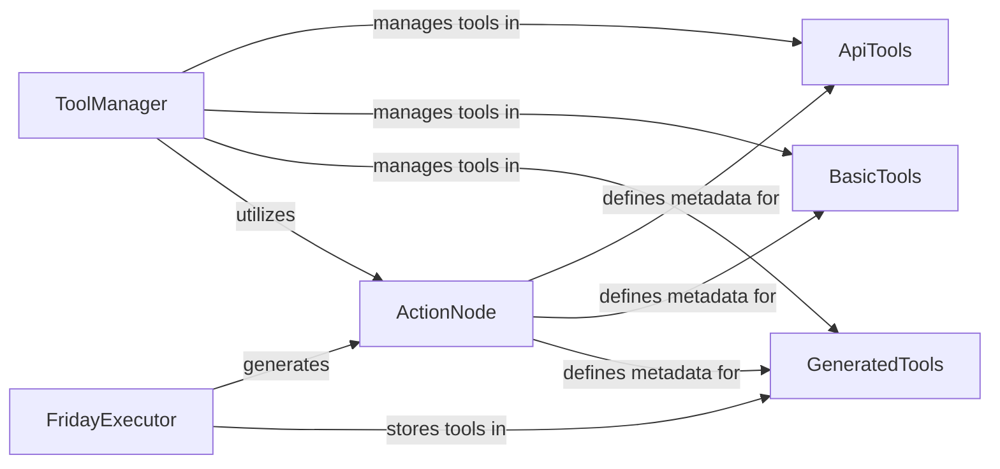

## Details

The oscopilot tool management subsystem is designed for dynamic tool handling, centered around the FridayExecutor for initial tool generation and the ToolManager for comprehensive tool lifecycle management. FridayExecutor is responsible for creating and preparing tools, which are standardized as ActionNode instances, and subsequently storing them in the GeneratedTools repository. The ToolManager acts as the central access point, overseeing tools categorized into ApiTools (for external API interactions), BasicTools (for core utilities), and GeneratedTools (for dynamically created tools). All tools, regardless of their origin, are represented by ActionNode to ensure consistent metadata and interaction patterns throughout the system. This architecture facilitates a flexible and extensible tool ecosystem, allowing the agent to adapt and expand its capabilities.

### FridayExecutor
Orchestrates the initial lifecycle of tools, focusing on their generation from specifications, repair, and initial storage. It acts as the primary interface for creating and preparing tools, especially those dynamically generated by the agent.

**Related Classes/Methods**:

- <a href="https://github.com/OS-Copilot/OS-Copilot/blob/main/oscopilot/modules/executor/friday_executor.py#L12-L589" target="_blank" rel="noopener noreferrer">`oscopilot.modules.executor.friday_executor.FridayExecutor`:12-589</a>

### ToolManager
Manages the central repository of tools. It provides core functionalities for adding new tools, deleting existing ones, and checking for a tool's existence, ensuring the agent has a discoverable and manageable set of tools. It acts as the primary interface for tool retrieval.

**Related Classes/Methods**:

- <a href="https://github.com/OS-Copilot/OS-Copilot/blob/main/oscopilot/tool_repository/manager/tool_manager.py" target="_blank" rel="noopener noreferrer">`oscopilot.tool_repository.manager.tool_manager.ToolManager`</a>

### ActionNode
Acts as a standardized data structure to represent individual actions or tools. It encapsulates essential metadata such as status, name, type, return value, and description, providing a consistent way to describe tools within the system.

**Related Classes/Methods**:

- <a href="https://github.com/OS-Copilot/OS-Copilot/blob/main/oscopilot/tool_repository/manager/action_node.py#L1-L109" target="_blank" rel="noopener noreferrer">`oscopilot.tool_repository.manager.action_node.ActionNode`:1-109</a>

### ApiTools
A repository for concrete implementations of tools designed to interact with external APIs. These are executable units that extend the agent's reach to external services.

**Related Classes/Methods**: _None_

### BasicTools
A repository housing fundamental, general-purpose tools that provide core functionalities not necessarily tied to external APIs. These are foundational utilities for the agent's operations.

**Related Classes/Methods**: _None_

### GeneratedTools
A repository serving as the storage location for tools that are dynamically created by the agent itself during runtime. This enables the agent to learn and adapt by extending its own toolset, a key aspect of self-improvement.

**Related Classes/Methods**: _None_

### [FAQ](https://github.com/CodeBoarding/GeneratedOnBoardings/tree/main?tab=readme-ov-file#faq)