```mermaid
graph LR
    Agent_Core_Orchestrator_["Agent Core (Orchestrator)"]
    Planning_Module["Planning Module"]
    Tool_Management_Repository["Tool Management & Repository"]
    Environment_Interaction_Layer["Environment Interaction Layer"]
    Knowledge_Retrieval_Module["Knowledge & Retrieval Module"]
    Self_Learning_Refinement_Module["Self-Learning & Refinement Module"]
    LLM_Integration_Module["LLM Integration Module"]
    API_Service_Layer["API Service Layer"]
    Agent_Core_Orchestrator_ -- "sends task requests to" --> Planning_Module
    Planning_Module -- "returns execution plans to" --> Agent_Core_Orchestrator_
    Agent_Core_Orchestrator_ -- "requests tool execution/generation from" --> Tool_Management_Repository
    Tool_Management_Repository -- "returns execution results/tool info to" --> Agent_Core_Orchestrator_
    Agent_Core_Orchestrator_ -- "submits code/commands to" --> Environment_Interaction_Layer
    Environment_Interaction_Layer -- "returns execution output/status to" --> Agent_Core_Orchestrator_
    Agent_Core_Orchestrator_ -- "sends prompts to" --> LLM_Integration_Module
    LLM_Integration_Module -- "returns LLM responses to" --> Agent_Core_Orchestrator_
    Agent_Core_Orchestrator_ -- "provides logs/feedback to" --> Self_Learning_Refinement_Module
    Self_Learning_Refinement_Module -- "provides updated strategies/knowledge to" --> Agent_Core_Orchestrator_
    Planning_Module -- "queries for info from" --> Knowledge_Retrieval_Module
    Knowledge_Retrieval_Module -- "provides retrieved info to" --> Planning_Module
    Tool_Management_Repository -- "stores tool definitions in" --> Knowledge_Retrieval_Module
    Knowledge_Retrieval_Module -- "retrieves tool info for" --> Tool_Management_Repository
    API_Service_Layer -- "triggers tool execution in" --> Tool_Management_Repository
    Tool_Management_Repository -- "provides results to" --> API_Service_Layer
    click Agent_Core_Orchestrator_ href "https://github.com/CodeBoarding/GeneratedOnBoardings/blob/main/OS-Copilot/Agent_Core_Orchestrator_.md" "Details"
    click Planning_Module href "https://github.com/CodeBoarding/GeneratedOnBoardings/blob/main/OS-Copilot/Planning_Module.md" "Details"
    click Tool_Management_Repository href "https://github.com/CodeBoarding/GeneratedOnBoardings/blob/main/OS-Copilot/Tool_Management_Repository.md" "Details"
    click Environment_Interaction_Layer href "https://github.com/CodeBoarding/GeneratedOnBoardings/blob/main/OS-Copilot/Environment_Interaction_Layer.md" "Details"
    click Self_Learning_Refinement_Module href "https://github.com/CodeBoarding/GeneratedOnBoardings/blob/main/OS-Copilot/Self_Learning_Refinement_Module.md" "Details"
    click LLM_Integration_Module href "https://github.com/CodeBoarding/GeneratedOnBoardings/blob/main/OS-Copilot/LLM_Integration_Module.md" "Details"
    click API_Service_Layer href "https://github.com/CodeBoarding/GeneratedOnBoardings/blob/main/OS-Copilot/API_Service_Layer.md" "Details"
```

## Details

The OS-Copilot project implements an AI Agent Framework designed for autonomous task execution and self-improvement within various operating system environments. At its heart, the Agent Core (Orchestrator) directs the overall process, leveraging a Planning Module for strategic task decomposition and an LLM Integration Module for intelligent decision-making. Interactions with the external world are managed by the Tool Management & Repository, which handles a diverse set of tools, and the Environment Interaction Layer, providing a standardized interface for OS-level command execution. A Knowledge & Retrieval Module supports these operations by providing essential information, while the Self-Learning & Refinement Module ensures continuous adaptation and performance enhancement. For external integration, an API Service Layer exposes key functionalities. This architecture is highly modular, promoting clear component boundaries and distinct data flows, making it well-suited for visual representation as a comprehensive flow graph illustrating the agent's intelligent orchestration and interaction with its environment and tools.

### Agent Core (Orchestrator) [[Expand]](./Agent_Core_Orchestrator_.md)
The central intelligence and control unit, orchestrating workflow, managing task execution, and driving self-refinement.

**Related Classes/Methods**:

- <a href="https://github.com/OS-Copilot/OS-Copilot/blob/main/oscopilot/agents/friday_agent.py" target="_blank" rel="noopener noreferrer">`oscopilot/agents/friday_agent.py`</a>
- <a href="https://github.com/OS-Copilot/OS-Copilot/blob/main/oscopilot/agents/friday2_agent.py" target="_blank" rel="noopener noreferrer">`oscopilot/agents/friday2_agent.py`</a>
- <a href="https://github.com/OS-Copilot/OS-Copilot/blob/main/oscopilot/agents/base_agent.py" target="_blank" rel="noopener noreferrer">`oscopilot/agents/base_agent.py`</a>

### Planning Module [[Expand]](./Planning_Module.md)
Decomposes complex tasks into sub-tasks and generates/revises execution plans.

**Related Classes/Methods**:

- <a href="https://github.com/OS-Copilot/OS-Copilot/blob/main/oscopilot/modules/planner/friday_planner.py" target="_blank" rel="noopener noreferrer">`oscopilot/modules/planner/friday_planner.py`</a>
- <a href="https://github.com/OS-Copilot/OS-Copilot/blob/main/oscopilot/modules/planner/basic_planner.py" target="_blank" rel="noopener noreferrer">`oscopilot/modules/planner/basic_planner.py`</a>

### Tool Management & Repository [[Expand]](./Tool_Management_Repository.md)
Manages tool lifecycle (generation, storage, retrieval, execution) and maintains a repository of tools.

**Related Classes/Methods**:

- <a href="https://github.com/OS-Copilot/OS-Copilot/blob/main/oscopilot/modules/executor/friday_executor.py" target="_blank" rel="noopener noreferrer">`oscopilot.modules.executor.friday_executor.py`</a>
- <a href="https://github.com/OS-Copilot/OS-Copilot/blob/main/oscopilot/tool_repository/manager/tool_manager.py" target="_blank" rel="noopener noreferrer">`oscopilot/tool_repository/manager/tool_manager.py`</a>
- <a href="https://github.com/OS-Copilot/OS-Copilot/blob/main/oscopilot/tool_repository/api_tools/" target="_blank" rel="noopener noreferrer">`oscopilot/tool_repository/api_tools/`</a>
- <a href="https://github.com/OS-Copilot/OS-Copilot/blob/main/oscopilot/tool_repository/basic_tools/" target="_blank" rel="noopener noreferrer">`oscopilot/tool_repository/basic_tools/`</a>
- <a href="https://github.com/OS-Copilot/OS-Copilot/blob/main/oscopilot/tool_repository/generated_tools/" target="_blank" rel="noopener noreferrer">`oscopilot/tool_repository/generated_tools/`</a>

### Environment Interaction Layer [[Expand]](./Environment_Interaction_Layer.md)
Provides a standardized interface for interacting with various operating system environments.

**Related Classes/Methods**:

- <a href="https://github.com/OS-Copilot/OS-Copilot/blob/main/oscopilot/environments/env.py" target="_blank" rel="noopener noreferrer">`oscopilot/environments/env.py`</a>
- <a href="https://github.com/OS-Copilot/OS-Copilot/blob/main/oscopilot/environments/subprocess_env.py" target="_blank" rel="noopener noreferrer">`oscopilot/environments/subprocess_env.py`</a>
- <a href="https://github.com/OS-Copilot/OS-Copilot/blob/main/oscopilot/environments/py_jupyter_env.py" target="_blank" rel="noopener noreferrer">`oscopilot/environments/py_jupyter_env.py`</a>
- <a href="https://github.com/OS-Copilot/OS-Copilot/blob/main/oscopilot/environments/applescript_env.py" target="_blank" rel="noopener noreferrer">`oscopilot/environments/applescript_env.py`</a>
- <a href="https://github.com/OS-Copilot/OS-Copilot/blob/main/oscopilot/environments/bash_env.py" target="_blank" rel="noopener noreferrer">`oscopilot/environments/bash_env.py`</a>
- <a href="https://github.com/OS-Copilot/OS-Copilot/blob/main/oscopilot/environments/base_env.py" target="_blank" rel="noopener noreferrer">`oscopilot/environments/base_env.py`</a>

### Knowledge & Retrieval Module
Manages storage and retrieval of relevant information (e.g., tool descriptions, learned knowledge).

**Related Classes/Methods**:

- <a href="https://github.com/OS-Copilot/OS-Copilot/blob/main/oscopilot/modules/retriever/vector_retriever.py" target="_blank" rel="noopener noreferrer">`oscopilot/modules/retriever/vector_retriever.py`</a>

### Self-Learning & Refinement Module [[Expand]](./Self_Learning_Refinement_Module.md)
Enables the agent to learn and improve performance by analyzing past interactions and outcomes.

**Related Classes/Methods**:

- <a href="https://github.com/OS-Copilot/OS-Copilot/blob/main/oscopilot/agents/self_learning.py" target="_blank" rel="noopener noreferrer">`oscopilot/agents/self_learning.py`</a>
- <a href="https://github.com/OS-Copilot/OS-Copilot/blob/main/oscopilot/modules/learner/self_learner.py" target="_blank" rel="noopener noreferrer">`oscopilot/modules/learner/self_learner.py`</a>

### LLM Integration Module [[Expand]](./LLM_Integration_Module.md)
Provides a unified interface for communication with Large Language Models, handling prompt generation and response processing.

**Related Classes/Methods**:

- <a href="https://github.com/OS-Copilot/OS-Copilot/blob/main/oscopilot/utils/llms.py" target="_blank" rel="noopener noreferrer">`oscopilot/utils/llms.py`</a>
- <a href="https://github.com/OS-Copilot/OS-Copilot/blob/main/oscopilot/prompts/" target="_blank" rel="noopener noreferrer">`oscopilot/prompts/`</a>

### API Service Layer [[Expand]](./API_Service_Layer.md)
Exposes agent functionalities or managed tools as a RESTful API for external interaction.

**Related Classes/Methods**:

- <a href="https://github.com/OS-Copilot/OS-Copilot/blob/main/oscopilot/tool_repository/manager/api_server.py" target="_blank" rel="noopener noreferrer">`oscopilot/tool_repository/manager/api_server.py`</a>

### [FAQ](https://github.com/CodeBoarding/GeneratedOnBoardings/tree/main?tab=readme-ov-file#faq)