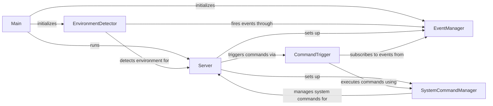

## Component Details

The Core Management component in OctoPrint is responsible for the application's initialization, coordination, and overall lifecycle. It encompasses the main entry point, server setup, environment detection, event management, and system command execution. This component ensures the smooth operation of OctoPrint by managing the interaction between various subsystems and providing core functionalities.

### Main
The entry point of the OctoPrint application. It initializes the platform, settings, logging, and other core components before starting the server.
- **Related Classes/Methods**: `OctoPrint.src.octoprint:init_platform`, `OctoPrint.src.octoprint:init_settings`, `OctoPrint.src.octoprint:preinit_logging`, `OctoPrint.src.octoprint:init_logging`, `OctoPrint.src.octoprint:octoprint_plugin_inject_factory`, `OctoPrint.src.octoprint:settings_plugin_inject_factory`, `OctoPrint.src.octoprint:init_settings_plugin_config_migration_and_cleanup`, `OctoPrint.src.octoprint:init_webcam_compat_overlay`, `OctoPrint.src.octoprint:init_custom_events`, `OctoPrint.src.octoprint:set_logging_config`, `OctoPrint.src.octoprint:init_pluginsystem`, `OctoPrint.src.octoprint:get_plugin_blacklist`, `OctoPrint.src.octoprint:init_event_manager`, `OctoPrint.src.octoprint:init_connectivity_checker`, `OctoPrint.src.octoprint:init_environment_detector`, `OctoPrint.src.octoprint:main`

### Server
The core server component of OctoPrint. It handles the setup of the Flask application, manages plugins, sets up the printer connection, and starts the Tornado web server. It orchestrates the various subsystems to provide the OctoPrint functionality.
- **Related Classes/Methods**: `OctoPrint.src.octoprint.server.Server:__init__`, `OctoPrint.src.octoprint.server.Server:run`, `OctoPrint.src.octoprint.server.Server:_setup_heartbeat_logging`, `OctoPrint.src.octoprint.server.Server:_setup_monkey_patching`, `OctoPrint.src.octoprint.server.Server:_setup_flask_app`, `OctoPrint.src.octoprint.server.Server:_setup_i18n`, `OctoPrint.src.octoprint.server.Server:_setup_analysis_queue`, `OctoPrint.src.octoprint.server.Server:_setup_slicing_manager`, `OctoPrint.src.octoprint.server.Server:_setup_storage_managers`, `OctoPrint.src.octoprint.server.Server:_setup_file_manager`, `OctoPrint.src.octoprint.server.Server:_setup_json_encoding`, `OctoPrint.src.octoprint.server.Server:_setup_plugin_permissions`, `OctoPrint.src.octoprint.server.Server:_setup_group_manager`, `OctoPrint.src.octoprint.server.Server:_setup_user_manager`, `OctoPrint.src.octoprint.server.Server:_setup_printer`, `OctoPrint.src.octoprint.server.Server:_setup_plugin_manager`, `OctoPrint.src.octoprint.server.Server:_setup_jinja2`, `OctoPrint.src.octoprint.server.Server:_register_template_plugins`, `OctoPrint.src.octoprint.server.Server:_register_additional_template_plugin`, `OctoPrint.src.octoprint.server.Server:_setup_assets`, `OctoPrint.src.octoprint.server.Server:_prepare_asset_plugins`, `OctoPrint.src.octoprint.server.Server:_setup_timelapse`, `OctoPrint.src.octoprint.server.Server:_setup_command_triggers`, `OctoPrint.src.octoprint.server.Server:_setup_login_manager`, `OctoPrint.src.octoprint.server.Server:_setup_blueprints`, `OctoPrint.src.octoprint.server.Server:_prepare_blueprint_plugins`, `OctoPrint.src.octoprint.server.Server:_add_plugin_request_handlers_to_blueprints`, `OctoPrint.src.octoprint.server.Server:_setup_tornado_app`, `OctoPrint.src.octoprint.server.Server:_get_server_handlers`, `OctoPrint.src.octoprint.server.Server:_get_header_transforms`, `OctoPrint.src.octoprint.server.Server:_initialize_and_bind_server`, `OctoPrint.src.octoprint.server.Server:_start_analysis_backlog`, `OctoPrint.src.octoprint.server.Server:_start_serial_autoconnect`, `OctoPrint.src.octoprint.server.Server:_start_serial_autorefresh`, `OctoPrint.src.octoprint.server.Server:_start_watched_observer`, `OctoPrint.src.octoprint.server.Server:_trigger_after_startup`, `OctoPrint.src.octoprint.server.Server:_register_shutdown_handlers`, `OctoPrint.src.octoprint.server.Server:_call_startup_plugins`, `OctoPrint.src.octoprint.server.Server:_call_afterstartup_plugins`, `OctoPrint.src.octoprint.server.Server:_call_shutdown_plugins`, `OctoPrint.src.octoprint.server.Server:_start_intermediary_server`, `OctoPrint.src.octoprint.server.Server:_create_socket_connection`, `OctoPrint.src.octoprint.server.Server:_execute_preemptive_flask_caching`

### EnvironmentDetector
Detects the operating system and Python environment. It gathers information about the system and logs it, notifying plugins about the detected environment.
- **Related Classes/Methods**: `OctoPrint.src.octoprint.environment.EnvironmentDetector:environment`, `OctoPrint.src.octoprint.environment.EnvironmentDetector:run_detection`, `OctoPrint.src.octoprint.environment.EnvironmentDetector:_detect_os`, `OctoPrint.src.octoprint.environment.EnvironmentDetector:_detect_python`, `OctoPrint.src.octoprint.environment.EnvironmentDetector:log_detected_environment`, `OctoPrint.src.octoprint.environment.EnvironmentDetector:_format`, `OctoPrint.src.octoprint.environment.EnvironmentDetector:notify_plugins`

### EventManager
Manages events within OctoPrint. It allows registering events, firing events, and handling event subscriptions. It's a central point for communication between different parts of the system.
- **Related Classes/Methods**: `OctoPrint.src.octoprint.events.Events:register_event`, `OctoPrint.src.octoprint.events:eventManager`, `OctoPrint.src.octoprint.events.EventManager:_work`, `OctoPrint.src.octoprint.events.EventManager:fire`, `OctoPrint.src.octoprint.events.GenericEventListener:subscribe`, `OctoPrint.src.octoprint.events.GenericEventListener:unsubscribe`

### SystemCommandManager
Manages system commands such as restart and shutdown. It provides methods to execute commands and check for their availability.
- **Related Classes/Methods**: `OctoPrint.src.octoprint.systemcommands:system_command_manager`, `OctoPrint.src.octoprint.systemcommands.SystemCommandManager:__init__`, `OctoPrint.src.octoprint.systemcommands.SystemCommandManager:execute`, `OctoPrint.src.octoprint.systemcommands.SystemCommandManager:get_command`, `OctoPrint.src.octoprint.systemcommands.SystemCommandManager:has_command`, `OctoPrint.src.octoprint.systemcommands.SystemCommandManager:get_server_restart_command`, `OctoPrint.src.octoprint.systemcommands.SystemCommandManager:get_system_restart_command`, `OctoPrint.src.octoprint.systemcommands.SystemCommandManager:get_system_shutdown_command`, `OctoPrint.src.octoprint.systemcommands.SystemCommandManager:has_server_restart_command`, `OctoPrint.src.octoprint.systemcommands.SystemCommandManager:has_system_restart_command`, `OctoPrint.src.octoprint.systemcommands.SystemCommandManager:has_system_shutdown_command`, `OctoPrint.src.octoprint.systemcommands.SystemCommandManager:perform_server_restart`, `OctoPrint.src.octoprint.systemcommands.SystemCommandManager:perform_system_restart`, `OctoPrint.src.octoprint.systemcommands.SystemCommandManager:perform_system_shutdown`

### CommandTrigger
Triggers commands based on events. It subscribes to specific events and executes predefined commands when those events occur.
- **Related Classes/Methods**: `OctoPrint.src.octoprint.events.CommandTrigger:__init__`, `OctoPrint.src.octoprint.events.CommandTrigger:_initSubscriptions`, `OctoPrint.src.octoprint.events.CommandTrigger:eventCallback`, `OctoPrint.src.octoprint.events.CommandTrigger:executeCommand`, `OctoPrint.src.octoprint.events.CommandTrigger:_executeSystemCommand`
