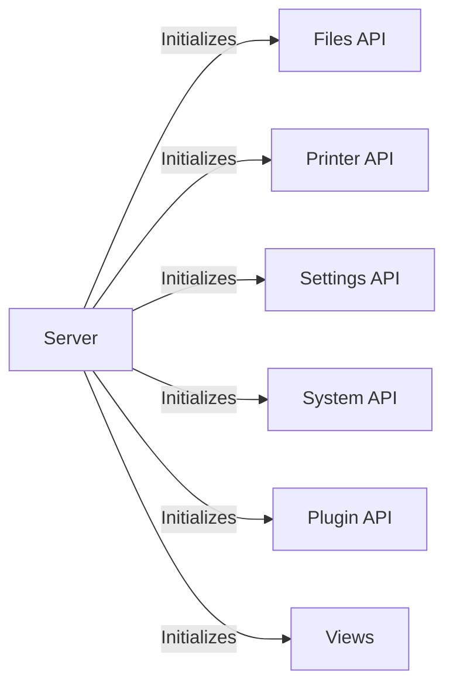

## Component Details

The Core Server component in OctoPrint is responsible for managing the entire OctoPrint instance. It initializes and coordinates various sub-systems, including the web server, plugin manager, settings, and printer communication. It handles the main application loop and orchestrates the interaction between different components. The server exposes API endpoints for file management, printer control, settings, system information, and plugins. It also manages the web interface views and rendering.

### Server
The central class responsible for initializing and running the OctoPrint server. It sets up all necessary components, including the web application, printer interface, plugin manager, and various other managers. It also handles the main event loop and manages the server lifecycle.
- **Related Classes/Methods**: `OctoPrint.src.octoprint.server.Server`

### Files API
Handles API endpoints related to file management, including reading, uploading, and deleting G-code files. It interacts with the file manager to perform these operations.
- **Related Classes/Methods**: `OctoPrint.src.octoprint.server.api.files`

### Printer API
Handles API endpoints related to printer control and status. It provides access to printer state information and allows sending commands to the printer.
- **Related Classes/Methods**: `OctoPrint.src.octoprint.server.api.printer`

### Settings API
Handles API endpoints for retrieving and modifying OctoPrint settings. It interacts with the settings manager to manage the application's configuration.
- **Related Classes/Methods**: `OctoPrint.src.octoprint.server.api.settings`

### System API
Handles API endpoints related to system information, such as version details and resource usage.
- **Related Classes/Methods**: `OctoPrint.src.octoprint.server.api.system`

### Plugin API
Handles API endpoints for plugins. Allows plugins to expose data and commands through the API.
- **Related Classes/Methods**: `OctoPrint.src.octoprint.server.api`

### Views
Handles the web interface views and rendering. It serves the HTML, CSS, and JavaScript files for the user interface.
- **Related Classes/Methods**: `OctoPrint.src.octoprint.server.views`
