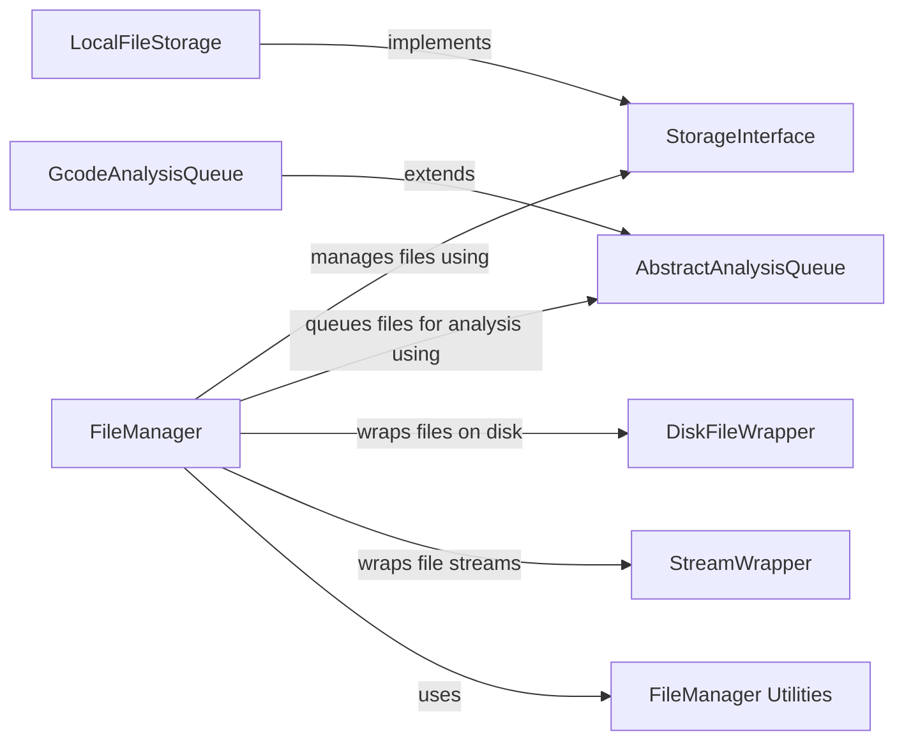

## Component Details

The Data Handling component in OctoPrint manages the storage, organization, analysis, and retrieval of files, primarily G-code files, which are essential for 3D printing. It provides a unified interface for interacting with various storage implementations, such as local file storage, and integrates with analysis queues to extract valuable information from the files, like print time and material usage. This component ensures efficient file management and prepares models for printing by handling metadata extraction and analysis.

### FileManager
The central component responsible for managing files within OctoPrint. It provides a unified interface for file operations, including storage, retrieval, organization, and analysis. It interacts with different storage implementations (e.g., LocalFileStorage) and analysis queues (e.g., GcodeAnalysisQueue) to provide a comprehensive file management system.
- **Related Classes/Methods**: `OctoPrint.src.octoprint.filemanager.FileManager`

### LocalFileStorage
Handles file storage on the local disk. It implements the StorageInterface and provides methods for interacting with the local file system, including adding, removing, copying, and moving files and folders. It also manages file metadata and history, ensuring data integrity and providing a reliable storage solution.
- **Related Classes/Methods**: `OctoPrint.src.octoprint.filemanager.storage.LocalFileStorage`

### StorageInterface
Defines the interface for file storage implementations. It specifies the methods that storage implementations must implement, such as adding, removing, copying, and moving files and folders. This interface promotes modularity and allows for different storage backends to be easily integrated into the file management system.
- **Related Classes/Methods**: `OctoPrint.src.octoprint.filemanager.storage.StorageInterface`

### GcodeAnalysisQueue
Implements an analysis queue specifically for G-code files. It extends the AbstractAnalysisQueue and provides methods for analyzing G-code files to extract information such as print time and material usage. This analysis is crucial for providing users with accurate estimates and optimizing printing parameters.
- **Related Classes/Methods**: `OctoPrint.src.octoprint.filemanager.analysis.GcodeAnalysisQueue`

### AbstractAnalysisQueue
Abstract base class for analysis queues. It provides a framework for queuing and processing files for analysis. It manages the analysis backlog and ensures that files are analyzed in a timely manner, providing a foundation for various file analysis tasks within OctoPrint.
- **Related Classes/Methods**: `OctoPrint.src.octoprint.filemanager.analysis.AbstractAnalysisQueue`

### DiskFileWrapper
Wraps a file on disk to provide a consistent interface for file access. It is used by the file manager to interact with files stored on the local file system, abstracting away the complexities of direct file system interaction and ensuring consistent behavior across different file operations.
- **Related Classes/Methods**: `OctoPrint.src.octoprint.filemanager.util.DiskFileWrapper`

### StreamWrapper
Wraps a file stream to provide a consistent interface for file access. It is used by the file manager to interact with files, regardless of their storage location, enabling the system to handle files from various sources in a uniform manner.
- **Related Classes/Methods**: `OctoPrint.src.octoprint.filemanager.util.StreamWrapper`

### FileManager Utilities
A collection of utility functions for file management, including functions for getting file extensions, content type mappings, and validating file types. These utilities provide essential support for the file management operations performed by the FileManager and other related components.
- **Related Classes/Methods**: `OctoPrint.src.octoprint.filemanager`
