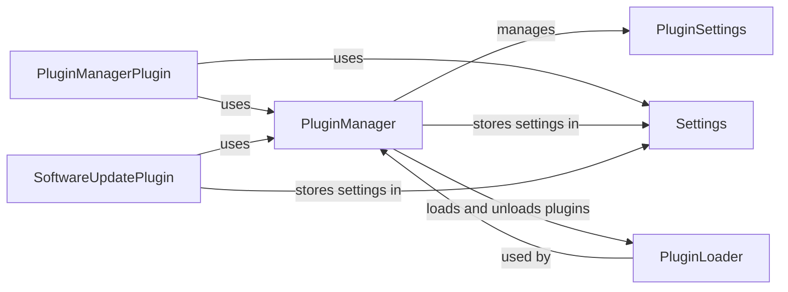

## Component Details

The Extensibility and Configuration subsystem in OctoPrint allows users to enhance the printer's functionality through plugins and customize its behavior via settings. The core components manage the plugin lifecycle, including discovery, installation, loading, and unloading, while also providing an API for plugins to interact with the system. Configuration management handles the storage and retrieval of settings, both for the core system and individual plugins, ensuring a flexible and customizable environment.

### PluginManager
The PluginManager is responsible for managing the lifecycle of plugins within OctoPrint. It handles tasks such as discovering available plugins, installing new plugins, loading and unloading plugins, and managing plugin dependencies. It interacts with the Settings component to persist plugin configurations and utilizes the PluginLoader to handle plugin imports and dependency resolution.
- **Related Classes/Methods**: `OctoPrint.src.octoprint.plugin.core.PluginManager`

### PluginSettings
The PluginSettings component provides a mechanism for individual plugins to store and retrieve their own settings within the OctoPrint configuration system. It offers methods for accessing and managing plugin-specific data, leveraging the Settings component for data persistence. This allows plugins to maintain their state and customize their behavior based on user preferences.
- **Related Classes/Methods**: `OctoPrint.src.octoprint.plugin.PluginSettings`

### PluginManagerPlugin
The PluginManagerPlugin is a plugin that provides a user interface and API endpoints for managing plugins through the OctoPrint web interface. It interacts with the PluginManager to perform plugin-related actions based on user requests, such as installing, uninstalling, enabling, or disabling plugins. It also uses the Settings component to manage its own configuration, such as the plugin repository URL.
- **Related Classes/Methods**: `OctoPrint.src.octoprint.plugins.pluginmanager.PluginManagerPlugin`

### Settings
The Settings component is responsible for managing the overall OctoPrint configuration, including core settings and plugin settings. It provides methods for loading, saving, and accessing settings data from a persistent storage. It acts as a central point for managing application-wide configurations and provides a consistent interface for plugins to access their settings.
- **Related Classes/Methods**: `OctoPrint.src.octoprint.settings.Settings`

### SoftwareUpdatePlugin
The SoftwareUpdatePlugin handles checking for and performing software updates for OctoPrint and its plugins. It interacts with the settings system to store update configurations and status. It uses the PluginManager to identify plugins for updates and the Settings class for storing update configurations.
- **Related Classes/Methods**: `OctoPrint.src.octoprint.plugins.softwareupdate.SoftwareUpdatePlugin`

### PluginLoader
The PluginLoader is responsible for loading plugin modules, resolving dependencies, and handling plugin imports. It is used by the PluginManager to load and unload plugins.
- **Related Classes/Methods**: `OctoPrint.src.octoprint.plugin.core.PluginLoader`
