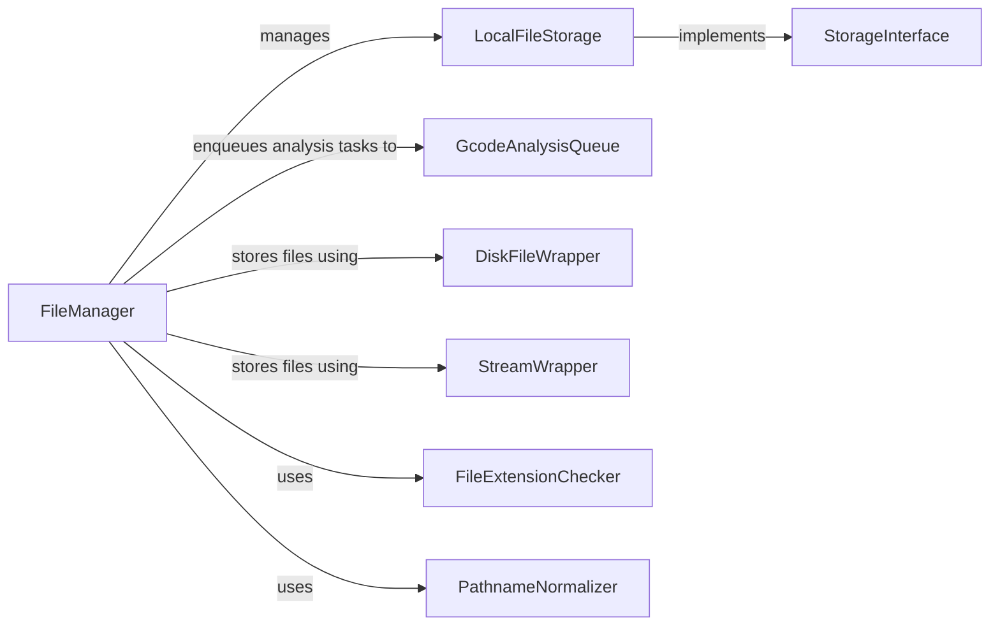

## Component Details

The File Management subsystem in OctoPrint is responsible for handling all file-related operations, including storage, retrieval, analysis, and organization of files used for 3D printing. It provides an abstraction layer for different storage backends, manages file metadata, and integrates with analysis tools to extract information from G-code files. The subsystem ensures consistent file access and management across the OctoPrint platform.

### FileManager
The FileManager is the central component responsible for coordinating file operations within OctoPrint. It manages file storage, retrieval, organization, and analysis. It interacts with storage backends like LocalFileStorage, queues analysis tasks using GcodeAnalysisQueue, and provides a unified interface for accessing and manipulating files.
- **Related Classes/Methods**: `OctoPrint.src.octoprint.filemanager.FileManager`

### LocalFileStorage
LocalFileStorage handles file storage on the local disk. It implements the StorageInterface and provides methods for file manipulation, metadata management, and path handling. It is responsible for storing files, retrieving them, and managing their associated metadata on the local filesystem.
- **Related Classes/Methods**: `OctoPrint.src.octoprint.filemanager.storage.LocalFileStorage`

### StorageInterface
The StorageInterface defines the contract for file storage backends. It specifies the methods that storage implementations must provide, such as save, delete, get, and list files. This interface allows OctoPrint to support different storage solutions in a modular way.
- **Related Classes/Methods**: `OctoPrint.src.octoprint.filemanager.storage.StorageInterface`

### GcodeAnalysisQueue
GcodeAnalysisQueue is responsible for queuing and processing G-code file analysis tasks. It extends AbstractAnalysisQueue and performs G-code specific analysis, such as extracting print time estimates and material usage. It allows OctoPrint to analyze G-code files in the background without blocking the main thread.
- **Related Classes/Methods**: `OctoPrint.src.octoprint.filemanager.analysis.GcodeAnalysisQueue`

### DiskFileWrapper
DiskFileWrapper wraps a file on disk to provide a consistent interface for file access. It encapsulates the file object and provides methods for reading and writing data. This wrapper ensures that file operations are handled consistently regardless of the underlying file type.
- **Related Classes/Methods**: `OctoPrint.src.octoprint.filemanager.util.DiskFileWrapper`

### StreamWrapper
StreamWrapper wraps a file stream to provide a consistent interface for file access. It encapsulates the stream object and provides methods for reading and writing data. This wrapper ensures that file operations are handled consistently regardless of the underlying stream type.
- **Related Classes/Methods**: `OctoPrint.src.octoprint.filemanager.util.StreamWrapper`

### FileExtensionChecker
FileExtensionChecker provides functionality to check file extensions against allowed or disallowed lists. It is used to ensure that only valid file types are uploaded and processed by OctoPrint. This component helps to prevent security vulnerabilities and ensures that only supported file formats are used.
- **Related Classes/Methods**: `OctoPrint.src.octoprint.filemanager.FileExtensionChecker`

### PathnameNormalizer
PathnameNormalizer normalizes pathnames to ensure consistency across different platforms. It converts pathnames to a standard format, regardless of the operating system. This component ensures that file paths are handled correctly and consistently across different environments.
- **Related Classes/Methods**: `OctoPrint.src.octoprint.filemanager.PathnameNormalizer`
