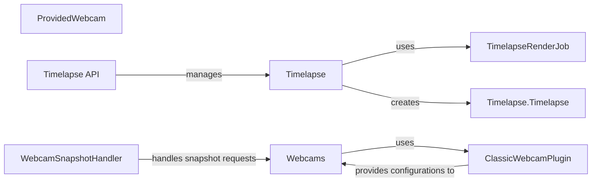

## Component Details

The Monitoring and Media Capture subsystem in OctoPrint provides functionalities for capturing and rendering timelapses of prints and managing and accessing webcams. It allows users to visually monitor and record their prints, enhancing the user experience. The core flow involves configuring timelapse settings, capturing frames during printing, rendering videos, and providing access to webcam streams and snapshots. The system integrates with printer events to trigger captures and provides API endpoints for controlling and accessing timelapse and webcam functionalities.

### Webcams
The Webcams component manages webcams connected to OctoPrint. It provides functionalities to retrieve webcam configurations, access webcam streams, and capture snapshots. It interacts with plugins like ClassicWebcamPlugin to obtain webcam configurations and provides a unified interface for accessing webcams.
- **Related Classes/Methods**: `OctoPrint.src.octoprint.webcams`

### ProvidedWebcam
The ProvidedWebcam component represents a webcam provided to OctoPrint, encapsulating its configuration and access details. It stores information such as stream URL, snapshot URL, and rotation settings.
- **Related Classes/Methods**: `OctoPrint.src.octoprint.webcams.ProvidedWebcam:__init__`

### Timelapse
The Timelapse component handles the creation, rendering, and management of timelapse videos. It includes functions for starting and stopping timelapses, capturing frames, rendering videos, and deleting old or unrendered timelapses. It interacts with the rendering queue and provides callbacks for notifications. It also manages different timelapse modes such as Z-change and timed timelapses.
- **Related Classes/Methods**: `OctoPrint.src.octoprint.timelapse`

### Timelapse.Timelapse
The Timelapse.Timelapse component represents a specific timelapse instance and handles the capturing of frames during printing. It manages the capture queue, performs the actual capture, and cleans up the capture directory. It interacts with the printer's events (print started, done, resumed) to trigger capture.
- **Related Classes/Methods**: `OctoPrint.src.octoprint.timelapse.Timelapse:__init__`, `OctoPrint.src.octoprint.timelapse.Timelapse:unload`, `OctoPrint.src.octoprint.timelapse.Timelapse:on_print_started`, `OctoPrint.src.octoprint.timelapse.Timelapse:on_print_done`, `OctoPrint.src.octoprint.timelapse.Timelapse:on_print_resumed`, `OctoPrint.src.octoprint.timelapse.Timelapse:stop_timelapse`, `OctoPrint.src.octoprint.timelapse.Timelapse:process_post_roll`, `OctoPrint.src.octoprint.timelapse.Timelapse:post_roll_finished`, `OctoPrint.src.octoprint.timelapse.Timelapse:_capture_queue_worker`, `OctoPrint.src.octoprint.timelapse.Timelapse:_perform_capture`, `OctoPrint.src.octoprint.timelapse.Timelapse:_copying_postroll`, `OctoPrint.src.octoprint.timelapse.Timelapse:clean_capture_dir`

### TimelapseRenderJob
The TimelapseRenderJob component handles the rendering of timelapse videos. It processes the captured frames using ffmpeg, generates thumbnails, and manages the rendering process. It interacts with the file system and external processes (ffmpeg).
- **Related Classes/Methods**: `OctoPrint.src.octoprint.timelapse.TimelapseRenderJob:process`, `OctoPrint.src.octoprint.timelapse.TimelapseRenderJob:_render`, `OctoPrint.src.octoprint.timelapse.TimelapseRenderJob:_process_ffmpeg_output`, `OctoPrint.src.octoprint.timelapse.TimelapseRenderJob:_try_generate_thumbnail`, `OctoPrint.src.octoprint.timelapse.TimelapseRenderJob:_create_ffmpeg_command_string`

### Timelapse API
The Timelapse API component provides API endpoints for accessing and controlling timelapse functionality. It includes endpoints for retrieving timelapse data, downloading timelapses, deleting timelapses, and setting timelapse configurations. It interacts with the Timelapse module to manage timelapses.
- **Related Classes/Methods**: `OctoPrint.src.octoprint.server.api.timelapse:_lastmodified`, `OctoPrint.src.octoprint.server.api.timelapse:_etag`, `OctoPrint.src.octoprint.server.api.timelapse:getTimelapseData`, `OctoPrint.src.octoprint.server.api.timelapse:downloadTimelapse`, `OctoPrint.src.octoprint.server.api.timelapse:deleteTimelapse`, `OctoPrint.src.octoprint.server.api.timelapse:deleteUnrenderedTimelapse`, `OctoPrint.src.octoprint.server.api.timelapse:processUnrenderedTimelapseCommand`, `OctoPrint.src.octoprint.server.api.timelapse:setTimelapseConfig`

### WebcamSnapshotHandler
The WebcamSnapshotHandler component handles requests for webcam snapshots. It retrieves snapshots from the configured webcam and serves them to the client.
- **Related Classes/Methods**: `OctoPrint.src.octoprint.server.util.tornado.WebcamSnapshotHandler:initialize`, `OctoPrint.src.octoprint.server.util.tornado.WebcamSnapshotHandler:get`

### ClassicWebcamPlugin
The ClassicWebcamPlugin component provides support for classic webcams. It handles webcam configurations, takes snapshots, and manages settings. It interacts with the Webcams module to provide webcam configurations.
- **Related Classes/Methods**: `OctoPrint.src.octoprint.plugins.classicwebcam.ClassicWebcamPlugin:get_webcam_configurations`, `OctoPrint.src.octoprint.plugins.classicwebcam.ClassicWebcamPlugin:_can_snapshot`, `OctoPrint.src.octoprint.plugins.classicwebcam.ClassicWebcamPlugin:take_webcam_snapshot`, `OctoPrint.src.octoprint.plugins.classicwebcam.ClassicWebcamPlugin:on_settings_save`, `OctoPrint.src.octoprint.plugins.classicwebcam.ClassicWebcamPlugin:is_wizard_required`
