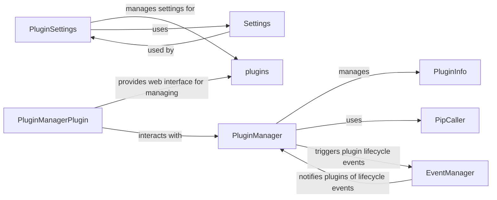

## Component Details

The Plugin Management subsystem in OctoPrint enables extending the core functionality through plugins. It handles the discovery, installation, loading, and management of plugins, providing an API for plugins to interact with the system and other plugins. The core flow involves the PluginManager discovering plugins, using PluginInfo to store plugin metadata, and utilizing PipCaller for installation/uninstallation. PluginSettings manages plugin-specific configurations, while the EventManager handles plugin lifecycle events. The PluginManagerPlugin provides a web interface for managing plugins.

### PluginManager
The PluginManager is the central component responsible for discovering, loading, unloading, enabling, and disabling plugins. It maintains a registry of plugins and their metadata, handles plugin activation/deactivation, and manages dependencies. It uses PluginInfo to manage plugin metadata, PipCaller to install/uninstall plugins, and the EventManager to trigger plugin lifecycle events.
- **Related Classes/Methods**: `OctoPrint.src.octoprint.plugin.core.PluginManager`

### PluginInfo
PluginInfo stores metadata about a plugin, such as its name, version, author, description, and dependencies. It is used by the PluginManager to keep track of plugin information and to determine compatibility and dependencies. It extracts metadata from the plugin's setup.py or plugin file.
- **Related Classes/Methods**: `OctoPrint.src.octoprint.plugin.core.PluginInfo`

### PluginSettings
PluginSettings manages the settings for individual plugins. It provides methods for loading, saving, and cleaning up plugin settings data. It interacts with the Settings component in OctoPrint to persist plugin-specific configurations.
- **Related Classes/Methods**: `OctoPrint.src.octoprint.plugin.PluginSettings`

### PipCaller
PipCaller is a utility class for interacting with the pip package manager. It is used by the PluginManager to install, uninstall, and update plugins. It provides methods for executing pip commands and managing the pip environment.
- **Related Classes/Methods**: `OctoPrint.src.octoprint.util.pip.PipCaller`

### PluginManagerPlugin
The PluginManagerPlugin is a plugin itself that provides a web interface for managing plugins. It allows users to install, uninstall, enable, and disable plugins through the OctoPrint web interface. It interacts with the PluginManager to perform plugin management operations and provides API endpoints for the web interface.
- **Related Classes/Methods**: `OctoPrint.src.octoprint.plugins.pluginmanager.PluginManagerPlugin`

### Settings
The Settings component provides access to OctoPrint's settings. It is used by PluginSettings to store and retrieve plugin-specific settings.
- **Related Classes/Methods**: `OctoPrint.src.octoprint.settings`

### EventManager
The EventManager is responsible for managing events within OctoPrint. Plugins can register for events and receive notifications when those events occur. The PluginManager uses the EventManager to notify plugins of lifecycle events, such as when a plugin is loaded or unloaded.
- **Related Classes/Methods**: `OctoPrint.src.octoprint.events.EventManager`, `OctoPrint.src.octoprint.events.Events`
