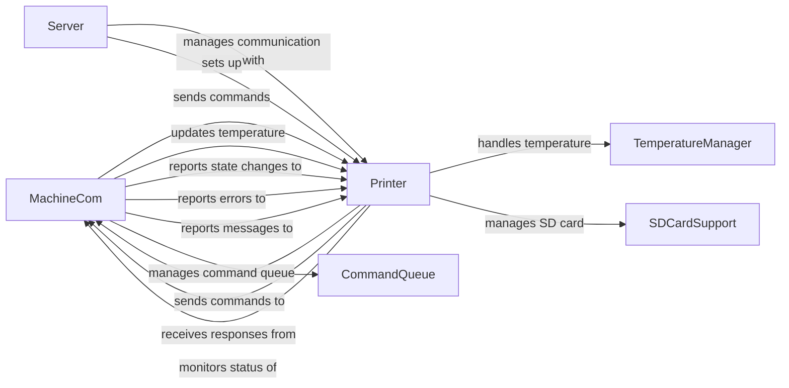

## Component Details

The Printer Control subsystem manages the communication between OctoPrint and the 3D printer. It encompasses sending G-code commands, receiving printer status updates, managing the printing process, monitoring temperature, handling SD card interactions, and ensuring error handling. The core components involved are MachineCom for serial communication, Printer for managing printer state and actions, Server for handling API requests, CommandQueue for managing G-code commands, and TemperatureManager for temperature control.

### MachineCom
The `MachineCom` class is responsible for managing the serial communication with the 3D printer. It handles sending commands, receiving responses, managing the command queue, and monitoring the printer's status. It also deals with temperature updates, resend requests, and error handling.
- **Related Classes/Methods**: `OctoPrint.src.octoprint.util.comm.MachineCom`

### Printer
The `Printer` class represents the 3D printer and manages its state, including connection status, printing status, and SD card status. It provides methods for connecting to and disconnecting from the printer, starting, pausing, resuming, and canceling prints, and initializing and releasing the SD card. It also handles communication log, temperature updates, state changes, errors, and messages from the `MachineCom` component.
- **Related Classes/Methods**: `OctoPrint.src.octoprint.printer.standard.Printer`

### Server
The `Server` class is responsible for setting up the printer instance and handling API requests related to printer control.
- **Related Classes/Methods**: `OctoPrint.src.octoprint.server.Server`

### CommandQueue
The `CommandQueue` within `MachineCom` manages the queue of G-code commands to be sent to the printer, ensuring they are sent in the correct order and handling resend requests.
- **Related Classes/Methods**: `OctoPrint.src.octoprint.util.comm.MachineCom`

### TemperatureManager
The `TemperatureManager` handles temperature monitoring and control, receiving temperature updates from the printer and allowing the user to set target temperatures.
- **Related Classes/Methods**: `OctoPrint.src.octoprint.printer.standard.Printer`

### SDCardSupport
The `SDCardSupport` manages the SD card functionality of the printer, including initializing the SD card, listing files, and starting prints from the SD card.
- **Related Classes/Methods**: `OctoPrint.src.octoprint.printer.standard.Printer`
