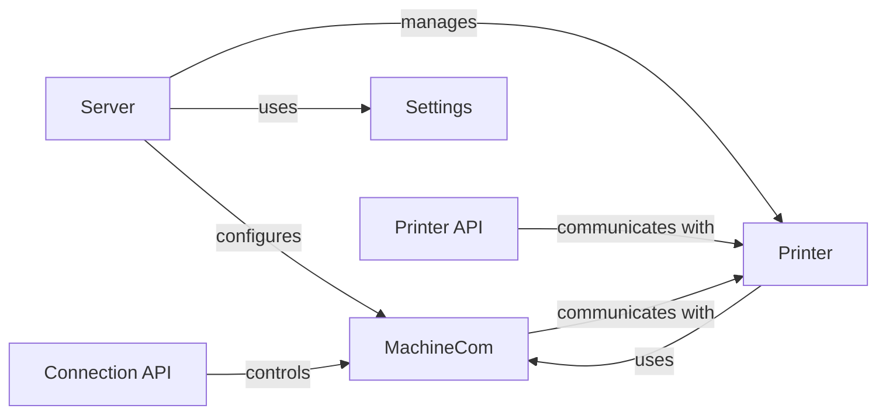

## Component Details

The Printer Management subsystem in OctoPrint is responsible for handling all communication and control aspects of the connected 3D printer. It manages the serial connection, translates user commands into G-code, monitors printer status, and handles temperature control, SD card operations, and error reporting. The core components work together to provide a reliable and responsive interface between the OctoPrint server and the physical printer.

### MachineCom
MachineCom manages the serial communication with the 3D printer. It establishes and maintains the serial connection, sends G-code commands, receives responses from the printer, and handles low-level communication details such as resend requests and error detection. It also monitors the printer's state and temperature, updating the Printer component accordingly.
- **Related Classes/Methods**: `OctoPrint.src.octoprint.util.comm.MachineCom`

### Printer
The Printer component represents the 3D printer and its current state. It provides a high-level interface for sending commands to the printer, managing print jobs, and accessing printer status information. It receives events and data from MachineCom, updates its internal state, and provides an API for other components to interact with the printer.
- **Related Classes/Methods**: `OctoPrint.src.octoprint.printer.standard.Printer`

### Server
The Server component is the central hub of OctoPrint. It initializes and manages the Printer and MachineCom components, sets up the serial connection, and provides API endpoints for controlling the printer. It also handles settings and autoconnect/autorefresh functionalities, ensuring that the printer is properly configured and connected.
- **Related Classes/Methods**: `OctoPrint.src.octoprint.server.Server`

### Settings
The Settings component manages OctoPrint's configuration settings. It provides access to configuration values related to printer communication, server behavior, and other aspects of the system. The Server and MachineCom components use Settings to retrieve and store configuration data.
- **Related Classes/Methods**: `OctoPrint.src.octoprint.settings.Settings`

### Connection API
The Connection API provides API endpoints for managing the connection to the 3D printer. It allows users to connect, disconnect, and get the current connection state. It interacts with the MachineCom component to control the serial connection.
- **Related Classes/Methods**: `OctoPrint.src.octoprint.server.api.connection`

### Printer API
The Printer API provides API endpoints for controlling the 3D printer. It allows users to send commands, start/pause/cancel prints, and access printer status information. It interacts with the Printer component to control the printer's behavior.
- **Related Classes/Methods**: `OctoPrint.src.octoprint.server.api.printer`
