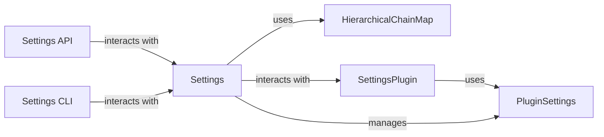

## Component Details

The Settings Management subsystem in OctoPrint is responsible for handling the application's configuration. It provides a centralized way to manage both core settings and plugin-specific settings. The subsystem allows for reading, modifying, and storing settings, ensuring that the application and its plugins can be configured according to user preferences and system requirements. It uses a hierarchical structure to manage settings, allowing for defaults and overrides. The settings can be accessed and modified through the web interface (Settings API) and the command-line interface (Settings CLI).

### Settings
The central component responsible for managing OctoPrint's settings. It handles loading settings from disk, applying overlays, providing access to settings values, and saving settings back to disk. It uses HierarchicalChainMap to manage the settings hierarchy and interacts with the plugin system to load and save plugin-specific settings.
- **Related Classes/Methods**: `OctoPrint.src.octoprint.settings.Settings`

### HierarchicalChainMap
A data structure that manages settings in a hierarchical manner, allowing for overlays and defaults. It provides methods for accessing, modifying, and deleting settings values within the hierarchy. It is used by the Settings component to store and manage the settings data.
- **Related Classes/Methods**: `OctoPrint.src.octoprint.settings.HierarchicalChainMap`

### SettingsPlugin
An abstract class that plugins can inherit from to provide their own settings. It defines methods for loading, saving, and cleaning up plugin-specific settings. The Settings component interacts with plugins through this interface to manage their settings.
- **Related Classes/Methods**: `OctoPrint.src.octoprint.plugin.types.SettingsPlugin`

### PluginSettings
Manages the settings for a specific plugin. It provides methods for accessing and modifying plugin settings, as well as for retrieving the plugin's data folder. It is used by the Settings component and the SettingsPlugin to manage plugin-specific settings.
- **Related Classes/Methods**: `OctoPrint.src.octoprint.plugin.PluginSettings`

### Settings API
Provides API endpoints for accessing and modifying settings via the web interface. It handles requests to get and set settings, generate API keys, and fetch template data. It interacts with the Settings component to retrieve and update settings values.
- **Related Classes/Methods**: `OctoPrint.src.octoprint.server.api.settings`

### Settings CLI
Provides command-line interface for interacting with settings. It allows users to get, set, remove, append, insert, and remove values from the settings. It interacts with the Settings component to perform these operations.
- **Related Classes/Methods**: `OctoPrint.src.octoprint.cli.config`
