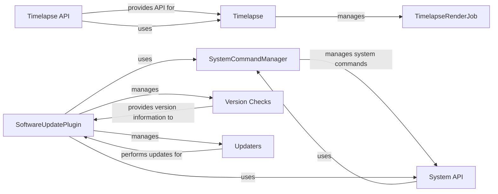

## Component Details

The System Management component in OctoPrint provides functionalities for managing the system, creating timelapses, and handling software updates. It allows users to control system-level commands, capture and render timelapses of prints, and update OctoPrint and its plugins. The core components include SystemCommandManager for managing system commands, Timelapse for capturing and rendering timelapses, and SoftwareUpdatePlugin for managing software updates. These components interact with each other to provide a comprehensive system management solution.

### SystemCommandManager
The SystemCommandManager component manages system commands, such as restarting the server or shutting down the system. It provides an API for executing these commands and retrieving their specifications. It interacts with the System API to execute commands and the SoftwareUpdatePlugin to perform restarts after updates.
- **Related Classes/Methods**: `OctoPrint.src.octoprint.systemcommands.SystemCommandManager`

### System API
The System API provides endpoints for performing system actions, such as restarting or shutting down the system, and for retrieving system commands. It interacts with the SystemCommandManager to execute commands.
- **Related Classes/Methods**: `OctoPrint.src.octoprint.server.api.system`

### Timelapse
The Timelapse class is the core component for managing timelapse creation. It handles capturing frames, managing the capture directory, and initiating the rendering process. It interacts with the printer's events (start, stop, resume) to trigger frame captures and the TimelapseRenderJob to render the captured frames.
- **Related Classes/Methods**: `OctoPrint.src.octoprint.timelapse.Timelapse`, `OctoPrint.src.octoprint.timelapse.ZTimelapse`, `OctoPrint.src.octoprint.timelapse.TimedTimelapse`

### TimelapseRenderJob
The TimelapseRenderJob class is responsible for rendering the captured frames into a timelapse video. It uses ffmpeg to perform the rendering and handles thumbnail generation. It processes the rendering queue and manages the ffmpeg process. It interacts with the Timelapse component to receive the frames to render.
- **Related Classes/Methods**: `OctoPrint.src.octoprint.timelapse.TimelapseRenderJob`

### Timelapse API
The Timelapse API provides endpoints for accessing and managing timelapses. It allows users to retrieve timelapse data, download timelapses, delete timelapses, and configure timelapse settings. It interacts with the Timelapse component to retrieve and manipulate timelapse data.
- **Related Classes/Methods**: `OctoPrint.src.octoprint.server.api.timelapse`

### SoftwareUpdatePlugin
The SoftwareUpdatePlugin is responsible for managing software updates for OctoPrint and its plugins. It checks for updates, downloads them, and installs them. It interacts with version check components to determine the latest available versions, update components to perform the actual update, the SystemCommandManager to perform restarts, and the System API.
- **Related Classes/Methods**: `OctoPrint.src.octoprint.plugins.softwareupdate.SoftwareUpdatePlugin`

### Version Checks
The Version Checks components are responsible for retrieving the latest available version information from various sources, such as GitHub releases, PyPI, and HTTP headers. They provide the SoftwareUpdatePlugin with the information needed to determine if an update is available.
- **Related Classes/Methods**: `OctoPrint.src.octoprint.plugins.softwareupdate.version_checks.github_release`, `OctoPrint.src.octoprint.plugins.softwareupdate.version_checks.python_checker`, `OctoPrint.src.octoprint.plugins.softwareupdate.version_checks.github_commit`, `OctoPrint.src.octoprint.plugins.softwareupdate.version_checks.httpheader`, `OctoPrint.src.octoprint.plugins.softwareupdate.version_checks.bitbucket_commit`, `OctoPrint.src.octoprint.plugins.softwareupdate.version_checks.jsondata`, `OctoPrint.src.octoprint.plugins.softwareupdate.version_checks.git_commit`, `OctoPrint.src.octoprint.plugins.softwareupdate.version_checks.commandline`, `OctoPrint.src.octoprint.plugins.softwareupdate.version_checks.pypi_release`

### Updaters
The Updaters components are responsible for performing the actual software update process. They handle different update methods, such as updating from source code, using pip, or running update scripts. They are invoked by the SoftwareUpdatePlugin when an update is performed.
- **Related Classes/Methods**: `OctoPrint.src.octoprint.plugins.softwareupdate.updaters.python_updater`, `OctoPrint.src.octoprint.plugins.softwareupdate.updaters.single_file_plugin`, `OctoPrint.src.octoprint.plugins.softwareupdate.updaters.update_script`, `OctoPrint.src.octoprint.plugins.softwareupdate.updaters.pip`
