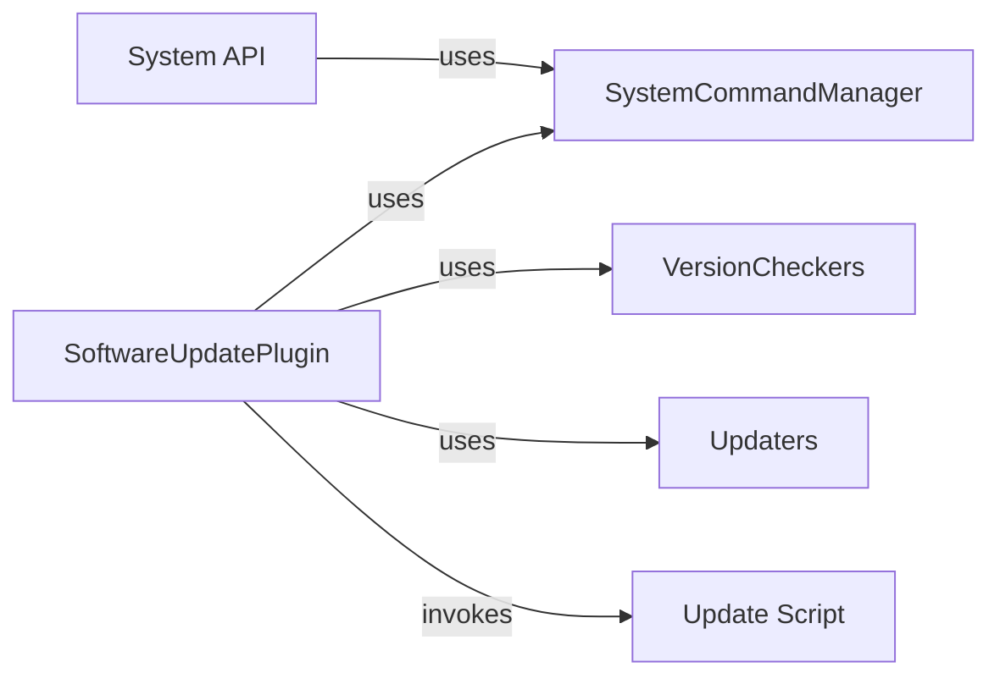

## Component Details

The System Utilities component in OctoPrint manages system-level operations such as software updates and system commands. The SoftwareUpdatePlugin orchestrates the update process by checking for new versions, applying updates, and restarting the server. The SystemCommandManager handles system commands like restarting or shutting down the server, and the System API provides endpoints for executing these commands. VersionCheckers and Updaters are used by the SoftwareUpdatePlugin to check for new versions and apply updates, respectively. The Update Script is invoked by the SoftwareUpdatePlugin to update the OctoPrint source code.

### SoftwareUpdatePlugin
This plugin is responsible for managing the software update process within OctoPrint. It handles checking for updates, applying them, and triggering a server restart if necessary. It interacts with version checkers to determine if updates are available and updaters to apply the updates. It also uses the SystemCommandManager to restart the server after an update.
- **Related Classes/Methods**: `OctoPrint.src.octoprint.plugins.softwareupdate.SoftwareUpdatePlugin`

### SystemCommandManager
The SystemCommandManager is responsible for managing system-level commands, such as restarting the server or shutting down the system. It provides an API for executing commands and retrieving command specifications. The SoftwareUpdatePlugin uses it to restart the server after updates are applied, and the System API uses it to execute commands.
- **Related Classes/Methods**: `OctoPrint.src.octoprint.systemcommands.SystemCommandManager`

### VersionCheckers
Version checkers are modules responsible for checking for new versions of software components. Each checker is tailored to a specific source, such as GitHub releases or PyPI. The SoftwareUpdatePlugin uses these checkers to determine if updates are available for the various components of OctoPrint.
- **Related Classes/Methods**: `OctoPrint.src.octoprint.plugins.softwareupdate.version_checks.github_release`, `OctoPrint.src.octoprint.plugins.softwareupdate.version_checks.python_checker`, `OctoPrint.src.octoprint.plugins.softwareupdate.version_checks.github_commit`, `OctoPrint.src.octoprint.plugins.softwareupdate.version_checks.httpheader`, `OctoPrint.src.octoprint.plugins.softwareupdate.version_checks.bitbucket_commit`, `OctoPrint.src.octoprint.plugins.softwareupdate.version_checks.jsondata`, `OctoPrint.src.octoprint.plugins.softwareupdate.version_checks.git_commit`, `OctoPrint.src.octoprint.plugins.softwareupdate.version_checks.commandline`, `OctoPrint.src.octoprint.plugins.softwareupdate.version_checks.pypi_release`

### Updaters
Updaters are modules that handle the actual update process for different types of software components, such as Python packages or single-file plugins. The SoftwareUpdatePlugin uses these updaters to apply the updates once they have been identified.
- **Related Classes/Methods**: `OctoPrint.src.octoprint.plugins.softwareupdate.updaters.python_updater`, `OctoPrint.src.octoprint.plugins.softwareupdate.updaters.single_file_plugin`, `OctoPrint.src.octoprint.plugins.softwareupdate.updaters.update_script`, `OctoPrint.src.octoprint.plugins.softwareupdate.updaters.pip`

### Update Script
The update script is responsible for updating the OctoPrint source code. It handles tasks such as executing git commands and python commands. The SoftwareUpdatePlugin invokes this script to perform the actual update of the OctoPrint core.
- **Related Classes/Methods**: `OctoPrint.src.octoprint.plugins.softwareupdate.scripts.update-octoprint`

### System API
The System API provides endpoints for retrieving system commands and executing them. It interacts with the SystemCommandManager to retrieve and execute commands. This allows external systems to manage OctoPrint's system-level operations.
- **Related Classes/Methods**: `OctoPrint.src.octoprint.server.api.system`
