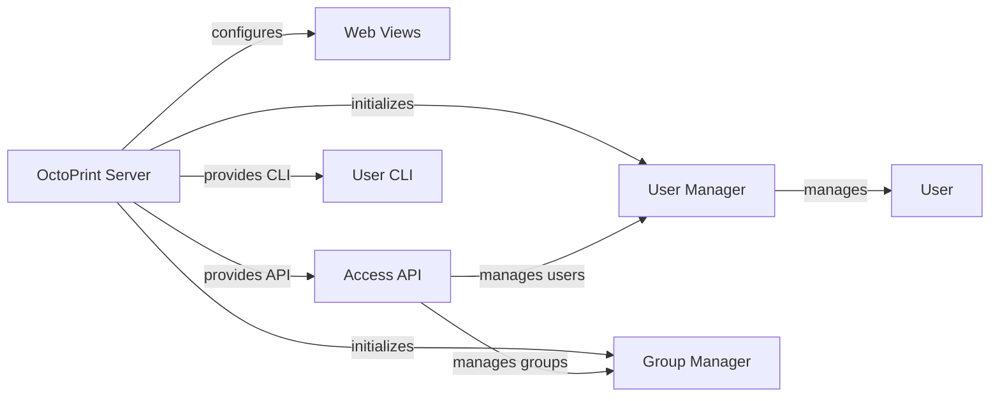

## Component Details

The User Interface and Access component in OctoPrint manages the web-based user interface, user accounts, groups, and permissions. It handles HTTP requests, serves static assets, and provides API endpoints for interacting with the core system. It also manages user authentication, authorization, and session management, ensuring a secure and user-friendly experience. The central point is the OctoPrint server which initializes and configures the user and group managers, web views, and API endpoints.

### OctoPrint Server
The central component responsible for setting up and running the OctoPrint server. It initializes and configures the Flask and Tornado web applications, user and group managers, and manages the server lifecycle.
- **Related Classes/Methods**: `OctoPrint.src.octoprint.server.Server`

### User Manager
Manages user accounts, authentication, and permissions within OctoPrint. It provides methods for creating, updating, deleting, and authenticating users.
- **Related Classes/Methods**: `OctoPrint.src.octoprint.access.users.UserManager`

### Group Manager
Manages user groups and their associated permissions. It allows for creating, updating, and deleting groups, as well as assigning users to groups.
- **Related Classes/Methods**: `OctoPrint.src.octoprint.access.groups.GroupManager`

### Web Views
Handles the web views for login, recovery, and the index page. It defines the routes and logic for rendering these pages using Flask.
- **Related Classes/Methods**: `OctoPrint.src.octoprint.server.views`

### Access API
Provides API endpoints for managing users, groups, and permissions. It allows external applications to interact with the access control system.
- **Related Classes/Methods**: `OctoPrint.src.octoprint.server.api.access`

### User CLI
Provides command-line interface (CLI) commands for managing users. It allows administrators to create, activate, and deactivate users from the command line.
- **Related Classes/Methods**: `OctoPrint.src.octoprint.cli.user`

### User
Represents a user account in OctoPrint. It stores user-related information such as username, password, and permissions.
- **Related Classes/Methods**: `OctoPrint.src.octoprint.access.users.User`
