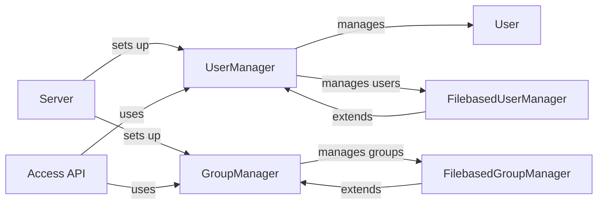

## Component Details

The User Management component in OctoPrint is responsible for handling user authentication, authorization, and access control. It manages user accounts, groups, and permissions to ensure that only authorized users can access specific features and resources. The component relies on file-based storage for user and group data, and it provides an API for managing users and groups via HTTP requests. The UserManager and GroupManager classes are central to this component, providing the core functionality for managing users and groups, respectively. The FilebasedUserManager and FilebasedGroupManager extend these classes to provide file-based storage. The Server class initializes the UserManager and GroupManager, and the access API provides the HTTP endpoints for managing users and groups.

### Server
The Server component is responsible for initializing the UserManager and GroupManager during the OctoPrint server startup. It acts as the entry point for configuring the access control system.
- **Related Classes/Methods**: `OctoPrint.src.octoprint.server.Server:_setup_group_manager`, `OctoPrint.src.octoprint.server.Server:_setup_user_manager`

### UserManager
The UserManager component handles user-related operations such as creation, authentication, session management, and permission checks. It provides methods for logging in, logging out, finding users, and validating user sessions.
- **Related Classes/Methods**: `OctoPrint.src.octoprint.access.users.UserManager:__init__`, `OctoPrint.src.octoprint.access.users.UserManager:anonymous_user_factory`, `OctoPrint.src.octoprint.access.users.UserManager:api_user_factory`, `OctoPrint.src.octoprint.access.users.UserManager:login_user`, `OctoPrint.src.octoprint.access.users.UserManager:logout_user`, `OctoPrint.src.octoprint.access.users.UserManager:find_user`, `OctoPrint.src.octoprint.access.users.UserManager:check_password`, `OctoPrint.src.octoprint.access.users.UserManager:validate_user_session`

### FilebasedUserManager
The FilebasedUserManager component extends the UserManager and provides file-based storage for user data. It handles loading and saving user information to disk, as well as modifying user attributes like permissions, groups, and settings.
- **Related Classes/Methods**: `OctoPrint.src.octoprint.access.users.FilebasedUserManager:__init__`, `OctoPrint.src.octoprint.access.users.FilebasedUserManager:_load`, `OctoPrint.src.octoprint.access.users.FilebasedUserManager:_save`, `OctoPrint.src.octoprint.access.users.FilebasedUserManager:add_user`, `OctoPrint.src.octoprint.access.users.FilebasedUserManager:change_user_password`, `OctoPrint.src.octoprint.access.users.FilebasedUserManager:find_user`

### User
The User component represents a user in the system. It stores user attributes such as username, password, permissions, and settings. It provides methods for checking permissions and accessing user-specific data.
- **Related Classes/Methods**: `OctoPrint.src.octoprint.access.users.User:as_dict`, `OctoPrint.src.octoprint.access.users.User:has_permission`, `OctoPrint.src.octoprint.access.users.User:get_setting`, `OctoPrint.src.octoprint.access.users.User:effective_permissions`

### GroupManager
The GroupManager component manages user groups and their associated permissions. It provides methods for creating, modifying, and deleting groups, as well as retrieving group information and default permissions.
- **Related Classes/Methods**: `OctoPrint.src.octoprint.access.groups.GroupManager:__init__`, `OctoPrint.src.octoprint.access.groups.GroupManager:add_group`, `OctoPrint.src.octoprint.access.groups.GroupManager:remove_group`, `OctoPrint.src.octoprint.access.groups.GroupManager:default_permissions_for_group`

### FilebasedGroupManager
The FilebasedGroupManager component extends the GroupManager and provides file-based storage for group data. It handles loading and saving group information to disk.
- **Related Classes/Methods**: `OctoPrint.src.octoprint.access.groups.FilebasedGroupManager:__init__`, `OctoPrint.src.octoprint.access.groups.FilebasedGroupManager:_load`, `OctoPrint.src.octoprint.access.groups.FilebasedGroupManager:_save`, `OctoPrint.src.octoprint.access.groups.FilebasedGroupManager:add_group`

### Access API
The Access API component provides endpoints for managing users and groups via HTTP requests. It uses the UserManager and GroupManager to handle the underlying operations.
- **Related Classes/Methods**: `OctoPrint.src.octoprint.server.api.access:get_permissions`, `OctoPrint.src.octoprint.server.api.access:get_groups`, `OctoPrint.src.octoprint.server.api.access:add_group`, `OctoPrint.src.octoprint.server.api.access:get_users`, `OctoPrint.src.octoprint.server.api.access:add_user`, `OctoPrint.src.octoprint.server.api.access:update_user`, `OctoPrint.src.octoprint.server.api.access:remove_user`
