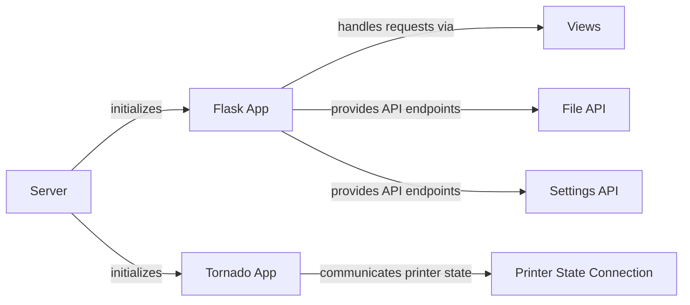

## Component Details

The Web Interface component in OctoPrint provides the user interface for interacting with the 3D printer. It leverages Flask for handling HTTP requests and serving static assets, and Tornado for managing WebSocket connections for real-time communication. The interface allows users to control the printer, monitor its status, manage files, adjust settings, and install plugins. It also provides APIs for plugins to extend the functionality of the web interface.

### Server
The central component responsible for initializing and running the OctoPrint server. It sets up the Flask and Tornado applications, manages plugins, configures the printer connection, and handles server startup and shutdown. It acts as the entry point for the web interface, orchestrating the other components.
- **Related Classes/Methods**: `OctoPrint.src.octoprint.server.Server`

### Flask App
Handles web requests and serves the user interface. It is configured by the Server component and uses blueprints to organize request handlers. It provides API endpoints for managing files, settings, and other functionalities.
- **Related Classes/Methods**: `OctoPrint.src.octoprint.server.Server:_setup_flask_app`

### Tornado App
Handles websocket connections for real-time communication with the client. It is configured by the Server component and provides handlers for server events. It enables live updates of printer status and other information.
- **Related Classes/Methods**: `OctoPrint.src.octoprint.server.Server:_setup_tornado_app`

### Views
Handles rendering of the web interface. It fetches data and processes template configurations to generate the HTML pages. It provides the structure and content of the user interface.
- **Related Classes/Methods**: `OctoPrint.src.octoprint.server.views:index`, `OctoPrint.src.octoprint.server.views:_get_render_kwargs`, `OctoPrint.src.octoprint.server.views:fetch_template_data`, `OctoPrint.src.octoprint.server.views:_process_template_configs`

### File API
Provides API endpoints for managing G-code files. It allows reading file lists and file details. It enables users to upload, download, and organize their print files.
- **Related Classes/Methods**: `OctoPrint.src.octoprint.server.api.files:readGcodeFiles`, `OctoPrint.src.octoprint.server.api.files:readGcodeFilesForOrigin`, `OctoPrint.src.octoprint.server.api.files:readGcodeFile`, `OctoPrint.src.octoprint.server.api.files:_getFileList`, `OctoPrint.src.octoprint.server.api.files:_getFileDetails`

### Settings API
Provides API endpoints for managing OctoPrint settings. It allows getting and setting settings. It enables users to customize the behavior of OctoPrint.
- **Related Classes/Methods**: `OctoPrint.src.octoprint.server.api.settings:getSettings`, `OctoPrint.src.octoprint.server.api.settings:setSettings`, `OctoPrint.src.octoprint.server.api.settings:_saveSettings`

### Printer State Connection
Handles real-time communication of printer state via SockJS. It sends events, timelapse configurations, and slicing/rendering progress to the client. It provides live updates of the printer's status and progress.
- **Related Classes/Methods**: `OctoPrint.src.octoprint.server.util.sockjs.PrinterStateConnection:on_open`, `OctoPrint.src.octoprint.server.util.sockjs.PrinterStateConnection:on_printer_send_initial_data`, `OctoPrint.src.octoprint.server.util.sockjs.PrinterStateConnection:sendEvent`, `OctoPrint.src.octoprint.server.util.sockjs.PrinterStateConnection:sendTimelapseConfig`, `OctoPrint.src.octoprint.server.util.sockjs.PrinterStateConnection:sendSlicingProgress`, `OctoPrint.src.octoprint.server.util.sockjs.PrinterStateConnection:sendRenderProgress`, `OctoPrint.src.octoprint.server.util.sockjs.PrinterStateConnection:_emit`, `OctoPrint.src.octoprint.server.util.sockjs.PrinterStateConnection:_do_emit`
