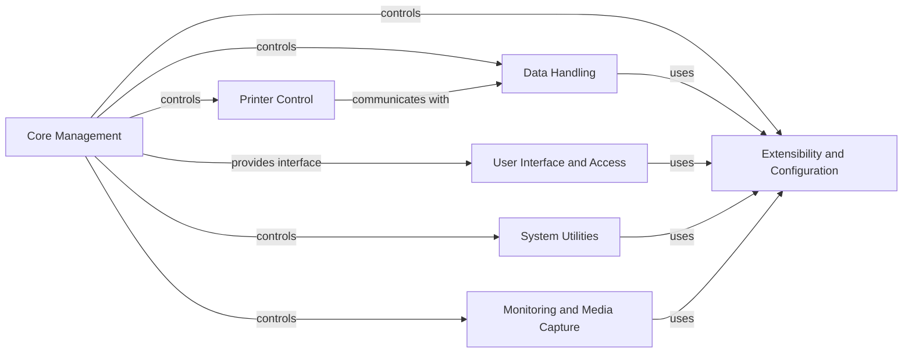

## Component Details

OctoPrint is a web-based interface for controlling 3D printers. It provides a user-friendly way to manage the printing process, monitor printer status, and manage G-code files. The system is designed to be extensible through plugins, allowing users to add new features and functionality. The core server orchestrates the interaction between various components, including printer communication, file management, plugin management, settings, user access control, and the web server.

### Core Management
This component is the heart of OctoPrint, responsible for initializing and coordinating all other sub-systems. It manages the application loop, handles events, and ensures smooth interaction between different parts of the system. It also provides core functionalities such as environment detection and system commands.
- **Related Classes/Methods**: `OctoPrint.src.octoprint.server.Server`, `OctoPrint.src.octoprint.environment.EnvironmentDetector`, `OctoPrint.src.octoprint.systemcommands.SystemCommandManager`, `OctoPrint.src.octoprint.events.EventManager`

### Printer Control
This component manages the communication with the 3D printer. It sends G-code commands, receives printer status updates, and manages the printing process. It also handles temperature monitoring, SD card interaction, and error handling, ensuring reliable and efficient printer operation.
- **Related Classes/Methods**: `OctoPrint.src.octoprint.util.comm.MachineCom`, `OctoPrint.src.octoprint.printer.standard.Printer`

### Data Handling
This component provides functionalities for managing G-code files, including storage, analysis, and slicing. It supports local file storage and integrates with slicing software to prepare models for printing. It also handles metadata extraction and analysis of G-code files, ensuring efficient file management and preparation for printing.
- **Related Classes/Methods**: `OctoPrint.src.octoprint.filemanager.FileManager`, `OctoPrint.src.octoprint.filemanager.storage.LocalFileStorage`, `OctoPrint.src.octoprint.filemanager.analysis.GcodeAnalysisQueue`

### Extensibility and Configuration
This component enables extending OctoPrint's functionality through plugins and manages the configuration of OctoPrint, including core settings and plugin-specific settings. It manages the discovery, installation, loading, and unloading of plugins and provides an API for plugins to interact with the core system. It also handles the storage and loading of configuration data, providing a flexible and customizable system.
- **Related Classes/Methods**: `OctoPrint.src.octoprint.plugin.core.PluginManager`, `OctoPrint.src.octoprint.plugin.PluginSettings`, `OctoPrint.src.octoprint.plugins.pluginmanager.PluginManagerPlugin`, `OctoPrint.src.octoprint.settings.Settings`

### User Interface and Access
This component provides the web-based user interface for OctoPrint and manages user accounts, groups, and permissions to control access to OctoPrint's features. It handles HTTP requests, serves static assets, and provides API endpoints for interacting with the core system. It also handles user authentication, authorization, and session management, ensuring a secure and user-friendly experience.
- **Related Classes/Methods**: `OctoPrint.src.octoprint.server.Server`, `OctoPrint.src.octoprint.server.util.tornado`, `OctoPrint.src.octoprint.server.util.flask`, `OctoPrint.src.octoprint.access.users.UserManager`, `OctoPrint.src.octoprint.access.groups.GroupManager`, `OctoPrint.src.octoprint.access.users.User`

### System Utilities
This component manages system-level commands, such as restarting the server or shutting down the system, and also handles software updates. It provides an API for executing commands and retrieving command specifications, and manages the update process. It ensures the system is running smoothly and up-to-date.
- **Related Classes/Methods**: `OctoPrint.src.octoprint.systemcommands.SystemCommandManager`, `OctoPrint.src.octoprint.plugins.softwareupdate.SoftwareUpdatePlugin`, `OctoPrint.src.octoprint.plugins.softwareupdate.updaters`, `OctoPrint.src.octoprint.plugins.softwareupdate.version_checks`

### Monitoring and Media Capture
This component provides functionalities for capturing and rendering timelapses of prints and managing and accessing webcams. It manages the configuration of timelapse settings, capturing frames, and rendering videos, and allows users to view webcam streams and capture snapshots. It enhances the user experience by providing visual monitoring and recording capabilities.
- **Related Classes/Methods**: `OctoPrint.src.octoprint.timelapse`, `OctoPrint.src.octoprint.server.api.timelapse`, `OctoPrint.src.octoprint.webcams`