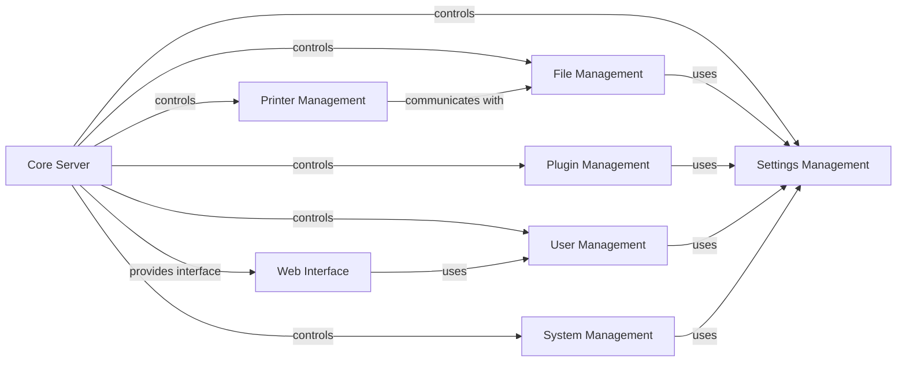

## Component Details

OctoPrint is a web-based interface for controlling 3D printers. It provides a user-friendly way to manage and monitor the printing process, manage files, configure settings, and extend functionality through plugins. The core server orchestrates the interaction between various components, including printer communication, file management, plugin management, settings, user access control, and the web interface.

### Core Server
The central component responsible for managing the OctoPrint instance. It initializes and coordinates various sub-systems, including the web server, plugin manager, settings, and printer communication. It handles the main application loop and orchestrates the interaction between different components. It acts as the central coordinator, initializing and managing all other components.
- **Related Classes/Methods**: `OctoPrint.src.octoprint.server.Server`, `OctoPrint.src.octoprint.server.views`, `OctoPrint.src.octoprint.server.api`

### Printer Management
Manages the communication with the 3D printer via serial connection. It handles sending G-code commands, receiving printer status updates, and managing the printing process. It also deals with temperature monitoring, SD card interaction, and error handling. It is responsible for translating user commands into printer actions and relaying printer status back to the user.
- **Related Classes/Methods**: `OctoPrint.src.octoprint.util.comm.MachineCom`, `OctoPrint.src.octoprint.printer.standard.Printer`

### File Management
Provides functionalities for managing G-code files, including storage, analysis, and slicing. It supports local file storage and integrates with slicing software to prepare models for printing. It also handles metadata extraction and analysis of G-code files. It acts as a repository for print files, providing analysis and storage capabilities.
- **Related Classes/Methods**: `OctoPrint.src.octoprint.filemanager.FileManager`, `OctoPrint.src.octoprint.filemanager.storage.LocalFileStorage`, `OctoPrint.src.octoprint.filemanager.analysis.GcodeAnalysisQueue`

### Plugin Management
Enables extending OctoPrint's functionality through plugins. It manages the discovery, installation, loading, and unloading of plugins. It also provides an API for plugins to interact with the core system and other plugins. It extends the core functionality by loading and managing plugins.
- **Related Classes/Methods**: `OctoPrint.src.octoprint.plugin.core.PluginManager`, `OctoPrint.src.octoprint.plugin.PluginSettings`, `OctoPrint.src.octoprint.plugins.pluginmanager.PluginManagerPlugin`

### Settings Management
Handles the configuration of OctoPrint, including core settings and plugin-specific settings. It provides an API for accessing and modifying settings, and it manages the storage and loading of configuration data. It provides a centralized configuration system for OctoPrint and its plugins.
- **Related Classes/Methods**: `OctoPrint.src.octoprint.settings.Settings`

### User Management
Manages user accounts, groups, and permissions to control access to OctoPrint's features. It handles user authentication, authorization, and session management. It also provides an API for managing users and groups. It controls access to OctoPrint's features based on user roles and permissions.
- **Related Classes/Methods**: `OctoPrint.src.octoprint.access.users.UserManager`, `OctoPrint.src.octoprint.access.groups.GroupManager`, `OctoPrint.src.octoprint.access.users.User`

### Web Interface
Provides the web-based user interface for OctoPrint. It handles HTTP requests, serves static assets, and provides API endpoints for interacting with the core system. It uses Tornado and Flask frameworks. It provides the user interface for interacting with OctoPrint.
- **Related Classes/Methods**: `OctoPrint.src.octoprint.server.Server`, `OctoPrint.src.octoprint.server.util.tornado`, `OctoPrint.src.octoprint.server.util.flask`

### System Management
Manages system-level commands, such as restarting the server or shutting down the system. It provides an API for executing commands and retrieving command specifications. It also includes functionalities for capturing and rendering timelapses of prints and updating OctoPrint and its plugins. It provides system-level control and maintenance functionalities.
- **Related Classes/Methods**: `OctoPrint.src.octoprint.systemcommands.SystemCommandManager`, `OctoPrint.src.octoprint.timelapse`, `OctoPrint.src.octoprint.server.api.timelapse`, `OctoPrint.src.octoprint.plugins.softwareupdate.SoftwareUpdatePlugin`, `OctoPrint.src.octoprint.plugins.softwareupdate.updaters`, `OctoPrint.src.octoprint.plugins.softwareupdate.version_checks`