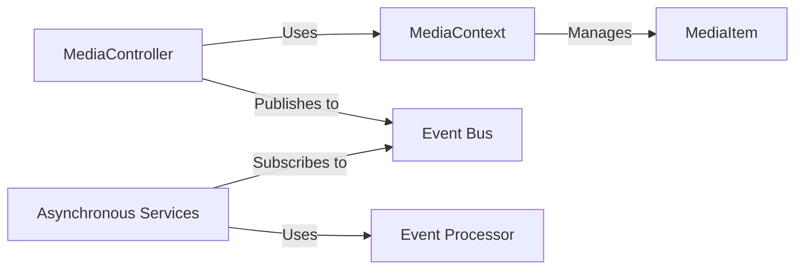

## Details

One paragraph explaining the functionality which is represented by this graph. What the main flow is and what is its purpose.

### MediaController
API Layer: Exposes HTTP endpoints for managing media. For state-changing commands (e.g., POST, PUT), it publishes events to the Event Bus. For synchronous read operations (e.g., GET), it may query the MediaContext directly.

**Related Classes/Methods**:

- `OhunIslam.WebAPI/Controllers/MediaController.cs`

### MediaItem
Domain Model: Represents the schema for a media item, including properties like title, artist, and URL. It is the central entity managed by this service.

**Related Classes/Methods**:

- `OhunIslam.WebAPI/Model/MediaItem.cs`

### MediaContext
Data Access Layer: Manages the database connection and handles the translation of MediaItem objects to and from database records.

**Related Classes/Methods**:

- `OhunIslam.WebAPI/Infrastructure/MediaContext.cs`

### Event Bus
Messaging Middleware: A central message broker that facilitates asynchronous communication. It receives events from publishers (like the MediaController) and delivers them to subscribers (Asynchronous Services), decoupling the components.

**Related Classes/Methods**: _None_

### Asynchronous Services
Service & Messaging Layer: Subscribes to the Event Bus to listen for events. Upon receiving an event, it invokes the appropriate Event Processor to handle the business logic asynchronously.

**Related Classes/Methods**:

- `OhunIslam.WebAPI/Services/MassTSConsumer.cs`
- `OhunIslam.WebAPI/Services/RadioMessageSubcriber.cs`

### Event Processor
Event Handling Logic: Contains the specific business logic for processing an event, such as adding a new radio item. It is invoked by Asynchronous Services.

**Related Classes/Methods**:

- `OhunIslam.WebAPI/EventProcessing/AddRadioEventProcessor.cs`

### [FAQ](https://github.com/CodeBoarding/GeneratedOnBoardings/tree/main?tab=readme-ov-file#faq)