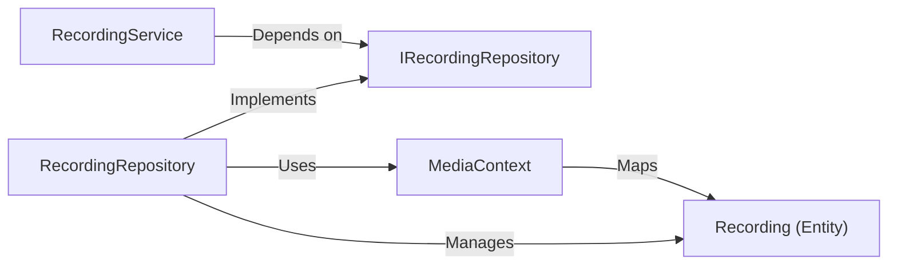

## Details

An analysis of the `Database` subsystem for the `OhunIslam Web API` project, based on the provided context and summary.

### MediaContext
The Entity Framework Core `DbContext` for the application. It acts as the primary API for database communication, managing the database connection, entity tracking, and schema definition for all media-related data.

**Related Classes/Methods**:

- `OhunIslam.WebAPI.Infrastructure.MediaContext`

### Recording (Entity)
A data model representing a single audio recording. Its properties (e.g., `Id`, `Title`, `Description`, `FilePath`) map directly to the columns of the `Recordings` table in the database.

**Related Classes/Methods**:

- `OhunIslam.WebAPI.Domain.Entities.Recording`

### IRecordingRepository
An interface that defines the contract for data operations related to `Recording` entities. It abstracts the data persistence logic, specifying methods for CRUD (Create, Read, Update, Delete) operations.

**Related Classes/Methods**:

- `OhunIslam.WebAPI.Application.Interfaces.IRecordingRepository`

### RecordingRepository
The concrete implementation of the `IRecordingRepository`. It uses the `MediaContext` to translate the interface's methods into database queries and commands, handling the actual data retrieval and persistence.

**Related Classes/Methods**:

- `OhunIslam.WebAPI.Infrastructure.Repositories.RecordingRepository`

### RecordingService
A business-layer service that orchestrates operations on recordings. It acts as the primary consumer of the data access layer by interacting with the `IRecordingRepository` interface, not its concrete implementation.

**Related Classes/Methods**:

- `OhunIslam.WebAPI.Application.Services.RecordingService`

### [FAQ](https://github.com/CodeBoarding/GeneratedOnBoardings/tree/main?tab=readme-ov-file#faq)