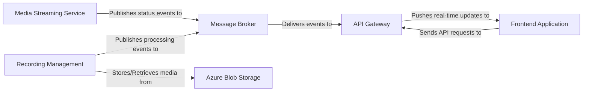

## Details

One paragraph explaining the functionality which is represented by this graph. What the main flow is and what is its purpose.

### Message Broker [[Expand]](./Message_Broker.md)
The central communication backbone using an event-driven model, implemented via RabbitMQ and abstracted by MassTransit. It decouples producers from consumers, enabling asynchronous updates and resilient inter-service communication.

**Related Classes/Methods**:

- `OhunIslam.Radio.Services.RabbitMQService`
- `OhunIslam.Radio.Services.MassTransitService`
- `OhunIslam.WebAPI.Services.RadioMessageSubcriber`
- `OhunIslam.WebAPI.Services.MassTSConsumer`

### Media Streaming Service
The publisher service responsible for managing the live radio stream. It broadcasts events (e.g., song changes, stream status) to the `Message Broker`.

**Related Classes/Methods**:

- `OhunIslam.Radio.Controllers.RadioController`

### API Gateway
The subscriber service that acts as the primary entry point for clients. It listens for events from the `Message Broker` to provide real-time updates to connected users.

**Related Classes/Methods**:

- `OhunIslam.WebAPI.Services.RadioMessageSubcriber`

### Frontend Application
An external client-facing application that consumes data from the `API Gateway`. It initiates requests and receives real-time status updates pushed from the gateway. Its source code is not present in this repository.

**Related Classes/Methods**: _None_

### Recording Management
A service responsible for handling uploaded audio files, including transcoding and metadata processing. It likely uses the message broker for long-running, asynchronous tasks.

**Related Classes/Methods**:

- `OhunIslam.WebAPI.Controllers.MediaController`

### Azure Blob Storage
The external cloud storage solution for persisting all media files, such as recordings and stream assets. The interaction logic is likely managed within the `MediaController`.

**Related Classes/Methods**:

- `OhunIslam.WebAPI.Controllers.MediaController`

### [FAQ](https://github.com/CodeBoarding/GeneratedOnBoardings/tree/main?tab=readme-ov-file#faq)