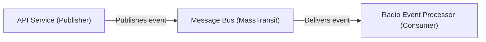

## Details

An analysis of the messaging subsystem for OhunIslam, a .NET-based application.

### API Service (Publisher)
Located within the `OhunIslam.WebAPI` project, this component is responsible for publishing messages to the message bus when business-relevant events occur. The publishing logic is typically triggered by controller actions, such as the creation of new media items.

**Related Classes/Methods**:

- `OhunIslam.WebAPI/Controllers/MediaController.cs`
- `OhunIslam.WebAPI/EventProcessing/PostProcessor/AddRadioEvent.cs`

### Message Bus (MassTransit)
This is the core communication infrastructure, implemented using MassTransit. It decouples the `WebAPI` from the `Radio` service, allowing for asynchronous, reliable communication. It routes messages from the publisher to the appropriate consumer(s).

**Related Classes/Methods**:

- `OhunIslam.Radio/Services/MassTransitService.cs`

### Radio Event Processor (Consumer)
Residing in the `OhunIslam.Radio` service, this component subscribes to specific messages from the bus. Upon receiving a message, it executes business logic within the Radio service, such as updating a playlist or refreshing a cache.

**Related Classes/Methods**:

- `OhunIslam.Radio/EventProcessing/PostProcessor/AddRadioEventProcessor.cs`

### [FAQ](https://github.com/CodeBoarding/GeneratedOnBoardings/tree/main?tab=readme-ov-file#faq)