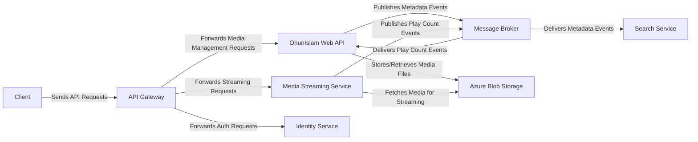

## Details

One paragraph explaining the functionality which is represented by this graph. What the main flow is and what is its purpose.

### Client
An abstract, user-facing application (e.g., web or mobile) that provides the interface for users to browse, search, and play media. It communicates with the backend services via the API Gateway. As this is a backend-focused repository, the client is not implemented here.

**Related Classes/Methods**: _None_

### API Gateway
Acts as a single, unified entry point for all client requests. It routes traffic to the appropriate downstream microservice. In this project, the `OhunIslam.WebAPI` project serves this role for the backend system.

**Related Classes/Methods**:

- `OhunIslam.WebAPI`

### OhunIslam Web API [[Expand]](./OhunIslam_Web_API.md)
The core backend service responsible for all media management. It handles CRUD operations for media assets and their metadata. It also subscribes to events from the `Message Broker` to receive and process real-time updates from other services, such as stream statistics.

**Related Classes/Methods**:

- `OhunIslam.WebAPI.Program`
- `OhunIslam.WebAPI.Controllers.MediaController`

### Media Streaming Service
This service is responsible for the actual delivery of media content to the client. It fetches media files from `Azure Blob Storage` and streams them efficiently. It also publishes consumption events (e.g., play counts) to the `Message Broker`.

**Related Classes/Methods**:

- `OhunIslam.Radio`

### Identity Service
Manages user authentication and authorization. It is responsible for issuing, validating, and renewing security tokens that the `API Gateway` uses to authorize requests to other microservices. This is an external component not present in this repository.

**Related Classes/Methods**:

- `OhunIslam.IdentityAPI`

### Message Broker [[Expand]](./Message_Broker.md)
A central component (RabbitMQ) that facilitates asynchronous communication between microservices using the MassTransit library. It enables event-driven workflows, decoupling services and improving system resilience.

**Related Classes/Methods**:

- `OhunIslam.Radio.Services.RabbitMQService`
- `OhunIslam.WebAPI.Services.MassTSConsumer`

### Search Service
Provides advanced search capabilities across the media library. This functionality is embedded within the `OhunIslam Web API` and subscribes to events from the `Message Broker` to keep its search index synchronized with the latest metadata changes.

**Related Classes/Methods**:

- `OhunIslam.WebAPI.Services.MassTSConsumer`

### Azure Blob Storage
The persistence layer for all binary media files (e.g., audio recordings). It provides a scalable, durable, and cost-effective solution for storing large amounts of unstructured data. The interaction logic is likely located within the `OhunIslam.WebAPI` (for uploads) and `OhunIslam.Radio` (for streaming).

**Related Classes/Methods**: _None_

### [FAQ](https://github.com/CodeBoarding/GeneratedOnBoardings/tree/main?tab=readme-ov-file#faq)