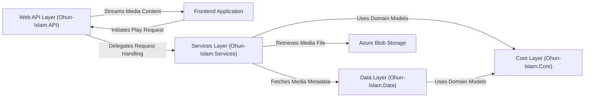

## Details

This revised analysis is based entirely on the C# project structure described in the meta_context (.sln, .csproj files) and follows standard C#/.NET Web API architecture patterns.

### Web API Layer (Ohun-Islam.API)
The primary entry point for all client requests, built on ASP.NET Core. It exposes HTTP endpoints to handle interactions from the frontend, such as requests for media lists and streaming content. It contains controllers that parse incoming requests and delegate business logic to the Services Layer.

**Related Classes/Methods**:

- `MediaController`
- `StreamController`

### Frontend Application
The user-facing client application (e.g., web or mobile) that allows users to browse and play media. It interacts with the `Web API Layer` to fetch media metadata and initiate streaming sessions.

**Related Classes/Methods**: _None_

### Services Layer (Ohun-Islam.Services)
Contains the core business logic of the application. This layer orchestrates the main functionality, such as retrieving media metadata from the Data Layer and fetching the actual media file from external storage for streaming.

**Related Classes/Methods**:

- `MediaService`
- `StreamingService`

### Data Layer (Ohun-Islam.Data)
Responsible for all data access and persistence. It abstracts the database interactions, providing a clean interface (e.g., a Repository pattern) for the Services Layer to query media metadata, user information, and playlists.

**Related Classes/Methods**:

- `AppDbContext`
- `MediaRepository`

### Core Layer (Ohun-Islam.Core)
The center of the application, containing the domain models and entities. These are plain C# objects (POCOs) that represent the fundamental concepts of the system, such as `Track`, `Album`, or `Artist`. This layer has no dependencies on other layers.

**Related Classes/Methods**:

- `Track`
- `Album`

### Azure Blob Storage
An external cloud storage service that holds the binary media files (e.g., MP3s). The `Services Layer` interacts with this component to retrieve media assets by their unique identifiers when a client requests a stream.

**Related Classes/Methods**: _None_

### [FAQ](https://github.com/CodeBoarding/GeneratedOnBoardings/tree/main?tab=readme-ov-file#faq)