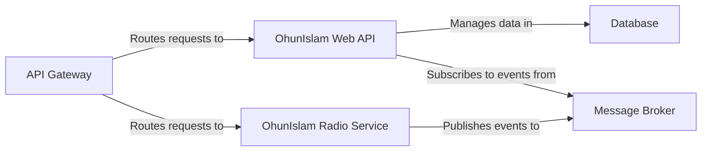

## Details

One paragraph explaining the functionality which is represented by this graph. What the main flow is and what is its purpose.

### API Gateway
Serves as the single entry point for all client requests. It routes incoming traffic to the appropriate downstream microservice (`OhunIslam Web API` or `OhunIslam Radio Service`), providing a unified and secure interface to the backend system.

**Related Classes/Methods**:

- `OhunIslam.WebAPI/Controllers/MediaController.cs`
- `OhunIslam.Radio/Controllers/RadioController.cs`

### OhunIslam Web API [[Expand]](./OhunIslam_Web_API.md)
The core backend service responsible for all media management. It handles CRUD operations for media assets and their metadata. It also subscribes to events from the `Message Broker` to receive and process real-time updates from other services, such as stream statistics.

**Related Classes/Methods**:

- `OhunIslam.WebAPI/Program.cs`
- `OhunIslam.WebAPI/Controllers/MediaController.cs`

### OhunIslam Radio Service
A dedicated microservice that manages all live radio streaming functionalities. It controls the state of radio streams and publishes status updates and events (e.g., `StreamStatsUpdate`) to the `Message Broker` to inform the rest of the system.

**Related Classes/Methods**:

- `OhunIslam.Radio/Program.cs`
- `OhunIslam.Radio/Controllers/RadioController.cs`

### Database [[Expand]](./Database.md)
The persistence layer for the `OhunIslam Web API`. It stores all core application data, including media metadata like titles, descriptions, and file locations, as defined by the `MediaContext`.

**Related Classes/Methods**:

- `OhunIslam.WebAPI/Infrastructure/MediaContext.cs`

### Message Broker [[Expand]](./Message_Broker.md)
The central communication backbone that facilitates asynchronous, event-driven communication between microservices. It decouples the `OhunIslam Radio Service` from the `OhunIslam Web API`, allowing for resilient and scalable status updates.

**Related Classes/Methods**:

- `OhunIslam.Radio/Services/RabbitMQService.cs`
- `OhunIslam.WebAPI/Services/RadioMessageSubcriber.cs`

### [FAQ](https://github.com/CodeBoarding/GeneratedOnBoardings/tree/main?tab=readme-ov-file#faq)