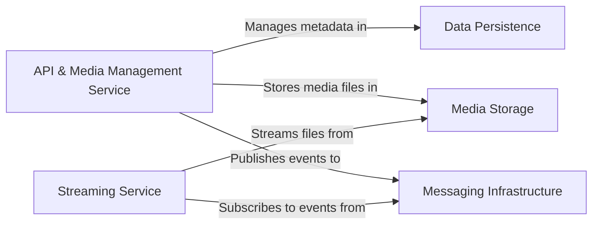

## Details

One paragraph explaining the functionality which is represented by this graph. What the main flow is and what is its purpose.

### API & Media Management Service [[Expand]](./API_Media_Management_Service.md)
The core service that exposes the public API. It handles the business logic for media content, including uploads and metadata management. It acts as the primary interface for client applications.

**Related Classes/Methods**:

- `OhunIslam.WebAPI/Controllers/MediaController.cs`
- `OhunIslam.WebAPI/Infrastructure/MediaContext.cs`
- `OhunIslam.WebAPI/Model/MediaItem.cs`

### Streaming Service [[Expand]](./Streaming_Service.md)
A dedicated microservice responsible for delivering media content. It retrieves media files from storage and streams them to the user's device in response to play requests.

**Related Classes/Methods**:

- `OhunIslam.Radio/Controllers/RadioController.cs`
- `OhunIslam.Radio/Services/RabbitMQService.cs`

### Data Persistence
A relational database, managed via Entity Framework, that stores metadata for all media items, such as titles, descriptions, and file locations.

**Related Classes/Methods**:

- `OhunIslam.WebAPI/Infrastructure/MediaContext.cs`
- `OhunIslam.WebAPI/Migrations/`

### Media Storage
A cloud-based object storage solution (e.g., Azure Blob Storage) used to store and retrieve large unstructured media files. This component is an external dependency and does not have a direct source code reference within this repository.

**Related Classes/Methods**:

- `Azure Blob Storage`

### Messaging Infrastructure [[Expand]](./Messaging_Infrastructure.md)
An asynchronous message bus (e.g., RabbitMQ with MassTransit) that facilitates event-driven communication between microservices, decoupling the API service from the Streaming service.

**Related Classes/Methods**:

- `OhunIslam.WebAPI/Services/RadioMessageSubcriber.cs`
- `OhunIslam.Radio/Services/MassTransitService.cs`

### [FAQ](https://github.com/CodeBoarding/GeneratedOnBoardings/tree/main?tab=readme-ov-file#faq)