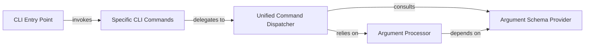

## Details

The `CLI Interface` subsystem serves as the user-facing entry point for initiating and configuring model optimization workflows within the Olive project. It is primarily defined by the `olive.cli.launcher` and `olive.cli.api` modules.

### CLI Entry Point
The primary user-facing entry point for the Olive CLI. It initializes the command-line interface environment and orchestrates the initial parsing of top-level arguments to direct control to the appropriate command.

**Related Classes/Methods**:

- <a href="https://github.com/microsoft/Olive/blob/main/olive/cli/launcher.py#L55-L66" target="_blank" rel="noopener noreferrer">`olive.cli.launcher.main`:55-66</a>

### Specific CLI Commands
A collection of user-facing functions that represent the distinct optimization tasks available through the CLI (e.g., `optimize`, `quantize`). These act as facades, defining the command interface but delegating their core execution logic.

**Related Classes/Methods**:

- <a href="https://github.com/microsoft/Olive/blob/main/olive/cli/api.py#L158-L171" target="_blank" rel="noopener noreferrer">`olive.cli.api.optimize`:158-171</a>
- <a href="https://github.com/microsoft/Olive/blob/main/olive/cli/api.py#L174-L187" target="_blank" rel="noopener noreferrer">`olive.cli.api.quantize`:174-187</a>
- <a href="https://github.com/microsoft/Olive/blob/main/olive/cli/api.py#L142-L155" target="_blank" rel="noopener noreferrer">`olive.cli.api.finetune`:142-155</a>

### Unified Command Dispatcher
A central orchestrator responsible for executing specific CLI commands. It receives processed command details and ensures that arguments are validated and prepared before invoking the core logic associated with a command.

**Related Classes/Methods**:

- <a href="https://github.com/microsoft/Olive/blob/main/olive/cli/api.py#L111-L139" target="_blank" rel="noopener noreferrer">`olive.cli.api._run_unified_command`:111-139</a>

### Argument Processor
Handles the transformation of raw command-line input arguments into a structured, unified format. This component ensures consistency in how arguments are presented to downstream components.

**Related Classes/Methods**:

- <a href="https://github.com/microsoft/Olive/blob/main/olive/cli/api.py#L82-L108" target="_blank" rel="noopener noreferrer">`olive.cli.api._create_unified_args`:82-108</a>

### Argument Schema Provider
Defines and provides the authoritative schema for all CLI commands, including expected argument types, structures, and validation rules. This ensures input correctness and consistency across the CLI.

**Related Classes/Methods**:

- <a href="https://github.com/microsoft/Olive/blob/main/olive/cli/api.py#L23-L79" target="_blank" rel="noopener noreferrer">`olive.cli.api._get_command_args_schema`:23-79</a>

### [FAQ](https://github.com/CodeBoarding/GeneratedOnBoardings/tree/main?tab=readme-ov-file#faq)