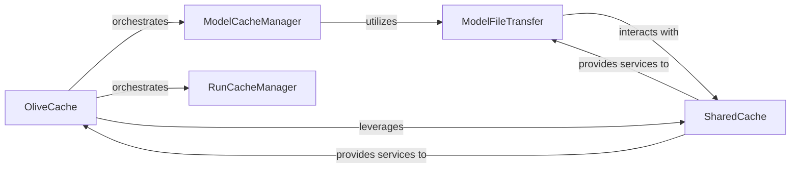

## Details

The `Caching System` subsystem, primarily encapsulated within `olive.cache`, is responsible for persistent storage and retrieval of intermediate and final ML models, optimization run histories, and evaluation results. It acts as a crucial component for efficiency and reproducibility in the Olive ML optimization pipeline.

### OliveCache
Serves as the central entry point and primary facade for the entire caching system. It orchestrates calls to other specialized caching components, providing a unified interface for external modules to interact with the cache.

**Related Classes/Methods**:

- <a href="https://github.com/microsoft/Olive/blob/main/olive/cache.py" target="_blank" rel="noopener noreferrer">`olive.cache`</a>

### SharedCache
Provides the underlying infrastructure for shared and distributed caching. It abstracts the specifics of blob storage interactions, enabling models and run artifacts to be stored and retrieved from remote locations.

**Related Classes/Methods**:

- <a href="https://github.com/microsoft/Olive/blob/main/olive/cache.py" target="_blank" rel="noopener noreferrer">`olive.cache`</a>

### ModelCacheManager
Manages the lifecycle of cached ML models. This includes operations for storing models (handling both local persistence and interaction with shared storage) and retrieving them from the cache.

**Related Classes/Methods**:

- <a href="https://github.com/microsoft/Olive/blob/main/olive/cache.py" target="_blank" rel="noopener noreferrer">`olive.cache:cache_model`</a>
- <a href="https://github.com/microsoft/Olive/blob/main/olive/cache.py" target="_blank" rel="noopener noreferrer">`olive.cache:load_model`</a>

### RunCacheManager
Manages the persistence and retrieval of historical optimization run data and associated artifacts. It ensures that details and results of past runs can be efficiently stored and fetched.

**Related Classes/Methods**:

- <a href="https://github.com/microsoft/Olive/blob/main/olive/cache.py" target="_blank" rel="noopener noreferrer">`olive.cache:cache_run`</a>
- <a href="https://github.com/microsoft/Olive/blob/main/olive/cache.py" target="_blank" rel="noopener noreferrer">`olive.cache:load_run`</a>

### ModelFileTransfer
Handles the low-level operations for transferring model files and directories. This includes uploading model assets to shared blob storage and downloading them to local resources as needed.

**Related Classes/Methods**:

- <a href="https://github.com/microsoft/Olive/blob/main/olive/cache.py" target="_blank" rel="noopener noreferrer">`olive.cache:upload_model_files`</a>
- <a href="https://github.com/microsoft/Olive/blob/main/olive/cache.py" target="_blank" rel="noopener noreferrer">`olive.cache:download_model`</a>

### [FAQ](https://github.com/CodeBoarding/GeneratedOnBoardings/tree/main?tab=readme-ov-file#faq)