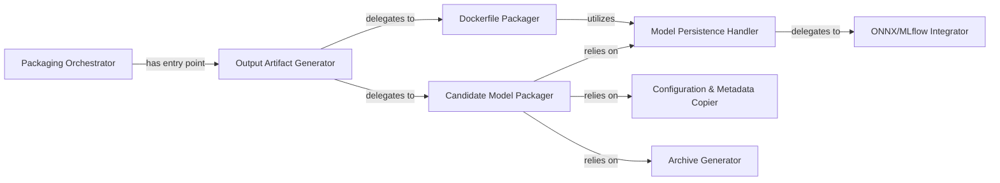

## Details

The `Deployment & Packaging` subsystem is primarily encapsulated within the `olive.engine.packaging` module. Its core functionality revolves around preparing optimized models and their dependencies for various deployment scenarios.

### Packaging Orchestrator
Coordinates the entire model packaging workflow, ensuring all necessary steps are executed to generate deployable artifacts. It acts as the high-level controller for the packaging process.

**Related Classes/Methods**:

- <a href="https://github.com/microsoft/Olive/blob/main/olive/engine/packaging/packaging_generator.py" target="_blank" rel="noopener noreferrer">`olive.engine.packaging.packaging_generator`</a>

### Output Artifact Generator
Serves as the primary public interface for initiating the creation of all required deployment outputs, acting as the entry point for packaging operations. It delegates specific packaging tasks.

**Related Classes/Methods**:

- <a href="https://github.com/microsoft/Olive/blob/main/olive/engine/packaging/packaging_generator.py#L28-L38" target="_blank" rel="noopener noreferrer">`olive.engine.packaging.packaging_generator.generate_output_artifacts`:28-38</a>

### Candidate Model Packager
Focuses on gathering, processing, and packaging the optimized model candidates along with their associated configurations and metadata into a deployable format. This component is crucial for assembling the final model package.

**Related Classes/Methods**:

- <a href="https://github.com/microsoft/Olive/blob/main/olive/engine/packaging/packaging_generator.py#L81-L137" target="_blank" rel="noopener noreferrer">`olive.engine.packaging.packaging_generator._package_candidate_models`:81-137</a>

### Dockerfile Packager
Manages the creation and population of Docker-related files, including embedding the optimized model within the Docker context for containerized deployment. This is essential for container-based deployments.

**Related Classes/Methods**:

- <a href="https://github.com/microsoft/Olive/blob/main/olive/engine/packaging/packaging_generator.py#L41-L78" target="_blank" rel="noopener noreferrer">`olive.engine.packaging.packaging_generator._package_dockerfile`:41-78</a>

### Model Persistence Handler
Provides a standardized mechanism for saving model files to the file system, abstracting the underlying storage details. It ensures models are correctly written to disk.

**Related Classes/Methods**:

- <a href="https://github.com/microsoft/Olive/blob/main/olive/engine/packaging/packaging_generator.py#L187-L233" target="_blank" rel="noopener noreferrer">`olive.engine.packaging.packaging_generator._save_model`:187-233</a>

### ONNX/MLflow Integrator
Handles the specific serialization and formatting of models to ensure compatibility with ONNX and MLflow standards, facilitating broader deployment options. This component is key for interoperability.

**Related Classes/Methods**:

- <a href="https://github.com/microsoft/Olive/blob/main/olive/engine/packaging/packaging_generator.py#L236-L274" target="_blank" rel="noopener noreferrer">`olive.engine.packaging.packaging_generator._generate_onnx_mlflow_model`:236-274</a>

### Configuration & Metadata Copier
Manages the copying and retrieval of various configuration files, performance metrics, and general model metadata essential for deployment and reproducibility. It ensures all necessary supplementary files are included.

**Related Classes/Methods**:

- <a href="https://github.com/microsoft/Olive/blob/main/olive/engine/packaging/packaging_generator.py#L164-L166" target="_blank" rel="noopener noreferrer">`olive.engine.packaging.packaging_generator._copy_inference_config`:164-166</a>
- <a href="https://github.com/microsoft/Olive/blob/main/olive/engine/packaging/packaging_generator.py#L176-L184" target="_blank" rel="noopener noreferrer">`olive.engine.packaging.packaging_generator._copy_metrics`:176-184</a>
- <a href="https://github.com/microsoft/Olive/blob/main/olive/engine/packaging/packaging_generator.py#L158-L161" target="_blank" rel="noopener noreferrer">`olive.engine.packaging.packaging_generator._copy_model_info`:158-161</a>
- <a href="https://github.com/microsoft/Olive/blob/main/olive/engine/packaging/packaging_generator.py#L147-L149" target="_blank" rel="noopener noreferrer">`olive.engine.packaging.packaging_generator._copy_models_rank`:147-149</a>
- <a href="https://github.com/microsoft/Olive/blob/main/olive/engine/packaging/packaging_generator.py#L140-L144" target="_blank" rel="noopener noreferrer">`olive.engine.packaging.packaging_generator._get_model_info`:140-144</a>
- <a href="https://github.com/microsoft/Olive/blob/main/olive/engine/packaging/packaging_generator.py#L169-L172" target="_blank" rel="noopener noreferrer">`olive.engine.packaging.packaging_generator._copy_configurations`:169-172</a>

### Archive Generator
Compresses model files and related assets into a zip archive, simplifying distribution and deployment. This provides a convenient single-file output for deployment.

**Related Classes/Methods**:

- <a href="https://github.com/microsoft/Olive/blob/main/olive/engine/packaging/packaging_generator.py#L152-L155" target="_blank" rel="noopener noreferrer">`olive.engine.packaging.packaging_generator._package_zipfile_model`:152-155</a>

### [FAQ](https://github.com/CodeBoarding/GeneratedOnBoardings/tree/main?tab=readme-ov-file#faq)