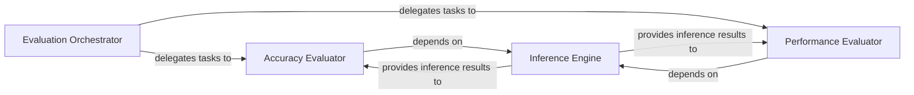

## Details

The `Evaluation & Metrics` subsystem in Olive is primarily encapsulated within the `olive.evaluator.olive_evaluator` module. This subsystem is responsible for assessing the performance and quality of optimized models using various metrics, aligning with the "Evaluation/Validation Module" expected component pattern for an ML Toolkit.

### Evaluation Orchestrator
This component serves as the high-level coordinator for the entire evaluation process. It initiates and manages the overall workflow, delegating specific metric computations (e.g., accuracy, performance) to specialized evaluators. This aligns with the "Workflow Orchestrator" pattern, ensuring a structured and extensible evaluation pipeline.

**Related Classes/Methods**:

- <a href="https://github.com/microsoft/Olive/blob/main/olive/evaluator/olive_evaluator.py#L976-L1044" target="_blank" rel="noopener noreferrer">`olive.evaluator.olive_evaluator.evaluate`:976-1044</a>

### Inference Engine
A foundational component responsible for executing model inference. It handles crucial tasks such as preparing input data, managing the inference session, and running the model to obtain predictions. This component is essential as both accuracy and performance evaluations depend on the model's ability to perform inference.

**Related Classes/Methods**:

- <a href="https://github.com/microsoft/Olive/blob/main/olive/evaluator/olive_evaluator.py#L886-L918" target="_blank" rel="noopener noreferrer">`olive.evaluator.olive_evaluator._inference`:886-918</a>
- <a href="https://github.com/microsoft/Olive/blob/main/olive/evaluator/olive_evaluator.py#L353-L395" target="_blank" rel="noopener noreferrer">`olive.evaluator.olive_evaluator.get_session_wrapper`:353-395</a>
- <a href="https://github.com/microsoft/Olive/blob/main/olive/evaluator/olive_evaluator.py#L957-L962" target="_blank" rel="noopener noreferrer">`olive.evaluator.olive_evaluator._prepare_dataloader`:957-962</a>

### Accuracy Evaluator
This specialized component focuses on assessing the model's accuracy. It coordinates the results from the Inference Engine with the logic required to compute accuracy metrics, ensuring the model's predictions align with ground truth.

**Related Classes/Methods**:

- <a href="https://github.com/microsoft/Olive/blob/main/olive/evaluator/olive_evaluator.py#L920-L930" target="_blank" rel="noopener noreferrer">`olive.evaluator.olive_evaluator._evaluate_accuracy`:920-930</a>
- <a href="https://github.com/microsoft/Olive/blob/main/olive/evaluator/olive_evaluator.py#L136-L140" target="_blank" rel="noopener noreferrer">`olive.evaluator.olive_evaluator.compute_accuracy`:136-140</a>

### Performance Evaluator
This component is dedicated to measuring and computing various performance metrics, such as latency and throughput. It handles the complexities of performance measurement, including considerations for different environments (e.g., ONNX Runtime, distributed setups) and raw measurement collection.

**Related Classes/Methods**:

- <a href="https://github.com/microsoft/Olive/blob/main/olive/evaluator/olive_evaluator.py#L240-L250" target="_blank" rel="noopener noreferrer">`olive.evaluator.olive_evaluator._evaluate_latency`:240-250</a>
- <a href="https://github.com/microsoft/Olive/blob/main/olive/evaluator/olive_evaluator.py#L252-L262" target="_blank" rel="noopener noreferrer">`olive.evaluator.olive_evaluator._evaluate_throughput`:252-262</a>
- <a href="https://github.com/microsoft/Olive/blob/main/olive/evaluator/olive_evaluator.py#L156-L167" target="_blank" rel="noopener noreferrer">`olive.evaluator.olive_evaluator.compute_latency`:156-167</a>
- <a href="https://github.com/microsoft/Olive/blob/main/olive/evaluator/olive_evaluator.py#L169-L188" target="_blank" rel="noopener noreferrer">`olive.evaluator.olive_evaluator.compute_throughput`:169-188</a>

### [FAQ](https://github.com/CodeBoarding/GeneratedOnBoardings/tree/main?tab=readme-ov-file#faq)