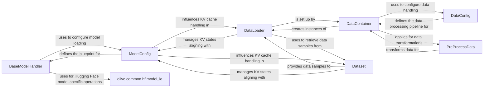

## Details

The Olive framework's core data and model handling subsystem is designed around a clear separation of concerns, enabling flexible and efficient AI model optimization. The `ModelConfig` component serves as the foundational blueprint, defining the structure and properties of an AI model, which is then utilized by the `BaseModelHandler` for loading and managing various model formats. Concurrently, the `DataConfig` component outlines the data processing pipeline, guiding the `DataContainer` in orchestrating dataset loading, preprocessing, and the creation of data iterators. The `DataContainer` leverages `PreProcessData` for data transformations and sets up `DataLoader` instances, which in turn interact with `Dataset` to provide data batches. Both `DataLoader` and `Dataset` are influenced by `ModelConfig` for specific model-related data handling, such as KV cache management. The `olive.common.hf.model_io` module provides specialized utilities, particularly for Hugging Face models, supporting the `BaseModelHandler` in its operations. This architecture ensures a modular and extensible system for handling diverse AI models and data workflows.

### BaseModelHandler
Provides a unified interface for loading, representing, and preparing various AI model formats, abstracting backend complexities.

**Related Classes/Methods**:

- <a href="https://github.com/microsoft/Olive/blob/main/olive/model/handler/base.py" target="_blank" rel="noopener noreferrer">`olive.model.handler.base`</a>

### DataContainer
Orchestrates data management, loading datasets, applying preprocessing, and creating dataloaders for calibration and inference.

**Related Classes/Methods**:

- <a href="https://github.com/microsoft/Olive/blob/main/olive/data/container/data_container.py" target="_blank" rel="noopener noreferrer">`olive.data.container.data_container`</a>

### ModelConfig
Defines comprehensive configuration for AI models (type, paths, I/O, quantization). It acts as a blueprint for BaseModelHandler and influences KV cache handling in DataLoader and Dataset.

**Related Classes/Methods**:

- <a href="https://github.com/microsoft/Olive/blob/main/olive/model/config/model_config.py#L19-L107" target="_blank" rel="noopener noreferrer">`olive.model.config.model_config.ModelConfig`:19-107</a>

### DataConfig
Defines the configuration for data sources and the entire data processing pipeline, guiding DataContainer.

**Related Classes/Methods**:

- <a href="https://github.com/microsoft/Olive/blob/main/olive/data/config.py#L42-L215" target="_blank" rel="noopener noreferrer">`olive.data.config.DataConfig`:42-215</a>

### DataLoader
Provides an iterable interface for accessing batches of data, set up by DataContainer and using Dataset. It also manages KV states aligned with ModelConfig.

**Related Classes/Methods**:

- <a href="https://github.com/microsoft/Olive/blob/main/examples/bert/user_script.py#L128-L130" target="_blank" rel="noopener noreferrer">`DataLoader`:128-130</a>

### Dataset
Represents a collection of data samples, providing items to DataLoader and managing KV states aligned with ModelConfig.

**Related Classes/Methods**:

- <a href="https://github.com/microsoft/Olive/blob/main/examples/bert/openvino/bert_base_multilingual_cased/user_script.py#L46-L60" target="_blank" rel="noopener noreferrer">`Dataset`:46-60</a>

### PreProcessData
Implements data transformation steps, applied by DataContainer.

**Related Classes/Methods**:

- <a href="https://github.com/microsoft/Olive/blob/main/olive/data/component/pre_process_data.py" target="_blank" rel="noopener noreferrer">`PreProcessData`</a>

### olive.common.hf.model_io
Provides specialized utilities for Hugging Face models, used by BaseModelHandler.

**Related Classes/Methods**:

- <a href="https://github.com/microsoft/Olive/blob/main/olive/common/hf/model_io.py" target="_blank" rel="noopener noreferrer">`olive.common.hf.model_io`</a>

### [FAQ](https://github.com/CodeBoarding/GeneratedOnBoardings/tree/main?tab=readme-ov-file#faq)