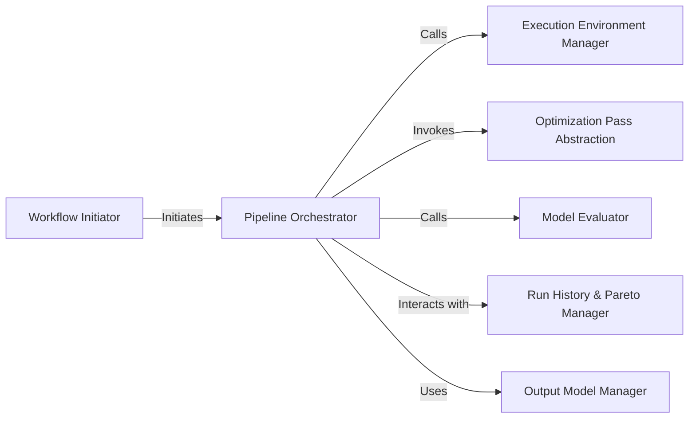

## Details

The Workflow Orchestrator subsystem encompasses the core logic for initiating, managing, and executing the model optimization pipeline. Its primary boundaries are defined by the olive.engine.engine module, which houses the central Engine responsible for orchestration, and the olive.workflows.run.run module, which serves as the entry point for initiating optimization workflows.

### Workflow Initiator
Acts as the primary user-facing interface for starting optimization runs. It is responsible for parsing input configurations (e.g., from CLI arguments or YAML files), setting up the initial environment, and then delegating the actual execution to the Pipeline Orchestrator. This aligns with the "CLI Tool" aspect of Olive.

**Related Classes/Methods**:

- <a href="https://github.com/microsoft/Olive/blob/main/olive/workflows/run/run.py" target="_blank" rel="noopener noreferrer">`olive.workflows.run.run`</a>

### Pipeline Orchestrator
The central control unit managing the entire model optimization pipeline. It orchestrates the execution of optimization passes, handles intermediate model management, coordinates with evaluators, and manages results. It embodies the "Pipeline/Workflow Engine" pattern.

**Related Classes/Methods**:

- <a href="https://github.com/microsoft/Olive/blob/main/olive/engine/engine.py#L43-L857" target="_blank" rel="noopener noreferrer">`olive.engine.engine.Engine`:43-857</a>

### Execution Environment Manager
Sets up the appropriate execution environment, including system configurations and resource allocation, necessary for the optimization passes and evaluations to run effectively.

**Related Classes/Methods**:

- <a href="https://github.com/microsoft/Olive/blob/main/olive/systems/system_config.py#L90-L92" target="_blank" rel="noopener noreferrer">`olive.systems.system_config.create_system`:90-92</a>

### Optimization Pass Abstraction
Represents a generic interface for applying various optimization techniques to a model. Concrete implementations of this abstraction perform specific transformations (e.g., quantization, pruning).

**Related Classes/Methods**:

- <a href="https://github.com/microsoft/Olive/blob/main/olive/passes/olive_pass.py" target="_blank" rel="noopener noreferrer">`olive.passes.olive_pass.OlivePass`</a>

### Model Evaluator
Assesses model performance against defined objectives and metrics. It provides feedback to the Pipeline Orchestrator, guiding the optimization process.

**Related Classes/Methods**:

- <a href="https://github.com/microsoft/Olive/blob/main/olive/evaluator/olive_evaluator.py#L54-L188" target="_blank" rel="noopener noreferrer">`olive.evaluator.olive_evaluator.OliveEvaluator`:54-188</a>

### Run History & Pareto Manager
Records historical data of optimization runs, including metrics and configurations, and manages the Pareto frontier of optimized models to identify the best trade-offs.

**Related Classes/Methods**:

- <a href="https://github.com/microsoft/Olive/blob/main/olive/engine/footprint.py" target="_blank" rel="noopener noreferrer">`olive.engine.footprint.Footprint`</a>

### Output Model Manager
Manages and retrieves the final optimized models and their associated metrics, ensuring they are correctly stored and accessible for export or further use.

**Related Classes/Methods**:

- <a href="https://github.com/microsoft/Olive/blob/main/olive/engine/output.py" target="_blank" rel="noopener noreferrer">`olive.engine.output.OutputModel`</a>

### [FAQ](https://github.com/CodeBoarding/GeneratedOnBoardings/tree/main?tab=readme-ov-file#faq)