```mermaid
graph LR
    CLI_Interface["CLI Interface"]
    Workflow_Orchestrator["Workflow Orchestrator"]
    Model_Data_Management["Model & Data Management"]
    Optimization_Engine["Optimization Engine"]
    Evaluation_Metrics["Evaluation & Metrics"]
    Caching_System["Caching System"]
    Deployment_Packaging["Deployment & Packaging"]
    CLI_Interface -- "triggers and passes configuration to" --> Workflow_Orchestrator
    Workflow_Orchestrator -- "requests loading from" --> Model_Data_Management
    Model_Data_Management -- "provides models and data to" --> Workflow_Orchestrator
    Workflow_Orchestrator -- "dispatches models and configurations to" --> Optimization_Engine
    Optimization_Engine -- "outputs transformed models to" --> Model_Data_Management
    Optimization_Engine -- "caches results in" --> Caching_System
    Caching_System -- "retrieves results for" --> Optimization_Engine
    Workflow_Orchestrator -- "initiates evaluation with" --> Evaluation_Metrics
    Evaluation_Metrics -- "loads models and consumes data from" --> Model_Data_Management
    Model_Data_Management -- "provides models and data to" --> Evaluation_Metrics
    Evaluation_Metrics -- "stores and retrieves results from" --> Caching_System
    Caching_System -- "provides results to" --> Evaluation_Metrics
    Evaluation_Metrics -- "reports results to" --> Workflow_Orchestrator
    Workflow_Orchestrator -- "hands over models for packaging to" --> Deployment_Packaging
    click CLI_Interface href "https://github.com/CodeBoarding/GeneratedOnBoardings/blob/main/Olive/CLI_Interface.md" "Details"
    click Workflow_Orchestrator href "https://github.com/CodeBoarding/GeneratedOnBoardings/blob/main/Olive/Workflow_Orchestrator.md" "Details"
    click Model_Data_Management href "https://github.com/CodeBoarding/GeneratedOnBoardings/blob/main/Olive/Model_Data_Management.md" "Details"
    click Evaluation_Metrics href "https://github.com/CodeBoarding/GeneratedOnBoardings/blob/main/Olive/Evaluation_Metrics.md" "Details"
    click Caching_System href "https://github.com/CodeBoarding/GeneratedOnBoardings/blob/main/Olive/Caching_System.md" "Details"
    click Deployment_Packaging href "https://github.com/CodeBoarding/GeneratedOnBoardings/blob/main/Olive/Deployment_Packaging.md" "Details"
```

## Details

The Olive architecture is structured as a robust, extensible pipeline for AI model optimization, driven by a CLI Interface that feeds user configurations to the central Workflow Orchestrator. This orchestrator dynamically manages the flow, interacting with Model & Data Management to acquire and prepare assets. The core transformation occurs within the Optimization Engine, which applies various passes to refine models. Post-optimization, the Evaluation & Metrics component rigorously assesses model performance. Throughout these stages, the Caching System ensures efficient reuse of artifacts and results. Finally, the validated, optimized models are handed off to Deployment & Packaging for artifact generation, completing the end-to-end model transformation lifecycle. This component-based design facilitates clear data and control flow, making it ideal for visual representation as a flow graph.

### CLI Interface [[Expand]](./CLI_Interface.md)
The user-facing entry point for initiating and configuring model optimization workflows.

**Related Classes/Methods**:

- <a href="https://github.com/microsoft/Olive/blob/main/olive/cli/launcher.py" target="_blank" rel="noopener noreferrer">`olive.cli.launcher`</a>
- <a href="https://github.com/microsoft/Olive/blob/main/olive/cli/api.py" target="_blank" rel="noopener noreferrer">`olive.cli.api`</a>

### Workflow Orchestrator [[Expand]](./Workflow_Orchestrator.md)
The central control unit managing the entire model optimization pipeline.

**Related Classes/Methods**:

- <a href="https://github.com/microsoft/Olive/blob/main/olive/engine/engine.py" target="_blank" rel="noopener noreferrer">`olive.engine.engine`</a>
- <a href="https://github.com/microsoft/Olive/blob/main/olive/workflows/run/run.py" target="_blank" rel="noopener noreferrer">`olive.workflows.run.run`</a>

### Model & Data Management [[Expand]](./Model_Data_Management.md)
Handles the loading, representation, and provision of AI models and datasets.

**Related Classes/Methods**:

- <a href="https://github.com/microsoft/Olive/blob/main/olive/model/handler/base.py" target="_blank" rel="noopener noreferrer">`olive.model.handler.base`</a>
- <a href="https://github.com/microsoft/Olive/blob/main/olive/data/container/data_container.py" target="_blank" rel="noopener noreferrer">`olive.data.container.data_container`</a>

### Optimization Engine
Executes modular algorithms and transformations to improve model performance, size, or efficiency.

**Related Classes/Methods**:

- <a href="https://github.com/microsoft/Olive/blob/main/olive/passes/olive_pass.py" target="_blank" rel="noopener noreferrer">`olive.passes.olive_pass`</a>
- <a href="https://github.com/microsoft/Olive/blob/main/olive/passes/onnx/conversion.py" target="_blank" rel="noopener noreferrer">`olive.passes.onnx.conversion`</a>
- <a href="https://github.com/microsoft/Olive/blob/main/olive/passes/pytorch/lora.py" target="_blank" rel="noopener noreferrer">`olive.passes.pytorch.lora`</a>

### Evaluation & Metrics [[Expand]](./Evaluation_Metrics.md)
Assesses the performance and quality of models using various metrics.

**Related Classes/Methods**:

- <a href="https://github.com/microsoft/Olive/blob/main/olive/evaluator/olive_evaluator.py" target="_blank" rel="noopener noreferrer">`olive.evaluator.olive_evaluator`</a>

### Caching System [[Expand]](./Caching_System.md)
Stores and retrieves intermediate and final models, run histories, and evaluation results.

**Related Classes/Methods**:

- <a href="https://github.com/microsoft/Olive/blob/main/olive/cache.py" target="_blank" rel="noopener noreferrer">`olive.cache`</a>

### Deployment & Packaging [[Expand]](./Deployment_Packaging.md)
Prepares optimized models and their dependencies for deployment.

**Related Classes/Methods**:

- <a href="https://github.com/microsoft/Olive/blob/main/olive/engine/packaging/packaging_generator.py" target="_blank" rel="noopener noreferrer">`olive.engine.packaging.packaging_generator`</a>

### [FAQ](https://github.com/CodeBoarding/GeneratedOnBoardings/tree/main?tab=readme-ov-file#faq)