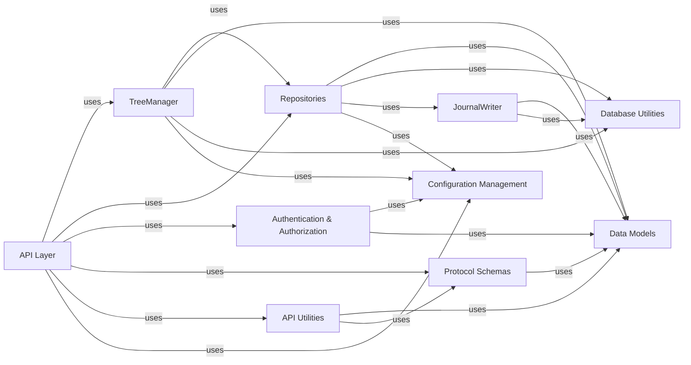

## Component Details

The `Backend Core Services` component acts as the central hub for all user interactions, orchestrating core business logic, managing authentication, task requests, message lifecycle, and persistent data storage. It directly interacts with the database and determines task availability.

### API Layer
The primary interface for all external interactions, handling request routing, parsing, and response formatting. It exposes the backend's functionalities to clients.

**Related Classes/Methods**:

- `backend.oasst_backend.api.v1` (0:0)
- <a href="https://github.com/LAION-AI/Open-Assistant/blob/master/backend/oasst_backend/api/deps.py#L0-L0" target="_blank" rel="noopener noreferrer">`backend.oasst_backend.api.deps` (0:0)</a>

### TreeManager
The core business logic component responsible for managing the lifecycle and state transitions of conversational message trees. It orchestrates task availability and user interactions within conversations.

**Related Classes/Methods**:

- <a href="https://github.com/LAION-AI/Open-Assistant/blob/master/backend/oasst_backend/tree_manager.py#L0-L0" target="_blank" rel="noopener noreferrer">`backend.oasst_backend.tree_manager` (0:0)</a>

### Repositories
Provides an abstraction layer for data access operations, encapsulating logic for querying, creating, updating, and deleting specific types of data (e.g., prompts, tasks, users).

**Related Classes/Methods**:

- <a href="https://github.com/LAION-AI/Open-Assistant/blob/master/backend/oasst_backend/prompt_repository.py#L0-L0" target="_blank" rel="noopener noreferrer">`backend.oasst_backend.prompt_repository` (0:0)</a>
- <a href="https://github.com/LAION-AI/Open-Assistant/blob/master/backend/oasst_backend/task_repository.py#L0-L0" target="_blank" rel="noopener noreferrer">`backend.oasst_backend.task_repository` (0:0)</a>
- <a href="https://github.com/LAION-AI/Open-Assistant/blob/master/backend/oasst_backend/user_repository.py#L0-L0" target="_blank" rel="noopener noreferrer">`backend.oasst_backend.user_repository` (0:0)</a>
- <a href="https://github.com/LAION-AI/Open-Assistant/blob/master/backend/oasst_backend/cached_stats_repository.py#L0-L0" target="_blank" rel="noopener noreferrer">`backend.oasst_backend.cached_stats_repository` (0:0)</a>
- <a href="https://github.com/LAION-AI/Open-Assistant/blob/master/backend/oasst_backend/user_stats_repository.py#L0-L0" target="_blank" rel="noopener noreferrer">`backend.oasst_backend.user_stats_repository` (0:0)</a>

### Data Models
Defines the SQLAlchemy ORM models representing the structure of persistent data in the database, including core entities like `Message`, `User`, `Journal`, and `Task`.

**Related Classes/Methods**:

- `backend.oasst_backend.models` (0:0)

### Database Utilities
Provides essential utility functions for managing database transactions and sessions, ensuring atomic and consistent database operations.

**Related Classes/Methods**:

- <a href="https://github.com/LAION-AI/Open-Assistant/blob/master/backend/oasst_backend/utils/database_utils.py#L0-L0" target="_blank" rel="noopener noreferrer">`backend.oasst_backend.utils.database_utils` (0:0)</a>
- <a href="https://github.com/LAION-AI/Open-Assistant/blob/master/backend/oasst_backend/database.py#L0-L0" target="_blank" rel="noopener noreferrer">`backend.oasst_backend.database` (0:0)</a>

### Authentication & Authorization
Handles user authentication (e.g., Discord login), API client authorization, and rate-limiting to secure access to the system.

**Related Classes/Methods**:

- <a href="https://github.com/LAION-AI/Open-Assistant/blob/master/backend/oasst_backend/auth.py#L0-L0" target="_blank" rel="noopener noreferrer">`backend.oasst_backend.auth` (0:0)</a>
- <a href="https://github.com/LAION-AI/Open-Assistant/blob/master/backend/oasst_backend/api/deps.py#L0-L0" target="_blank" rel="noopener noreferrer">`backend.oasst_backend.api.deps` (0:0)</a>

### JournalWriter
Dedicated to logging various user and system events (e.g., text replies, ratings, rankings) into a journal, providing an audit trail and data source for analysis.

**Related Classes/Methods**:

- <a href="https://github.com/LAION-AI/Open-Assistant/blob/master/backend/oasst_backend/journal_writer.py#L0-L0" target="_blank" rel="noopener noreferrer">`backend.oasst_backend.journal_writer` (0:0)</a>

### Protocol Schemas
Defines Pydantic schemas for data validation, serialization, and deserialization, establishing the contract for data exchange, especially for API requests and responses.

**Related Classes/Methods**:

- <a href="https://github.com/LAION-AI/Open-Assistant/blob/master/oasst-shared/oasst_shared/schemas/protocol.py#L0-L0" target="_blank" rel="noopener noreferrer">`oasst_shared.schemas.protocol` (0:0)</a>
- `backend.oasst_backend.schemas` (0:0)

### Configuration Management
Centralizes the management of application-wide configuration settings, providing a unified interface for accessing parameters like database connection strings and API keys.

**Related Classes/Methods**:

- <a href="https://github.com/LAION-AI/Open-Assistant/blob/master/backend/oasst_backend/config.py#L0-L0" target="_blank" rel="noopener noreferrer">`backend.oasst_backend.config` (0:0)</a>

### API Utilities
Contains helper functions used by the `API Layer` to transform raw database models into `Protocol Schemas` for API responses, streamlining data presentation.

**Related Classes/Methods**:

- <a href="https://github.com/LAION-AI/Open-Assistant/blob/master/backend/oasst_backend/api/v1/utils.py#L0-L0" target="_blank" rel="noopener noreferrer">`backend.oasst_backend.api.v1.utils` (0:0)</a>

### [FAQ](https://github.com/CodeBoarding/GeneratedOnBoardings/tree/main?tab=readme-ov-file#faq)