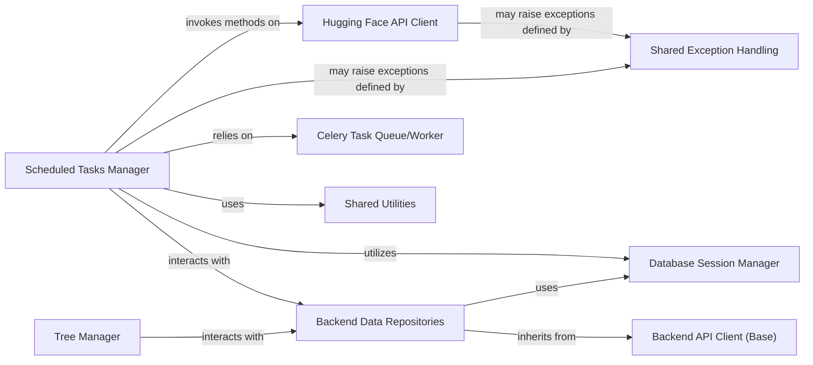

## Component Details

This subsystem provides essential supporting functionalities for the Open-Assistant backend, encompassing scheduled background tasks, external service integrations, and fundamental data management. It ensures the system's scalability, responsiveness, and ability to interact with specialized external AI services.

### Scheduled Tasks Manager
This component is the orchestrator for all automated, periodic background tasks within the Open-Assistant backend. It is responsible for initiating and managing critical operations such as interacting with the Hugging Face API for model inference and feature extraction, performing toxicity analysis on user inputs, updating search indices, and managing user-specific data like streak resets. It leverages a Celery-based task queue for asynchronous processing, ensuring that these long-running tasks do not block the main application flow.

**Related Classes/Methods**:

- `Scheduled Tasks Manager` (1:1)

### Hugging Face API Client
This component provides a dedicated and structured interface for secure communication with the Hugging Face platform's APIs. Its primary responsibility is to facilitate sending data (e.g., prompts, messages) to Hugging Face models for specialized processing (such as inference, toxicity checks, and feature extraction) and to handle the responses, including potential errors. It acts as the gateway for leveraging external AI capabilities.

**Related Classes/Methods**:

- `Hugging Face API Client` (1:1)

### Database Session Manager
This component is fundamental for managing database connections and sessions across the backend. It provides a centralized factory for obtaining database sessions and includes utility functions for database-specific operations, such as converting language codes for PostgreSQL's text search. It serves as the primary gateway for all data persistence and retrieval operations, ensuring consistent and efficient database interactions.

**Related Classes/Methods**:

- `Database Session Manager` (1:1)

### Backend API Client (Base)
This component serves as a foundational base class (`ApiClient`) for various repository classes within the `oasst_backend` system. It provides common functionalities or an abstract interface for interacting with different data domains or backend services, ensuring consistency and reusability across data access operations. It establishes a common pattern for data interaction.

**Related Classes/Methods**:

- `Backend API Client (Base)` (1:1)

### Backend Data Repositories
This is a collection of specialized repository classes (e.g., `PromptRepository`, `UserRepository`, `TaskRepository`, `JournalWriter`) responsible for abstracting data access operations to the database. They provide a clean API for creating, reading, updating, and deleting data related to prompts, users, tasks, and journal entries, building upon the `Backend API Client (Base)`. This component ensures a clear separation between business logic and data persistence.

**Related Classes/Methods**:

- `Backend Data Repositories` (1:1)
- `Backend Data Repositories` (1:1)
- `Backend Data Repositories` (1:1)
- `Backend Data Repositories` (1:1)

### Celery Task Queue/Worker
This component manages the asynchronous execution of background tasks using the Celery distributed task queue. It provides the mechanism for scheduling, queuing, and processing tasks initiated by the `Scheduled Tasks Manager`, ensuring that long-running or periodic operations do not block the main application flow. It is critical for the scalability and responsiveness of the backend.

**Related Classes/Methods**:

- `Celery Task Queue/Worker` (1:1)

### Tree Manager
This component is specifically responsible for managing the complex message tree structure within the Open-Assistant system. It interacts with the `PromptRepository` to retrieve and update messages, ensuring the integrity and consistency of conversational flows. It handles operations related to creating, updating, and navigating the hierarchical message data.

**Related Classes/Methods**:

- `Tree Manager` (1:1)

### Shared Utilities
A collection of general-purpose utility functions, external to the immediate `oasst_backend` package, but commonly used across different modules and components of the `Open-Assistant` project. This includes functionalities for logging execution timings and obtaining current UTC timestamps, promoting code reusability and consistency throughout the system.

**Related Classes/Methods**:

- `Shared Utilities` (1:1)

### Shared Exception Handling
This component defines a standardized set of custom exception classes, specifically `OasstError`, along with associated error codes. While external to `oasst_backend`, it ensures consistent and structured error reporting across the entire `Open-Assistant` API, making debugging and error management more efficient and predictable.

**Related Classes/Methods**:

- `Shared Exception Handling` (1:1)

### [FAQ](https://github.com/CodeBoarding/GeneratedOnBoardings/tree/main?tab=readme-ov-file#faq)