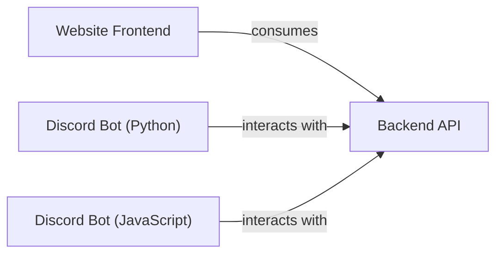

## Component Details

This overview details the structure, flow, and purpose of the `Client Applications` subsystem within the Open-Assistant project. This subsystem is crucial as it provides all user-facing interfaces, enabling direct interaction with the platform for message creation, ranking, and labeling.

### Website Frontend
The primary web-based user interface for Open-Assistant. It allows users to create new messages, rank existing ones, and label conversations, directly contributing to the dataset. This component is built to be responsive and user-friendly, consuming the RESTful API provided by the `Backend API`.

**Related Classes/Methods**: _None_

### Discord Bot (Python)
A Discord bot implemented in Python that enables users to interact with the Open-Assistant platform directly from Discord. It translates Discord commands into API calls to the `Backend API` for tasks such as message creation, ranking, and labeling.

**Related Classes/Methods**: _None_

### Discord Bot (JavaScript)
A Discord bot implemented in JavaScript, serving a similar purpose to the Python bot. It provides an alternative interface for Discord users to engage with the Open-Assistant platform, facilitating data collection tasks through Discord commands by communicating with the `Backend API`.

**Related Classes/Methods**: _None_

### Backend API
This component provides the central RESTful API that all client applications (Website Frontend, Discord Bots) consume to interact with the Open-Assistant platform's core functionalities. It acts as an intermediary, handling requests for message creation, retrieval, ranking, and labeling, and orchestrating operations with the underlying data storage and processing layers.

**Related Classes/Methods**: _None_

### [FAQ](https://github.com/CodeBoarding/GeneratedOnBoardings/tree/main?tab=readme-ov-file#faq)