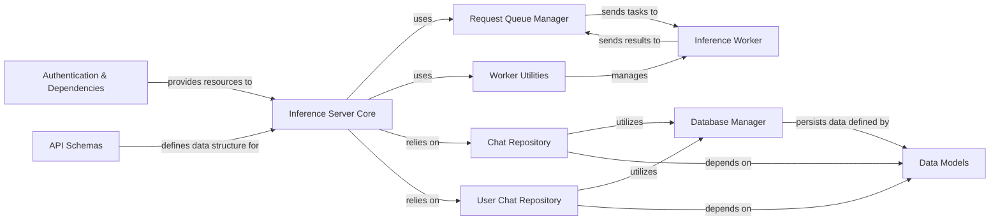

## Component Details

Here's an overview of the fundamental components within the Inference System, their responsibilities, and their interactions. These components were chosen because they represent distinct functional areas critical to the system's operation, from handling API requests to performing the actual model inference and managing data persistence.

### Inference Server Core
The main application entry point, responsible for setting up the FastAPI application, defining API endpoints, and orchestrating the overall inference flow. It initializes the FastAPI app, sets up middleware, defines routes for chat interactions, and integrates with other components. It acts as the public-facing API for inference requests.

**Related Classes/Methods**:

- <a href="https://github.com/LAION-AI/Open-Assistant/blob/master/oasst-shared/oasst_shared/schemas/inference.py#L1-L1" target="_blank" rel="noopener noreferrer">`inference.server.oasst_inference_server` (1:1)</a>

### Request Queue Manager
Manages the asynchronous queuing of inference requests and responses, ensuring efficient communication between the server and worker nodes. It implements a message queue to push inference requests to workers and retrieve their responses asynchronously, handling the lifecycle of these messages.

**Related Classes/Methods**:

- <a href="https://github.com/LAION-AI/Open-Assistant/blob/master/inference/server/oasst_inference_server/queueing.py#L1-L1" target="_blank" rel="noopener noreferrer">`inference.server.oasst_inference_server.queueing` (1:1)</a>

### Worker Utilities
Provides helper functions and logic for interacting with and managing the worker nodes that perform the actual model inference. This includes sending requests to workers and handling their responses, bridging the server's request handling with the actual worker execution.

**Related Classes/Methods**:

- <a href="https://github.com/LAION-AI/Open-Assistant/blob/master/inference/server/oasst_inference_server/worker_utils.py#L1-L1" target="_blank" rel="noopener noreferrer">`inference.server.oasst_inference_server.worker_utils` (1:1)</a>

### Chat Repository
Handles the persistence and retrieval of chat-related data, including messages, conversations, and reports, which are central to inference requests and responses. It provides CRUD operations for chat messages, conversations, and reports, interacting directly with the database via SQLAlchemy models.

**Related Classes/Methods**:

- <a href="https://github.com/LAION-AI/Open-Assistant/blob/master/inference/server/oasst_inference_server/chat_repository.py#L1-L1" target="_blank" rel="noopener noreferrer">`inference.server.oasst_inference_server.chat_repository` (1:1)</a>

### User Chat Repository
A specialized repository for managing chat data specific to individual users. It provides CRUD operations for chat messages, conversations, and reports, interacting directly with the database via SQLAlchemy models.

**Related Classes/Methods**:

- <a href="https://github.com/LAION-AI/Open-Assistant/blob/master/inference/server/oasst_inference_server/user_chat_repository.py#L1-L1" target="_blank" rel="noopener noreferrer">`inference.server.oasst_inference_server.user_chat_repository` (1:1)</a>

### Database Manager
Manages the database connection and session handling for all data persistence operations within the inference server. It provides a consistent interface for other components to interact with the database.

**Related Classes/Methods**:

- <a href="https://github.com/LAION-AI/Open-Assistant/blob/master/inference/server/oasst_inference_server/database.py#L1-L1" target="_blank" rel="noopener noreferrer">`inference.server.oasst_inference_server.database` (1:1)</a>

### Data Models
Defines the SQLAlchemy ORM models for various entities like chat messages (DbMessage), reports (DbReport), users, and worker events (DbWorkerEvent), structuring the data stored and retrieved by the system. It defines the structure and validation rules for data exchanged within the system and stored in the database.

**Related Classes/Methods**:

- `inference.server.oasst_inference_server.models` (1:1)

### API Schemas
Defines Pydantic schemas for request and response validation, ensuring data consistency across the API. It defines the structure and validation rules for data exchanged within the system and presented via the API.

**Related Classes/Methods**:

- `inference.server.oasst_inference_server.schemas` (1:1)

### Authentication & Dependencies
Handles user authentication, authorization, and dependency injection for various services and repositories used throughout the server. It secures API endpoints and provides necessary resources to handlers.

**Related Classes/Methods**:

- <a href="https://github.com/LAION-AI/Open-Assistant/blob/master/inference/server/oasst_inference_server/auth.py#L1-L1" target="_blank" rel="noopener noreferrer">`inference.server.oasst_inference_server.auth` (1:1)</a>
- <a href="https://github.com/LAION-AI/Open-Assistant/blob/master/inference/server/oasst_inference_server/deps.py#L1-L1" target="_blank" rel="noopener noreferrer">`inference.server.oasst_inference_server.deps` (1:1)</a>

### Inference Worker
Executes the actual language model inference. It receives inference tasks from the Request Queue Manager, loads the models, performs the actual forward pass, and sends the results back to the server via the queueing mechanism.

**Related Classes/Methods**:

- <a href="https://github.com/LAION-AI/Open-Assistant/blob/master/oasst-shared/oasst_shared/schemas/inference.py#L1-L1" target="_blank" rel="noopener noreferrer">`inference.server.worker` (1:1)</a>

### [FAQ](https://github.com/CodeBoarding/GeneratedOnBoardings/tree/main?tab=readme-ov-file#faq)