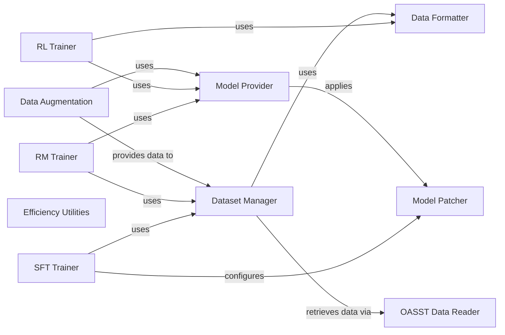

## Component Details

This subsystem encompasses the entire lifecycle of language model development, from data acquisition and augmentation to model training (Supervised Fine-Tuning, Reward Models, Reinforcement Learning) and evaluation. Its primary purpose is to prepare and deploy models for use by the Inference System.

### SFT Trainer
Orchestrates the Supervised Fine-Tuning (SFT) process. It handles argument parsing, tokenizer and model loading, dataset preparation, and the training loop for SFT models. It is the primary entry point for SFT.

**Related Classes/Methods**:

- <a href="https://github.com/LAION-AI/Open-Assistant/blob/master/model/model_training/trainer_sft.py#L1-L1" target="_blank" rel="noopener noreferrer">`model.model_training.trainer_sft` (1:1)</a>

### RM Trainer
Manages the training of Reward Models (RM). Similar to the SFT Trainer, it's responsible for setting up the training environment, loading necessary components, and executing the RM training loop.

**Related Classes/Methods**:

- <a href="https://github.com/LAION-AI/Open-Assistant/blob/master/model/model_training/trainer_rm.py#L1-L1" target="_blank" rel="noopener noreferrer">`model.model_training.trainer_rm` (1:1)</a>

### RL Trainer
Oversees the Reinforcement Learning (RL) training process, including argument parsing and the creation of reward functions. It integrates with models and data formatting for the RL loop.

**Related Classes/Methods**:

- <a href="https://github.com/LAION-AI/Open-Assistant/blob/master/model/model_training/trainer_rl.py#L1-L1" target="_blank" rel="noopener noreferrer">`model.model_training.trainer_rl` (1:1)</a>

### Dataset Manager
A comprehensive module responsible for loading, processing, and managing various custom datasets used in model training. It acts as a factory for different dataset types (QA, summarization, instruction, ranking, etc.).

**Related Classes/Methods**:

- `model.model_training.custom_datasets` (1:1)
- <a href="https://github.com/LAION-AI/Open-Assistant/blob/master/model/model_training/custom_datasets/instruction.py#L1-L1" target="_blank" rel="noopener noreferrer">`model.model_training.custom_datasets.instruction` (1:1)</a>
- <a href="https://github.com/LAION-AI/Open-Assistant/blob/master/model/model_training/custom_datasets/oasst_dataset.py#L1-L1" target="_blank" rel="noopener noreferrer">`model.model_training.custom_datasets.oasst_dataset` (1:1)</a>
- <a href="https://github.com/LAION-AI/Open-Assistant/blob/master/model/model_training/custom_datasets/pretrain_datasets.py#L1-L1" target="_blank" rel="noopener noreferrer">`model.model_training.custom_datasets.pretrain_datasets` (1:1)</a>
- <a href="https://github.com/LAION-AI/Open-Assistant/blob/master/model/model_training/custom_datasets/rank_datasets.py#L1-L1" target="_blank" rel="noopener noreferrer">`model.model_training.custom_datasets.rank_datasets` (1:1)</a>

### Data Formatter
Provides utilities for formatting raw data into structured entries suitable for model training, including handling dialogues, utterances, and creating dataset entry objects. It defines the common data structures used across different training types.

**Related Classes/Methods**:

- <a href="https://github.com/LAION-AI/Open-Assistant/blob/master/model/model_training/custom_datasets/formatting.py#L1-L1" target="_blank" rel="noopener noreferrer">`model.model_training.custom_datasets.formatting` (1:1)</a>

### Model Provider
Offers utility functions for retrieving and initializing models and tokenizers, abstracting away the specifics of model loading and configuration. It ensures consistent model instantiation across different training pipelines.

**Related Classes/Methods**:

- <a href="https://github.com/LAION-AI/Open-Assistant/blob/master/model/model_training/utils/utils.py#L300-L356" target="_blank" rel="noopener noreferrer">`model.model_training.utils.utils:get_model` (300:356)</a>
- <a href="https://github.com/LAION-AI/Open-Assistant/blob/master/model/model_training/utils/utils.py#L207-L242" target="_blank" rel="noopener noreferrer">`model.model_training.utils.utils:get_tokenizer` (207:242)</a>

### Model Patcher
Handles modifications and optimizations to models, such as applying PEFT (Parameter-Efficient Fine-Tuning) adapters, adding flash attention, or patching Rope embeddings for specific architectures (e.g., Falcon, Llama, NeoX).

**Related Classes/Methods**:

- <a href="https://github.com/LAION-AI/Open-Assistant/blob/master/model/model_training/models/patching.py#L1-L1" target="_blank" rel="noopener noreferrer">`model.model_training.models.patching` (1:1)</a>
- <a href="https://github.com/LAION-AI/Open-Assistant/blob/master/model/model_training/models/peft_modeling.py#L1-L1" target="_blank" rel="noopener noreferrer">`model.model_training.models.peft_modeling` (1:1)</a>

### Efficiency Utilities
Contains functions aimed at improving the efficiency of model operations, such as fusing GELU activations or other performance-enhancing techniques.

**Related Classes/Methods**:

- <a href="https://github.com/LAION-AI/Open-Assistant/blob/master/model/model_training/efficiency_utils.py#L1-L1" target="_blank" rel="noopener noreferrer">`model.model_training.efficiency_utils` (1:1)</a>

### OASST Data Reader
Dedicated module for reading and parsing Open-Assistant (OASST) specific data formats, including message trees and individual messages from JSONL files, adhering to defined schemas.

**Related Classes/Methods**:

- <a href="https://github.com/LAION-AI/Open-Assistant/blob/master/oasst-data/oasst_data/reader.py#L1-L1" target="_blank" rel="noopener noreferrer">`oasst_data.reader` (1:1)</a>

### Data Augmentation
A separate script and module for augmenting existing datasets, providing various strategies like hierarchical summarization, entity recognition, and code bugging/instruction generation to enrich the training data.

**Related Classes/Methods**:

- <a href="https://github.com/LAION-AI/Open-Assistant/blob/master/scripts/data_augment/data_augment.py#L1-L1" target="_blank" rel="noopener noreferrer">`scripts.data_augment.data_augment` (1:1)</a>

### [FAQ](https://github.com/CodeBoarding/GeneratedOnBoardings/tree/main?tab=readme-ov-file#faq)