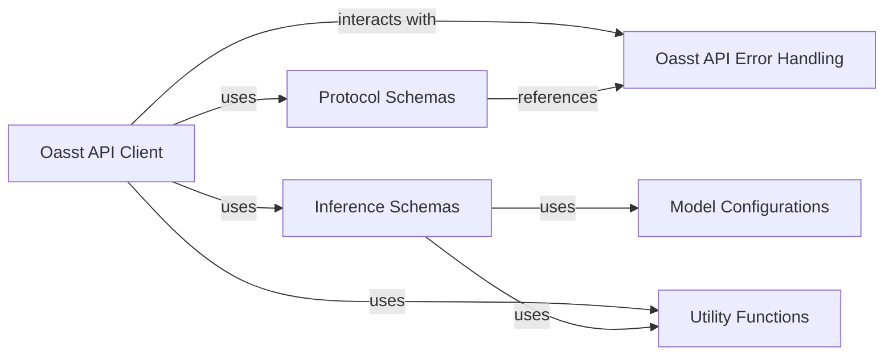

## Component Details

The `Oasst Shared Library` is a crucial foundational component within the Open-Assistant project, providing a standardized set of data schemas, API client definitions, and utility functions. Its primary purpose is to ensure data consistency and simplify inter-component communication across the entire Open-Assistant ecosystem.

### Protocol Schemas
This component defines the core data models using Pydantic schemas for various protocol-level objects. These include fundamental entities like `Task`, `Message`, `User`, and different types of `Interaction`s (e.g., `MessageRanking`, `TextReplyToMessage`). These schemas are critical for ensuring consistent data exchange and interoperability across all Open-Assistant components, particularly between the backend and frontend, and for defining the structure of tasks and user interactions.

**Related Classes/Methods**:

- <a href="https://github.com/LAION-AI/Open-Assistant/blob/master/oasst-shared/oasst_shared/schemas/protocol.py#L0-L0" target="_blank" rel="noopener noreferrer">`oasst_shared/schemas/protocol.py` (0:0)</a>

### Inference Schemas
This component specializes in defining data models (Pydantic schemas) for communication specifically with the inference workers. This includes requests for work (`WorkerRequestBase`), various types of responses (generated text, errors - `WorkerResponseBase`), and worker status information. It also incorporates `ModelConfig` for specifying model-specific parameters.

**Related Classes/Methods**:

- <a href="https://github.com/LAION-AI/Open-Assistant/blob/master/oasst-shared/oasst_shared/schemas/inference.py#L0-L0" target="_blank" rel="noopener noreferrer">`oasst_shared/schemas/inference.py` (0:0)</a>

### Oasst API Client
This component is the primary interface for all API communication with the Open-Assistant backend. It handles the lifecycle of API calls, including fetching tasks, acknowledging or negatively acknowledging tasks, and posting various user interactions. It is also responsible for the serialization and deserialization of data according to defined schemas and robust error handling during API operations.

**Related Classes/Methods**:

- `oasst_shared/oasst_api_client.py` (0:0)

### Oasst API Error Handling
This component provides a standardized mechanism for managing API-related errors. It defines custom exception classes (`OasstError`) and error codes (`OasstErrorCode`) that allow the system to gracefully handle and respond to issues encountered during API calls, improving system resilience and debuggability.

**Related Classes/Methods**:

- <a href="https://github.com/LAION-AI/Open-Assistant/blob/master/oasst-shared/oasst_shared/exceptions/oasst_api_error.py#L0-L0" target="_blank" rel="noopener noreferrer">`oasst_shared/exceptions/oasst_api_error.py` (0:0)</a>

### Model Configurations
This component is dedicated to defining data models (`ModelConfig`) for various model-specific configurations and parameters. It is primarily utilized within the `InferenceSchemas` to specify details such as model types, hyperparameters, and other settings required for inference requests and worker configurations.

**Related Classes/Methods**:

- <a href="https://github.com/LAION-AI/Open-Assistant/blob/master/oasst-shared/oasst_shared/model_configs.py#L0-L0" target="_blank" rel="noopener noreferrer">`oasst_shared/model_configs.py` (0:0)</a>

### Utility Functions
This component comprises a collection of general-purpose utility functions designed for common, reusable tasks. Examples include `ScopeTimer` for performance measurement and `Anonymizer` for data privacy, which can be leveraged across various parts of the shared library or by other components consuming the library.

**Related Classes/Methods**:

- <a href="https://github.com/LAION-AI/Open-Assistant/blob/master/oasst-shared/oasst_shared/utils.py#L0-L0" target="_blank" rel="noopener noreferrer">`oasst_shared/utils.py` (0:0)</a>

### [FAQ](https://github.com/CodeBoarding/GeneratedOnBoardings/tree/main?tab=readme-ov-file#faq)