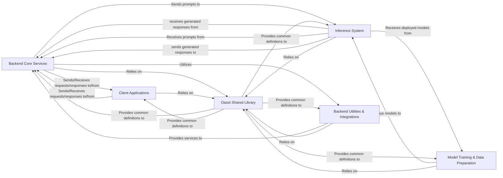

## Component Details

This analysis consolidates the Control Flow Graph (CFG) and Source Code analysis to present a high-level overview of the `Open-Assistant` project's architecture, focusing on critical interaction pathways and central modules.

### Backend Core Services
The central hub for all user interactions, managing authentication, task requests, message lifecycle, and persistent data storage. It orchestrates the core business logic, determines task availability, and interacts directly with the database.

**Related Classes/Methods**:

- `backend.oasst_backend.api.v1` (0:0)
- <a href="https://github.com/LAION-AI/Open-Assistant/blob/master/backend/oasst_backend/tree_manager.py#L0-L0" target="_blank" rel="noopener noreferrer">`backend.oasst_backend.tree_manager` (0:0)</a>
- `backend.oasst_backend.models` (0:0)
- <a href="https://github.com/LAION-AI/Open-Assistant/blob/master/backend/oasst_backend/utils/database_utils.py#L0-L0" target="_blank" rel="noopener noreferrer">`backend.oasst_backend.utils.database_utils` (0:0)</a>
- <a href="https://github.com/LAION-AI/Open-Assistant/blob/master/backend/oasst_backend/journal_writer.py#L0-L0" target="_blank" rel="noopener noreferrer">`backend.oasst_backend.journal_writer` (0:0)</a>
- <a href="https://github.com/LAION-AI/Open-Assistant/blob/master/backend/oasst_backend/prompt_repository.py#L0-L0" target="_blank" rel="noopener noreferrer">`backend.oasst_backend.prompt_repository` (0:0)</a>
- <a href="https://github.com/LAION-AI/Open-Assistant/blob/master/backend/oasst_backend/task_repository.py#L0-L0" target="_blank" rel="noopener noreferrer">`backend.oasst_backend.task_repository` (0:0)</a>
- <a href="https://github.com/LAION-AI/Open-Assistant/blob/master/backend/oasst_backend/user_repository.py#L0-L0" target="_blank" rel="noopener noreferrer">`backend.oasst_backend.user_repository` (0:0)</a>

### Inference System
Responsible for serving trained language models, handling inference requests from the Backend Core Services, and orchestrating the distribution of these requests to worker nodes. It manages the queuing of requests and responses for efficient asynchronous communication.

**Related Classes/Methods**:

- <a href="https://github.com/LAION-AI/Open-Assistant/blob/master/oasst-shared/oasst_shared/schemas/inference.py#L0-L0" target="_blank" rel="noopener noreferrer">`inference.server.oasst_inference_server` (0:0)</a>
- <a href="https://github.com/LAION-AI/Open-Assistant/blob/master/inference/server/oasst_inference_server/queueing.py#L0-L0" target="_blank" rel="noopener noreferrer">`inference.server.oasst_inference_server.queueing` (0:0)</a>
- <a href="https://github.com/LAION-AI/Open-Assistant/blob/master/inference/server/oasst_inference_server/worker_utils.py#L0-L0" target="_blank" rel="noopener noreferrer">`inference.server.oasst_inference_server.worker_utils` (0:0)</a>
- <a href="https://github.com/LAION-AI/Open-Assistant/blob/master/oasst-shared/oasst_shared/schemas/inference.py#L0-L0" target="_blank" rel="noopener noreferrer">`inference.server.worker` (0:0)</a>

### Model Training & Data Preparation
Encompasses the entire lifecycle of language model development, from data acquisition and augmentation to model training (Supervised Fine-Tuning, Reward Models, Reinforcement Learning) and evaluation. It prepares and deploys models for use by the Inference System.

**Related Classes/Methods**:

- `model.model_training` (0:0)
- `oasst_data` (0:0)
- <a href="https://github.com/LAION-AI/Open-Assistant/blob/master/scripts/data_augment/data_augment.py#L0-L0" target="_blank" rel="noopener noreferrer">`scripts.data_augment.data_augment` (0:0)</a>

### Client Applications
Provides the user-facing interfaces through which users interact with the Open-Assistant platform. This includes the web-based user interface for message creation, ranking, and labeling, as well as command-based interactions via the Discord bot.

**Related Classes/Methods**:

- `discord_bots.oa_bot_py.bot` (0:0)

### Backend Utilities & Integrations
Provides supporting functionalities for the Backend Core Services. This includes the execution of scheduled background tasks (e.g., toxicity checks, user streak resets) and integration with external services like Hugging Face for specialized processing.

**Related Classes/Methods**:

- <a href="https://github.com/LAION-AI/Open-Assistant/blob/master/backend/oasst_backend/scheduled_tasks.py#L0-L0" target="_blank" rel="noopener noreferrer">`backend.oasst_backend.scheduled_tasks` (0:0)</a>
- <a href="https://github.com/LAION-AI/Open-Assistant/blob/master/backend/oasst_backend/utils/hugging_face.py#L0-L0" target="_blank" rel="noopener noreferrer">`backend.oasst_backend.utils.hugging_face` (0:0)</a>

### Oasst Shared Library
A foundational library providing a consistent set of data schemas, API client definitions, and utility functions. It is used across almost all components of the Open-Assistant project to ensure data consistency and simplify inter-component communication.

**Related Classes/Methods**:

- `oasst_shared` (0:0)

### [FAQ](https://github.com/CodeBoarding/GeneratedOnBoardings/tree/main?tab=readme-ov-file#faq)