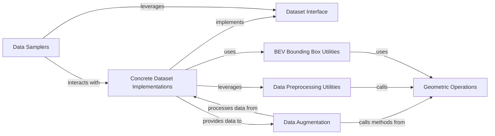

## Details

The `ml3d.datasets` subsystem is designed around a flexible `Dataset Interface` that standardizes how 3D datasets are handled. `Concrete Dataset Implementations` provide specific dataset loading and parsing, adhering to this interface. Data flow from these implementations can be further processed by `Data Augmentation` for diversity and prepared by `Data Preprocessing Utilities` for consistency. `Data Samplers` then organize this data into batches for model consumption. Underlying these operations, `Geometric Operations` provides fundamental 3D mathematical functions, which are utilized by both `Data Augmentation` and `Data Preprocessing Utilities`, and critically, by `BEV Bounding Box Utilities` for specialized bounding box manipulations. This modular design ensures robust and extensible data handling for 3D machine learning tasks.

### Dataset Interface
Defines the foundational abstract interface and common structure that all 3D dataset classes must adhere to. It ensures data consistency across different dataset implementations.

**Related Classes/Methods**:

- <a href="https://github.com/isl-org/Open3D-ML/blob/main/ml3d/datasets" target="_blank" rel="noopener noreferrer">`ml3d.datasets`</a>

### Concrete Dataset Implementations
A conceptual grouping of specific dataset handlers (e.g., SemanticKITTI, S3DIS, KITTI, CustomDataset) that implement the `ml3d.datasets` interface. These components are responsible for dataset-specific parsing, loading, and initial data structuring.

**Related Classes/Methods**:

- <a href="https://github.com/isl-org/Open3D-ML/blob/main/ml3d/datasets/semantickitti.py" target="_blank" rel="noopener noreferrer">`ml3d.datasets.semantickitti`</a>
- <a href="https://github.com/isl-org/Open3D-ML/blob/main/ml3d/datasets/s3dis.py" target="_blank" rel="noopener noreferrer">`ml3d.datasets.s3dis`</a>
- <a href="https://github.com/isl-org/Open3D-ML/blob/main/ml3d/datasets/kitti.py" target="_blank" rel="noopener noreferrer">`ml3d.datasets.kitti`</a>
- <a href="https://github.com/isl-org/Open3D-ML/blob/main/ml3d/datasets/customdataset.py" target="_blank" rel="noopener noreferrer">`ml3d.datasets.customdataset`</a>

### Data Augmentation
Provides a collection of methods and classes for applying various transformations (e.g., rotation, scaling, noise) to 3D data, enhancing dataset diversity and model robustness.

**Related Classes/Methods**:

- <a href="https://github.com/isl-org/Open3D-ML/blob/main/ml3d/datasets/augment/augmentation.py" target="_blank" rel="noopener noreferrer">`ml3d.datasets.augment.augmentation`</a>

### Data Samplers
Defines strategies and mechanisms for sampling points or data clouds from datasets, crucial for creating mini-batches for training and inference.

**Related Classes/Methods**:

- <a href="https://github.com/isl-org/Open3D-ML/blob/main/ml3d/datasets/samplers" target="_blank" rel="noopener noreferrer">`ml3d.datasets.samplers`</a>

### Data Preprocessing Utilities
Manages common preprocessing tasks such as transformations between 3D coordinate systems, point cloud filtering, and normalization.

**Related Classes/Methods**:

- <a href="https://github.com/isl-org/Open3D-ML/blob/main/ml3d/datasets/utils/dataprocessing.py" target="_blank" rel="noopener noreferrer">`ml3d.datasets.utils.dataprocessing`</a>

### Geometric Operations
Offers low-level, fundamental functions for 3D geometric manipulations, serving as a foundational utility for other components requiring basic 3D math.

**Related Classes/Methods**:

- <a href="https://github.com/isl-org/Open3D-ML/blob/main/ml3d/datasets/utils/operations.py" target="_blank" rel="noopener noreferrer">`ml3d.datasets.utils.operations`</a>

### BEV Bounding Box Utilities
Encapsulates logic for handling and converting 3D bounding boxes, particularly for Bird's Eye View (BEV) representations, which are common in autonomous driving datasets.

**Related Classes/Methods**:

- <a href="https://github.com/isl-org/Open3D-ML/blob/main/ml3d/datasets/utils/bev_box.py" target="_blank" rel="noopener noreferrer">`ml3d.datasets.utils.bev_box`</a>

### [FAQ](https://github.com/CodeBoarding/GeneratedOnBoardings/tree/main?tab=readme-ov-file#faq)