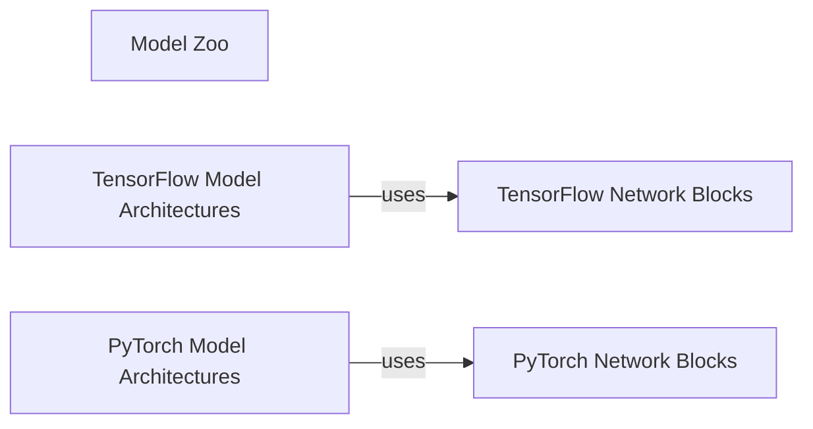

## Details

The Model Zoo subsystem serves as a central repository for 3D deep learning model architectures, implemented in both TensorFlow and PyTorch. Its core functionality revolves around defining and organizing various model structures, which are constructed from a set of fundamental, reusable network building blocks. This design promotes modularity and reusability, allowing different model architectures to leverage common computational patterns. The critical interaction pathway within this subsystem is the composition of Model Architectures from Network Blocks. Specifically, TensorFlow Model Architectures utilize TensorFlow Network Blocks, and PyTorch Model Architectures utilize PyTorch Network Blocks to define their forward passes and overall structures. This hierarchical relationship is essential for understanding how complex models are built from simpler, foundational components.

### Model Zoo [[Expand]](./Model_Zoo.md)
The Model Zoo subsystem is defined by the `ml3d.tf.models` and `ml3d.torch.models` packages. It encapsulates various 3D deep learning model architectures implemented in TensorFlow and PyTorch, serving as a central repository for reusable model definitions.

**Related Classes/Methods**:

- <a href="https://github.com/isl-org/Open3D-ML/blob/main/ml3d/tf/models" target="_blank" rel="noopener noreferrer">`ml3d.tf.models`</a>
- <a href="https://github.com/isl-org/Open3D-ML/blob/main/ml3d/torch/models" target="_blank" rel="noopener noreferrer">`ml3d.torch.models`</a>

### TensorFlow Model Architectures
Implements specific 3D deep learning models (e.g., KPConv, PointPillars, PointTransformer, PVCNN, RandLANet) using TensorFlow. These components define the forward pass and overall structure of the models.

**Related Classes/Methods**:

- <a href="https://github.com/isl-org/Open3D-ML/blob/main/ml3d/tf/models/kpconv.py" target="_blank" rel="noopener noreferrer">`ml3d.tf.models.kpconv`</a>
- <a href="https://github.com/isl-org/Open3D-ML/blob/main/ml3d/tf/models/point_pillars.py" target="_blank" rel="noopener noreferrer">`ml3d.tf.models.point_pillars`</a>
- <a href="https://github.com/isl-org/Open3D-ML/blob/main/ml3d/tf/models/point_transformer.py" target="_blank" rel="noopener noreferrer">`ml3d.tf.models.point_transformer`</a>
- <a href="https://github.com/isl-org/Open3D-ML/blob/main/ml3d/tf/models/pvcnn.py" target="_blank" rel="noopener noreferrer">`ml3d.tf.models.pvcnn`</a>
- <a href="https://github.com/isl-org/Open3D-ML/blob/main/ml3d/tf/models/randlanet.py" target="_blank" rel="noopener noreferrer">`ml3d.tf.models.randlanet`</a>

### PyTorch Model Architectures
Implements specific 3D deep learning models (e.g., KPConv, PointPillars, PointTransformer, PVCNN, RandLANet) using PyTorch. These components define the forward pass and overall structure of the models.

**Related Classes/Methods**:

- <a href="https://github.com/isl-org/Open3D-ML/blob/main/ml3d/torch/models/kpconv.py" target="_blank" rel="noopener noreferrer">`ml3d.torch.models.kpconv`</a>
- <a href="https://github.com/isl-org/Open3D-ML/blob/main/ml3d/torch/models/point_pillars.py" target="_blank" rel="noopener noreferrer">`ml3d.torch.models.point_pillars`</a>
- <a href="https://github.com/isl-org/Open3D-ML/blob/main/ml3d/torch/models/point_transformer.py" target="_blank" rel="noopener noreferrer">`ml3d.torch.models.point_transformer`</a>
- <a href="https://github.com/isl-org/Open3D-ML/blob/main/ml3d/torch/models/pvcnn.py" target="_blank" rel="noopener noreferrer">`ml3d.torch.models.pvcnn`</a>
- <a href="https://github.com/isl-org/Open3D-ML/blob/main/ml3d/torch/models/randlanet.py" target="_blank" rel="noopener noreferrer">`ml3d.torch.models.randlanet`</a>

### TensorFlow Network Blocks
Provides reusable, fundamental neural network layers and building blocks specifically designed for TensorFlow models. These blocks are composed to form the larger model architectures.

**Related Classes/Methods**:

- <a href="https://github.com/isl-org/Open3D-ML/blob/main/ml3d/tf/models/network_blocks.py" target="_blank" rel="noopener noreferrer">`ml3d.tf.models.network_blocks`</a>

### PyTorch Network Blocks
Provides reusable, fundamental neural network layers and building blocks specifically designed for PyTorch models. These blocks are composed to form the larger model architectures.

**Related Classes/Methods**:

- <a href="https://github.com/isl-org/Open3D-ML/blob/main/ml3d/torch/modules" target="_blank" rel="noopener noreferrer">`ml3d.torch.modules`</a>

### [FAQ](https://github.com/CodeBoarding/GeneratedOnBoardings/tree/main?tab=readme-ov-file#faq)