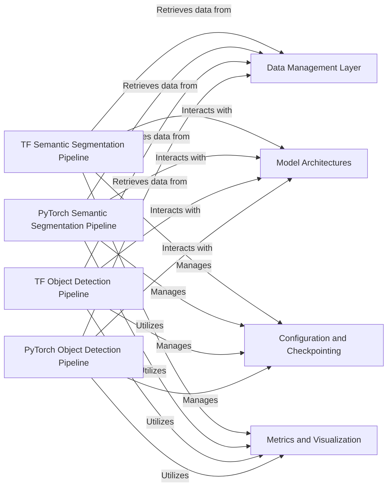

## Details

The `ml3d` project's core functionality is orchestrated by specialized **Pipeline** components for TensorFlow and PyTorch, handling both semantic segmentation and object detection tasks. These pipelines serve as the central orchestrators, managing the entire machine learning lifecycle from data ingestion to model evaluation. They **retrieve data from** the **Data Management Layer**, which is responsible for efficient loading, preprocessing, and augmentation of 3D point cloud datasets. The pipelines **interact with** the **Model Architectures** component, which encapsulates the various deep learning models tailored for specific tasks and frameworks. Throughout the training and inference processes, the pipelines **manage** the **Configuration and Checkpointing** component to apply experiment settings and persist model states. Finally, they **utilize** the **Metrics and Visualization** component to compute performance metrics and generate insightful 3D visualizations of the results. This modular design ensures clear separation of concerns, allowing for flexible integration of new datasets, models, and evaluation techniques.

### TF Semantic Segmentation Pipeline
Manages the sequential execution of machine learning stages (training, validation, testing, inference) for TensorFlow semantic segmentation models. It drives forward/backward passes, coordinates data loading, handles model checkpointing, records metrics, applies configurations, and produces summaries including 3D visualizations.

**Related Classes/Methods**:

- <a href="https://github.com/isl-org/Open3D-ML/blob/main/ml3d/tf/pipelines/semantic_segmentation.py" target="_blank" rel="noopener noreferrer">`ml3d.tf.pipelines.semantic_segmentation`</a>

### PyTorch Semantic Segmentation Pipeline
Manages the sequential execution of machine learning stages (training, validation, testing, inference) for PyTorch semantic segmentation models. It drives forward/backward passes, coordinates data loading, handles model checkpointing, records metrics, applies configurations, and produces summaries including 3D visualizations.

**Related Classes/Methods**:

- <a href="https://github.com/isl-org/Open3D-ML/blob/main/ml3d/torch/pipelines/semantic_segmentation.py" target="_blank" rel="noopener noreferrer">`ml3d.torch.pipelines.semantic_segmentation`</a>

### TF Object Detection Pipeline
Manages the sequential execution of machine learning stages (training, validation, testing, inference) for TensorFlow object detection models. It drives forward/backward passes, coordinates data loading, handles model checkpointing, records metrics, applies configurations, and produces summaries including 3D visualizations.

**Related Classes/Methods**:

- <a href="https://github.com/isl-org/Open3D-ML/blob/main/ml3d/tf/pipelines/object_detection.py" target="_blank" rel="noopener noreferrer">`ml3d.tf.pipelines.object_detection`</a>

### PyTorch Object Detection Pipeline
Manages the sequential execution of machine learning stages (training, validation, testing, inference) for PyTorch object detection models. It drives forward/backward passes, coordinates data loading, handles model checkpointing, records metrics, applies configurations, and produces summaries including 3D visualizations.

**Related Classes/Methods**:

- <a href="https://github.com/isl-org/Open3D-ML/blob/main/ml3d/torch/pipelines/object_detection.py" target="_blank" rel="noopener noreferrer">`ml3d.torch.pipelines.object_detection`</a>

### Data Management Layer
Responsible for loading, preprocessing, and augmenting 3D point cloud data from various datasets, providing a unified interface for different machine learning pipelines. It handles data iterators and batching for efficient model training and evaluation.

**Related Classes/Methods**:

- <a href="https://github.com/isl-org/Open3D-ML/blob/main/ml3d/datasets" target="_blank" rel="noopener noreferrer">`ml3d.datasets`</a>
- <a href="https://github.com/isl-org/Open3D-ML/blob/main/ml3d/tf/dataloaders/tf_dataloader.py" target="_blank" rel="noopener noreferrer">`ml3d.tf.dataloaders.tf_dataloader`</a>
- <a href="https://github.com/isl-org/Open3D-ML/blob/main/ml3d/torch/dataloaders/torch_dataloader.py" target="_blank" rel="noopener noreferrer">`ml3d.torch.dataloaders.torch_dataloader`</a>

### Model Architectures
Contains the implementations of various 3D deep learning models for tasks like semantic segmentation and object detection, supporting both TensorFlow and PyTorch frameworks. It defines the neural network structures and their forward pass logic.

**Related Classes/Methods**:

- <a href="https://github.com/isl-org/Open3D-ML/blob/main/ml3d/tf/models" target="_blank" rel="noopener noreferrer">`ml3d.tf.models`</a>
- <a href="https://github.com/isl-org/Open3D-ML/blob/main/ml3d/torch/models" target="_blank" rel="noopener noreferrer">`ml3d.torch.models`</a>

### Configuration and Checkpointing
Manages the loading and application of experiment configurations, and handles the saving and loading of model checkpoints during training and inference. This ensures reproducibility and allows for resuming training or deploying trained models.

**Related Classes/Methods**:

- <a href="https://github.com/isl-org/Open3D-ML/blob/main/ml3d/configs" target="_blank" rel="noopener noreferrer">`ml3d.configs`</a>
- <a href="https://github.com/isl-org/Open3D-ML/blob/main/ml3d/tf/pipelines/semantic_segmentation.py" target="_blank" rel="noopener noreferrer">`ml3d.tf.pipelines.semantic_segmentation`</a>
- <a href="https://github.com/isl-org/Open3D-ML/blob/main/ml3d/torch/pipelines/semantic_segmentation.py" target="_blank" rel="noopener noreferrer">`ml3d.torch.pipelines.semantic_segmentation`</a>

### Metrics and Visualization
Provides functionalities for calculating and reporting performance metrics (e.g., mAP, IoU) and generating visualizations, including 3D point cloud visualizations, to assess model performance and provide insights.

**Related Classes/Methods**:

- <a href="https://github.com/isl-org/Open3D-ML/blob/main/ml3d/metrics" target="_blank" rel="noopener noreferrer">`ml3d.metrics`</a>

### [FAQ](https://github.com/CodeBoarding/GeneratedOnBoardings/tree/main?tab=readme-ov-file#faq)