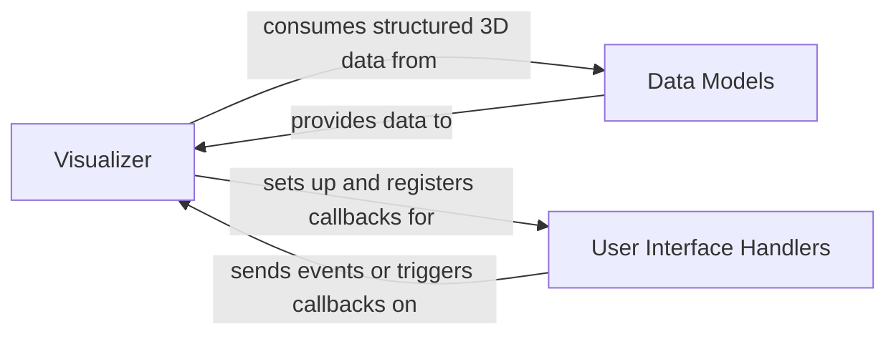

## Details

The `Visualization` subsystem provides interactive tools for visualizing 3D point clouds, bounding boxes, and segmentation results, aiding in data exploration, debugging, and analyzing model outputs.

### Visualizer
This is the core component responsible for initializing and managing the 3D visualization environment. It handles the rendering of visual representations, updates the display based on data changes, and manages camera controls and animations. It acts as the central orchestrator for the visualization process.

**Related Classes/Methods**:

- <a href="https://github.com/isl-org/Open3D-ML/blob/main/ml3d/vis/visualizer.py#L416-L1813" target="_blank" rel="noopener noreferrer">`ml3d.vis.visualizer.Visualizer`:416-1813</a>

### Data Models
This component encapsulates and provides structured access to various types of 3D data, such as point clouds, datasets, and bounding box information. It serves as the data layer for the visualization, ensuring that data is presented in a consistent and usable format for the `Visualizer`.

**Related Classes/Methods**:

- <a href="https://github.com/isl-org/Open3D-ML/blob/main/ml3d/vis/visualizer.py#L231-L264" target="_blank" rel="noopener noreferrer">`ml3d.vis.visualizer.DataModel`:231-264</a>
- <a href="https://github.com/isl-org/Open3D-ML/blob/main/ml3d/vis/visualizer.py#L267-L413" target="_blank" rel="noopener noreferrer">`ml3d.vis.visualizer.DatasetModel`:267-413</a>
- <a href="https://github.com/isl-org/Open3D-ML/blob/main/ml3d/vis/visualizer.py#L24-L35" target="_blank" rel="noopener noreferrer">`ml3d.vis.visualizer.BoundingBoxData`:24-35</a>

### User Interface Handlers
This component facilitates user interaction with the visualization. It includes controls for data selection, display parameters (e.g., colormaps, label look-up tables), camera adjustments, and animation controls. It translates user input into actions that affect the `Visualizer`'s display.

**Related Classes/Methods**:

- <a href="https://github.com/isl-org/Open3D-ML/blob/main/ml3d/vis/visualizer.py#L499-L692" target="_blank" rel="noopener noreferrer">`ml3d.vis.visualizer.ColormapEdit`:499-692</a>
- <a href="https://github.com/isl-org/Open3D-ML/blob/main/ml3d/vis/visualizer.py#L419-L497" target="_blank" rel="noopener noreferrer">`ml3d.vis.visualizer.LabelLUTEdit`:419-497</a>
- <a href="https://github.com/isl-org/Open3D-ML/blob/main/ml3d/vis/visualizer.py#L694-L740" target="_blank" rel="noopener noreferrer">`ml3d.vis.visualizer.ProgressDialog`:694-740</a>

### [FAQ](https://github.com/CodeBoarding/GeneratedOnBoardings/tree/main?tab=readme-ov-file#faq)