```mermaid
graph LR
    Application_Entry_Points["Application Entry Points"]
    Configuration["Configuration"]
    Data_Layer["Data Layer"]
    Model_Zoo["Model Zoo"]
    Pipeline_Orchestration["Pipeline Orchestration"]
    Evaluation_Metrics["Evaluation & Metrics"]
    Visualization["Visualization"]
    Application_Entry_Points -- "initiates process by loading configuration" --> Configuration
    Configuration -- "configures data loading" --> Data_Layer
    Configuration -- "configures model architecture" --> Model_Zoo
    Configuration -- "configures pipeline execution" --> Pipeline_Orchestration
    Data_Layer -- "provides input data" --> Pipeline_Orchestration
    Pipeline_Orchestration -- "executes model (Training/Inference)" --> Model_Zoo
    Model_Zoo -- "sends predictions for evaluation" --> Evaluation_Metrics
    Evaluation_Metrics -- "returns evaluation results" --> Pipeline_Orchestration
    Pipeline_Orchestration -- "sends data for visualization" --> Visualization
    Visualization -- "loads raw data (for inspection)" --> Data_Layer
    click Configuration href "https://github.com/CodeBoarding/GeneratedOnBoardings/blob/main/Open3D-ML/Configuration.md" "Details"
    click Data_Layer href "https://github.com/CodeBoarding/GeneratedOnBoardings/blob/main/Open3D-ML/Data_Layer.md" "Details"
    click Model_Zoo href "https://github.com/CodeBoarding/GeneratedOnBoardings/blob/main/Open3D-ML/Model_Zoo.md" "Details"
    click Pipeline_Orchestration href "https://github.com/CodeBoarding/GeneratedOnBoardings/blob/main/Open3D-ML/Pipeline_Orchestration.md" "Details"
    click Visualization href "https://github.com/CodeBoarding/GeneratedOnBoardings/blob/main/Open3D-ML/Visualization.md" "Details"
```

## Details

The Open3D-ML project is structured around a clear set of architectural components designed to facilitate 3D deep learning workflows. The `Application Entry Points` serve as the initial touchpoints, launching various tasks such as data preprocessing or pipeline execution. These entry points rely on the `Configuration` component to load and manage all necessary settings, including dataset paths, model parameters, and pipeline specifics. The `Data Layer` is responsible for handling the ingestion, preprocessing, and augmentation of 3D datasets, providing standardized data to the rest of the system. The `Model Zoo` houses a collection of 3D deep learning models, implemented in both TensorFlow and PyTorch, ready for various tasks like semantic segmentation or object detection. The central `Pipeline Orchestration` component manages the end-to-end machine learning workflows, coordinating data flow from the `Data Layer` to the `Model Zoo` for training or inference. Model predictions are then passed to the `Evaluation & Metrics` component for performance assessment. Finally, the `Visualization` component offers interactive tools for inspecting 3D data and model outputs, aiding in debugging and analysis. This modular design ensures a clear separation of concerns and a streamlined data flow for efficient 3D machine learning development.

### Application Entry Points
Top-level scripts that serve as the starting points for various project tasks, such as running training/inference pipelines or preprocessing datasets. They initiate the workflow by loading configurations.

**Related Classes/Methods**:

- <a href="https://github.com/isl-org/Open3D-ML/blob/main/scripts/run_pipeline.py" target="_blank" rel="noopener noreferrer">`scripts.run_pipeline`</a>
- <a href="https://github.com/isl-org/Open3D-ML/blob/main/scripts/demo_obj_det.py" target="_blank" rel="noopener noreferrer">`scripts.demo_obj_det`</a>
- <a href="https://github.com/isl-org/Open3D-ML/blob/main/scripts/preprocess_semantic3d.py" target="_blank" rel="noopener noreferrer">`scripts.preprocess_semantic3d`</a>

### Configuration [[Expand]](./Configuration.md)
Centralized component responsible for loading, parsing, and managing project configurations from YAML files. It defines and instantiates various parts of the pipeline, including dataset paths, model parameters, and pipeline settings.

**Related Classes/Methods**:

- <a href="https://github.com/isl-org/Open3D-ML/blob/main/ml3d/utils/config.py" target="_blank" rel="noopener noreferrer">`ml3d.utils.config`</a>

### Data Layer [[Expand]](./Data_Layer.md)
Handles the ingestion, preprocessing, and augmentation of diverse 3D datasets. It provides standardized interfaces for accessing data, ensuring pipelines receive data in a consistent format.

**Related Classes/Methods**:

- <a href="https://github.com/isl-org/Open3D-ML/blob/main/ml3d/datasets/augment/augmentation.py" target="_blank" rel="noopener noreferrer">`ml3d.datasets.augment.augmentation`</a>
- <a href="https://github.com/isl-org/Open3D-ML/blob/main/ml3d/datasets/semantickitti.py" target="_blank" rel="noopener noreferrer">`ml3d.datasets.semantickitti`</a>
- <a href="https://github.com/isl-org/Open3D-ML/blob/main/ml3d/datasets/s3dis.py" target="_blank" rel="noopener noreferrer">`ml3d.datasets.s3dis`</a>

### Model Zoo [[Expand]](./Model_Zoo.md)
Encapsulates various 3D deep learning model architectures implemented using both TensorFlow and PyTorch. These models perform core machine learning tasks like semantic segmentation or object detection.

**Related Classes/Methods**:

- <a href="https://github.com/isl-org/Open3D-ML/blob/main/ml3d/tf/models/kpconv.py" target="_blank" rel="noopener noreferrer">`ml3d.tf.models.kpconv`</a>
- <a href="https://github.com/isl-org/Open3D-ML/blob/main/ml3d/torch/models/kpconv.py" target="_blank" rel="noopener noreferrer">`ml3d.torch.models.kpconv`</a>
- <a href="https://github.com/isl-org/Open3D-ML/blob/main/ml3d/tf/models/point_pillars.py" target="_blank" rel="noopener noreferrer">`ml3d.tf.models.point_pillars`</a>
- <a href="https://github.com/isl-org/Open3D-ML/blob/main/ml3d/torch/models/point_pillars.py" target="_blank" rel="noopener noreferrer">`ml3d.torch.models.point_pillars`</a>

### Pipeline Orchestration [[Expand]](./Pipeline_Orchestration.md)
The core of the ML3D architecture, orchestrating end-to-end machine learning workflows (training, validation, inference) for both TensorFlow and PyTorch models. It manages data flow, model execution, checkpointing, and logging.

**Related Classes/Methods**:

- <a href="https://github.com/isl-org/Open3D-ML/blob/main/ml3d/tf/pipelines/semantic_segmentation.py" target="_blank" rel="noopener noreferrer">`ml3d.tf.pipelines.semantic_segmentation`</a>
- <a href="https://github.com/isl-org/Open3D-ML/blob/main/ml3d/torch/pipelines/semantic_segmentation.py" target="_blank" rel="noopener noreferrer">`ml3d.torch.pipelines.semantic_segmentation`</a>
- <a href="https://github.com/isl-org/Open3D-ML/blob/main/ml3d/tf/pipelines/object_detection.py" target="_blank" rel="noopener noreferrer">`ml3d.tf.pipelines.object_detection`</a>
- <a href="https://github.com/isl-org/Open3D-ML/blob/main/ml3d/torch/pipelines/object_detection.py" target="_blank" rel="noopener noreferrer">`ml3d.torch.pipelines.object_detection`</a>

### Evaluation & Metrics
Provides functionalities for calculating and reporting performance metrics (e.g., mAP, IoU) based on model predictions and ground truth data, assessing model performance.

**Related Classes/Methods**:

- <a href="https://github.com/isl-org/Open3D-ML/blob/main/ml3d/metrics/mAP.py" target="_blank" rel="noopener noreferrer">`ml3d.metrics.mAP`</a>
- <a href="https://github.com/isl-org/Open3D-ML/blob/main/ml3d/tf/modules/metrics/semseg_metric.py" target="_blank" rel="noopener noreferrer">`ml3d.tf.modules.metrics.semseg_metric`</a>

### Visualization [[Expand]](./Visualization.md)
Offers interactive tools for visualizing 3D point clouds, bounding boxes, and segmentation results. This component aids in data exploration, debugging, and analyzing model outputs.

**Related Classes/Methods**:

- <a href="https://github.com/isl-org/Open3D-ML/blob/main/ml3d/vis/visualizer.py" target="_blank" rel="noopener noreferrer">`ml3d.vis.visualizer`</a>

### [FAQ](https://github.com/CodeBoarding/GeneratedOnBoardings/tree/main?tab=readme-ov-file#faq)