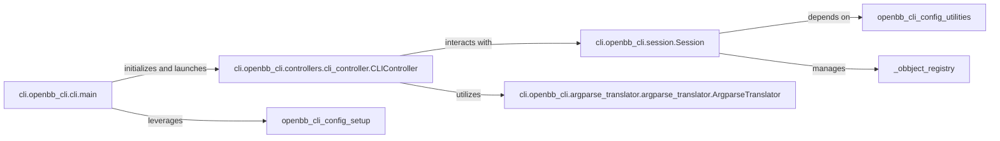

## Component Details

The `CLI Application Core` subsystem serves as the primary interface for user interaction within the OpenBB Platform CLI. It is responsible for initializing the CLI environment, parsing user commands, managing the interactive session, and orchestrating the execution of various routines and commands. This core acts as the central orchestrator, bridging user input with the underlying platform functionalities.

### cli.openbb_cli.cli.main
This function serves as the absolute entry point of the entire CLI application. Its primary purpose is to initialize the CLI environment by calling the `bootstrap` function and then to hand over control to the `CLIController` to begin the interactive session. It's the first piece of code executed when the CLI starts.

**Related Classes/Methods**:

- <a href="https://github.com/OpenBB-finance/OpenBB/blob/master/cli/openbb_cli/cli.py#L7-L20" target="_blank" rel="noopener noreferrer">`cli.openbb_cli.cli.main` (7:20)</a>

### cli.openbb_cli.controllers.cli_controller.CLIController
This is the central orchestrator of the CLI's interactive session. It manages the main command loop, processes user input, dynamically generates commands and menus based on the OpenBB Platform's structure, dispatches commands for execution, and handles the overall flow of user interaction. It acts as the primary interface between the user and the OpenBB Platform's functionalities.

**Related Classes/Methods**:

- <a href="https://github.com/OpenBB-finance/OpenBB/blob/master/cli/openbb_cli/controllers/cli_controller.py#L64-L499" target="_blank" rel="noopener noreferrer">`cli.openbb_cli.controllers.cli_controller.CLIController` (64:499)</a>

### cli.openbb_cli.session.Session
This component is responsible for managing the global state and context of the current CLI session. Implemented as a singleton, it ensures a consistent and personalized user experience by maintaining user settings, command history, environment variables, and cached results. It provides essential services like console output and prompt management to other core components.

**Related Classes/Methods**:

- <a href="https://github.com/OpenBB-finance/OpenBB/blob/master/cli/openbb_cli/session.py#L35-L107" target="_blank" rel="noopener noreferrer">`cli.openbb_cli.session.Session` (35:107)</a>

### cli.openbb_cli.argparse_translator.argparse_translator.ArgparseTranslator
This component handles the dynamic parsing and translation of user commands. It takes raw command-line input and converts it into a structured format that can be understood and executed by the OpenBB Platform's backend functions. It achieves this by dynamically building `argparse` parsers from Python function signatures, making it crucial for interpreting user intentions and enabling flexible command-line interfaces.

**Related Classes/Methods**:

- <a href="https://github.com/OpenBB-finance/OpenBB/blob/master/cli/openbb_cli/argparse_translator/argparse_translator.py#L42-L489" target="_blank" rel="noopener noreferrer">`cli.openbb_cli.argparse_translator.argparse_translator.ArgparseTranslator` (42:489)</a>

### [FAQ](https://github.com/CodeBoarding/GeneratedOnBoardings/tree/main?tab=readme-ov-file#faq)