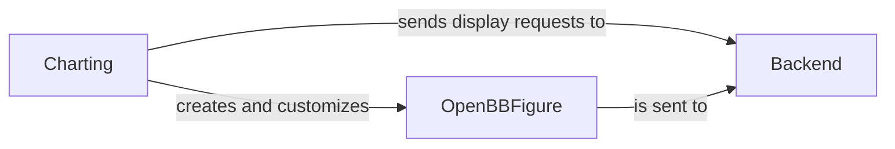

## Component Details

The Charting System in `openbb_platform` is designed to provide comprehensive data visualization capabilities, allowing for the creation, customization, and rendering of various chart types. It integrates with underlying charting libraries and handles display in different environments (e.g., CLI, Jupyter).

### Charting
This class serves as the primary entry point and facade for users to interact with the charting functionalities. It orchestrates the entire charting process by providing methods to create different chart types, manage charting settings, and initiate the display of results. It acts as a high-level API that abstracts the complexities of chart generation and rendering.

**Related Classes/Methods**:

- <a href="https://github.com/OpenBB-finance/OpenBB/blob/master/openbb_platform/obbject_extensions/charting/openbb_charting/charting.py#L0-L0" target="_blank" rel="noopener noreferrer">`openbb_platform.obbject_extensions.charting.openbb_charting.charting:show` (0:0)</a>
- <a href="https://github.com/OpenBB-finance/OpenBB/blob/master/openbb_platform/obbject_extensions/charting/openbb_charting/charting.py#L0-L0" target="_blank" rel="noopener noreferrer">`openbb_platform.obbject_extensions.charting.openbb_charting.charting:to_chart` (0:0)</a>
- <a href="https://github.com/OpenBB-finance/OpenBB/blob/master/openbb_platform/obbject_extensions/charting/openbb_charting/charting.py#L0-L0" target="_blank" rel="noopener noreferrer">`openbb_platform.obbject_extensions.charting.openbb_charting.charting:create_line_chart` (0:0)</a>
- <a href="https://github.com/OpenBB-finance/OpenBB/blob/master/openbb_platform/obbject_extensions/charting/openbb_charting/charting.py#L0-L0" target="_blank" rel="noopener noreferrer">`openbb_platform.obbject_extensions.charting.openbb_charting.charting:create_bar_chart` (0:0)</a>

### Backend
This class is responsible for managing the communication with the underlying charting display mechanism (e.g., PyWry). It handles the actual rendering and presentation of figures and tables, ensuring that the charting output is correctly displayed to the user, whether in a terminal, a Jupyter Notebook, or other environments. It acts as the bridge between the charting logic and the visual output.

**Related Classes/Methods**:

- <a href="https://github.com/OpenBB-finance/OpenBB/blob/master/openbb_platform/obbject_extensions/charting/openbb_charting/core/backend.py#L0-L0" target="_blank" rel="noopener noreferrer">`openbb_platform.obbject_extensions.charting.openbb_charting.core.backend:send_figure` (0:0)</a>

### OpenBBFigure
This custom Plotly figure class extends `plotly.graph_objects.Figure` and provides OpenBB-specific functionalities for extensive chart customization. This includes applying themes, handling date gaps in time series data, and adding various plot elements such as histograms, trend lines, and correlation plots. It encapsulates the visual representation and behavior of all charts generated within the OpenBB Platform.

**Related Classes/Methods**:

- <a href="https://github.com/OpenBB-finance/OpenBB/blob/master/openbb_platform/obbject_extensions/charting/openbb_charting/core/openbb_figure.py#L0-L0" target="_blank" rel="noopener noreferrer">`openbb_platform.obbject_extensions.charting.openbb_charting.core.openbb_figure:show` (0:0)</a>

### [FAQ](https://github.com/CodeBoarding/GeneratedOnBoardings/tree/main?tab=readme-ov-file#faq)