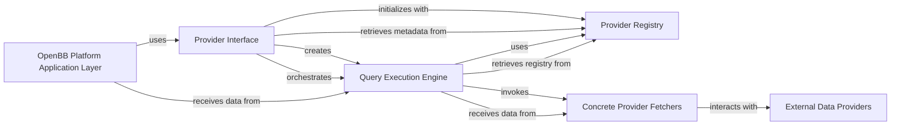

## Component Details

The `Data Provider Integration` subsystem is the backbone for accessing and standardizing financial data from various external sources within the OpenBB Platform. It acts as an abstraction layer, allowing the rest of the application to request data without needing to know the specifics of each provider's API. This subsystem is fundamental because it centralizes data access logic, ensures data consistency, and enables the platform to easily integrate new data sources or switch between existing ones without significant changes to the core application. It decouples the data consumption from the data fetching, making the system more robust and scalable.

### Provider Interface
This component serves as the primary entry point for the OpenBB Platform's application layer to interact with the data providers. It dynamically generates Pydantic models and dataclasses for query parameters and return data, ensuring type safety and clear documentation. It orchestrates the creation and use of the `Query Execution Engine`.

**Related Classes/Methods**:

- <a href="https://github.com/OpenBB-finance/OpenBB/blob/master/openbb_platform/core/openbb_core/app/provider_interface.py#L1-L1" target="_blank" rel="noopener noreferrer">`provider_interface` (1:1)</a>

### Provider Registry
This component acts as the central catalog for all available data providers and their supported data models. It dynamically loads and organizes metadata about each provider, including their query parameters, data schemas, and required credentials.

**Related Classes/Methods**:

- <a href="https://github.com/OpenBB-finance/OpenBB/blob/master/openbb_platform/core/openbb_core/provider/registry_map.py#L1-L1" target="_blank" rel="noopener noreferrer">`registry_map` (1:1)</a>

### Query Execution Engine
This component is responsible for the actual execution of data fetching requests. It takes a data model name and a chosen provider, retrieves the appropriate `Fetcher` implementation from the `Provider Registry`, handles necessary credentials, and dispatches the query to the `Fetcher` to retrieve raw data.

**Related Classes/Methods**:

- <a href="https://github.com/OpenBB-finance/OpenBB/blob/master/openbb_platform/core/openbb_core/provider/query_executor.py#L1-L1" target="_blank" rel="noopener noreferrer">`query_executor` (1:1)</a>

### Concrete Provider Fetchers
These are the specific implementations for each data provider and each data model they support. A `Fetcher` is responsible for the low-level details of interacting with an external API (e.g., constructing URLs, making HTTP requests, parsing raw JSON/XML responses) and transforming that raw data into the standardized OpenBB Platform data models.

**Related Classes/Methods**:

- <a href="https://github.com/OpenBB-finance/OpenBB/blob/master/openbb_platform/core/openbb_core/provider/standard_models/equity_historical.py#L1-L1" target="_blank" rel="noopener noreferrer">`equity_historical` (1:1)</a>

### OpenBB Platform Application Layer
Represents the higher-level application components that consume data provided by the `Data Provider Integration` subsystem.

**Related Classes/Methods**: _None_

### External Data Providers
These are the external financial data sources (e.g., FMP, Alpha Vantage) that provide raw data to the OpenBB Platform.

**Related Classes/Methods**: _None_

### [FAQ](https://github.com/CodeBoarding/GeneratedOnBoardings/tree/main?tab=readme-ov-file#faq)